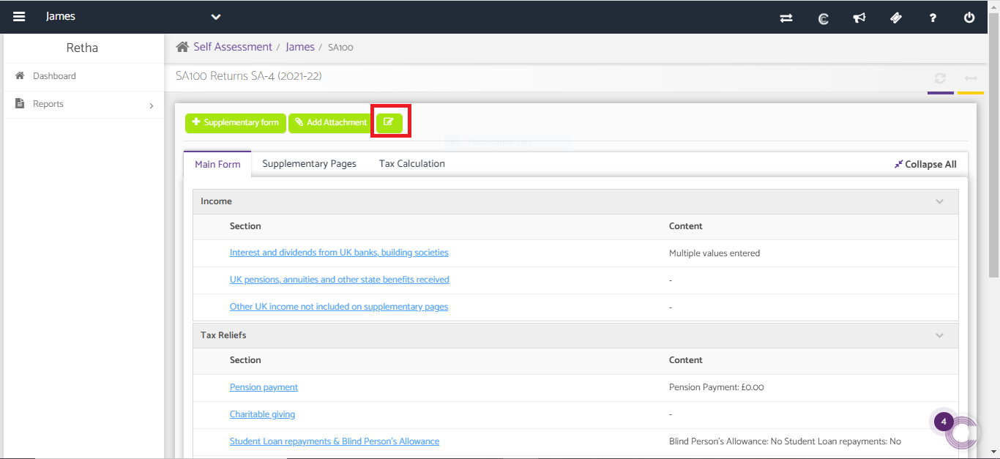
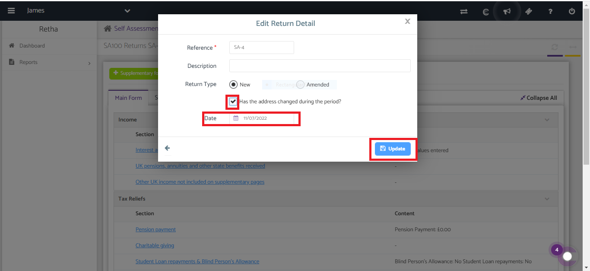

# Edit the change of address date for SA100
	 	
			
			Print

- **Category:** Self Assessment
- **Folder:** Self Assessment Help Guide
- **Source URL:** [https://capium.freshdesk.com/support/solutions/articles/9000236610-edit-the-change-of-address-date-for-sa100](https://capium.freshdesk.com/support/solutions/articles/9000236610-edit-the-change-of-address-date-for-sa100)
- **Article ID:** 9000236610

## Content

Solution home 
		Self Assessment 
		Self Assessment Help Guide

### Edit the change of address date for SA100

			Print

	Modified on: Fri, 1 Mar, 2024 at 12:39 PM

		Navigation: Self-Assessment >> Select Particular Client >> Click on Edit return Details.

After clicking on the tab you can find the checkbox 'Has the address Changed during the period?'

Select the checkbox. 

Once done it will give an option where you can edit the change of address date.

										Did you find it helpful?
								Yes
								No

Send feedback	Sorry we couldn't be helpful. Help us improve this article with your feedback.

## Screenshots & Diagrams (2)

