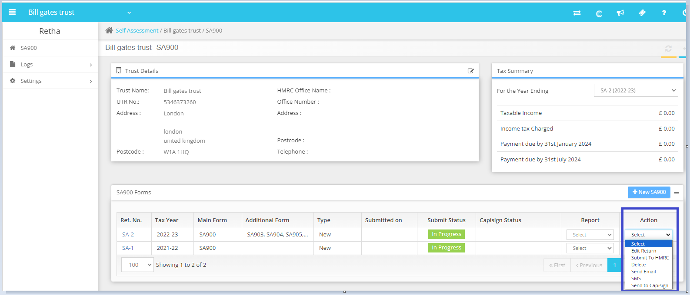
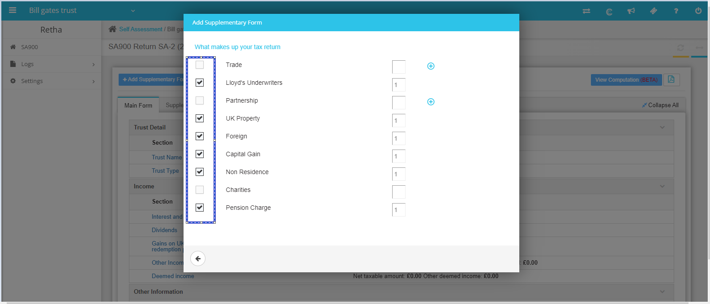

# How to add supplementary pages in SA 900
	 	
			
			Print

- **Category:** Self Assessment
- **Folder:** Self Assessment FAQs
- **Source URL:** [https://capium.freshdesk.com/support/solutions/articles/9000237944-how-to-add-supplementary-pages-in-sa-900](https://capium.freshdesk.com/support/solutions/articles/9000237944-how-to-add-supplementary-pages-in-sa-900)
- **Article ID:** 9000237944

## Content

Solution home 
		Self Assessment 
		Self Assessment FAQs

### How to add supplementary pages in SA 900

			Print

	Modified on: Fri, 17 May, 2024 at 11:53 AM

		Navigation: Self Assessment >> Client >> Action >> Edit Return  >> + Add Supplementary Form >> 

Check the relevant form and the same would be added to Self Assessment return. Please refer to the screenshots below.  

										Did you find it helpful?
								Yes
								No

Send feedback	Sorry we couldn't be helpful. Help us improve this article with your feedback.

## Screenshots & Diagrams (2)

