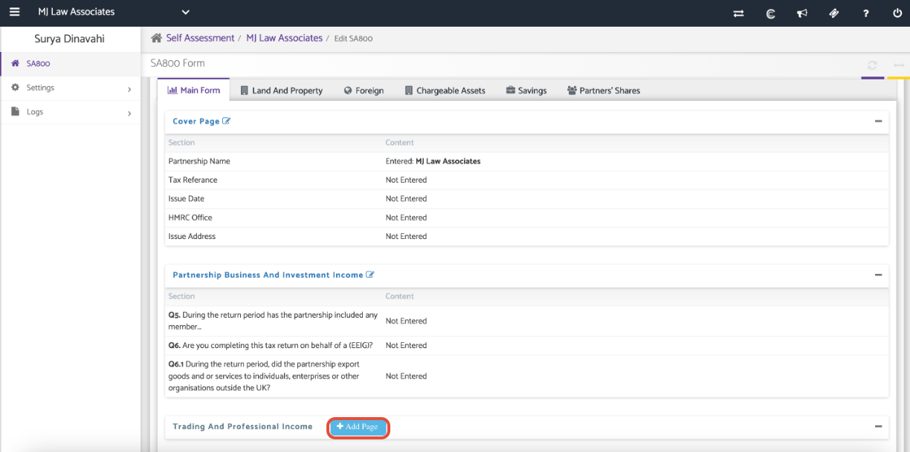
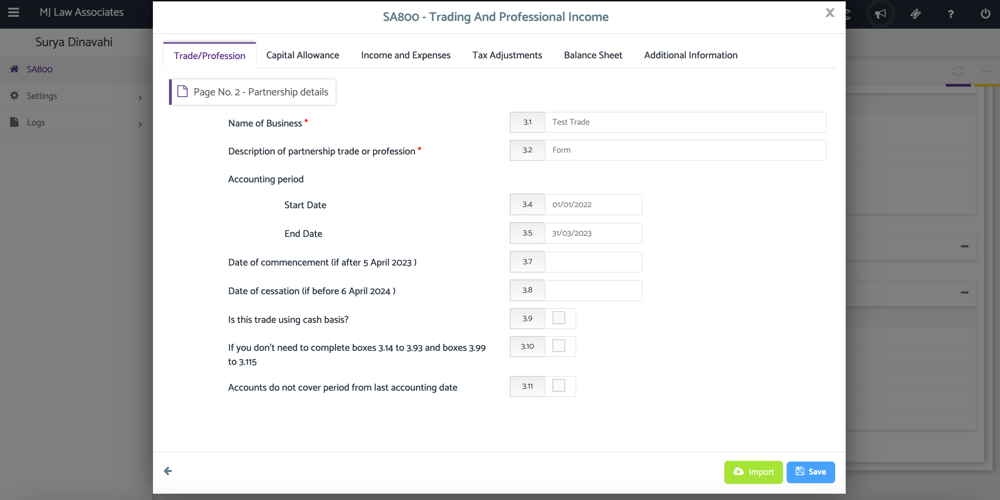
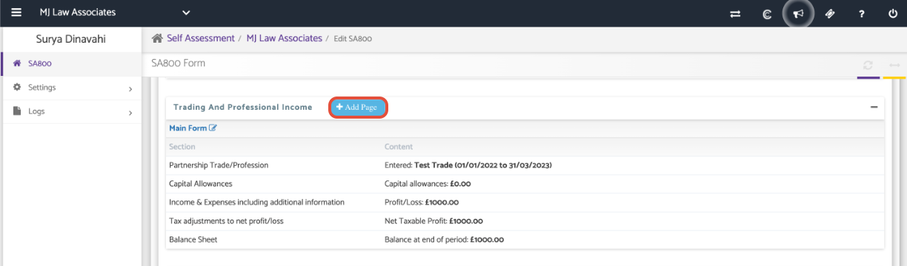
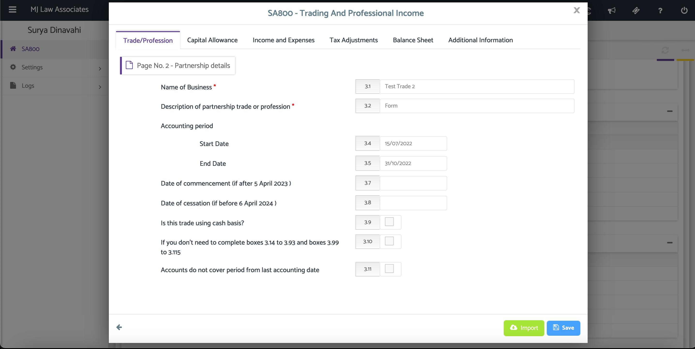
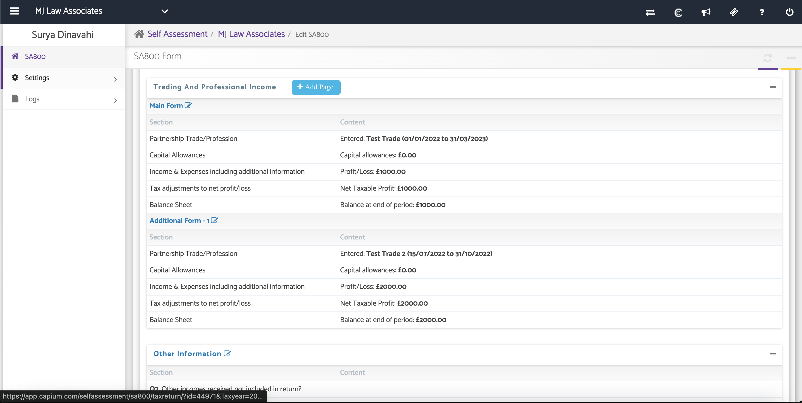
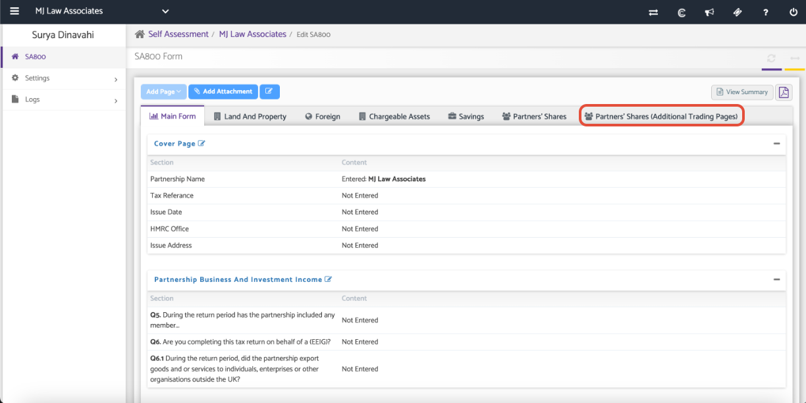
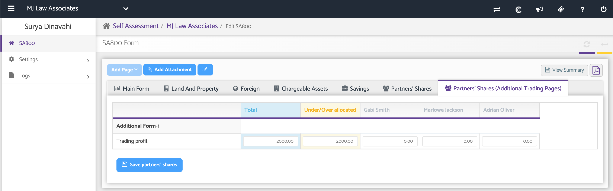
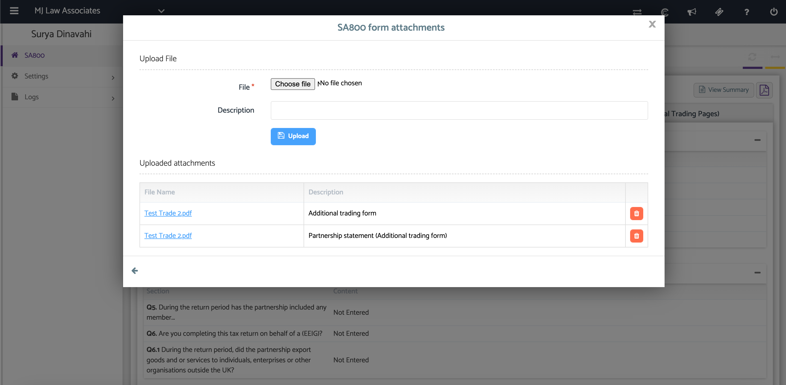

# Basis Reform: SA800 - Adding an Additional Period
	 	
			
			Print

- **Category:** Self Assessment
- **Folder:** Self Assessment Help Guide
- **Source URL:** [https://capium.freshdesk.com/support/solutions/articles/9000241053-basis-reform-sa800-adding-an-additional-period](https://capium.freshdesk.com/support/solutions/articles/9000241053-basis-reform-sa800-adding-an-additional-period)
- **Article ID:** 9000241053

## Content

Solution home 
		Self Assessment 
		Self Assessment Help Guide

### Basis Reform: SA800 - Adding an Additional Period

			Print

	Modified on: Fri, 20 Sep, 2024 at  4:37 PM

		The article below will guide you how to add additional periods beyond the 12 month period in SA 800. 

Additional Trading and Professional Income Pages

Navigation: Client > Actions > Edit Return > Main Form

Step 1.   

Fill in an Trading and Professional Income page for the 12 month period. 

Navigate: Main form > Trading And Professional Income and click '+ Add Page'. Once you have added a page please ensure you have added the correct Accounting period; Start date & End Date.

Step 2. 

Create and fill in an additional period page by clicking on '+ Add Page'.

Once you have added a page please ensure you have added the correct additional Accounting period; Start date & End Date.

Note: The additional form will be submitted to HMRC as an attachment.

Partner shares

Once you have created the Additional Form an additional Partner's Shares will automatically be created on the top of the page, where you can allocate the profit to the partners. 

Note: The additional Partners' Shares pages will be submitted to HMRC as an attachment.

As shown on the screenshots below:

Finally, you will be able to submit the Additional trading form and Partnership Statement (Additional trading form) as attachments to HMRC.

If you have any questions or queries please contact support@capium.com.

										Did you find it helpful?
								Yes
								No

Send feedback	Sorry we couldn't be helpful. Help us improve this article with your feedback.

## Screenshots & Diagrams (8)

