# Self-Assessment Questionnaire
	 	
			
			Print

- **Category:** Self Assessment
- **Folder:** Self Assessment Help Guide
- **Source URL:** [https://capium.freshdesk.com/support/solutions/articles/9000246677-self-assessment-questionnaire](https://capium.freshdesk.com/support/solutions/articles/9000246677-self-assessment-questionnaire)
- **Article ID:** 9000246677

## Content

Solution home 
		Self Assessment 
		Self Assessment Help Guide

### Self-Assessment Questionnaire

			Print

	Modified on: Fri, 11 Apr, 2025 at  5:04 PM

		Capium's Self-Assessment module now features the Self-Assessment Questionnaire, designed to streamline the process of collecting vital information from clients. With this new tool, accountants can efficiently gather data, eliminating back-and-forth communications and reducing manual data entry. The questionnaire allows accountants to select clients who need to provide specific information, and once submitted, the details can be seamlessly auto-populated into SA100 forms. This ensures that tax filing becomes quicker, more accurate, and less stressful. 

In this guide, we’ll walk you through how to use the Self-Assessment Questionnaire in the module step by step.

Step 1: Create a new Self Assessment Return 

To get started with the self-assessment questionnaire you will need to create a new self-assessment return for each client on your list of clients. Please use the below navigation to get to the client screen (as shown in screenshot 1).

Navigation: Self Assessment > Dashboard > Client selection  

From the list of clients select the client that you want to produce an SA100 return for, and navigate to the client screen (as shown in screenshot 2). 

( 

(Screenshot 1) 

( (Screenshot 2)  

Create a new SA100 form: Create a new SA100 form. Here you will notice that a new tab has been added to the bottom of your screen to create your SA100 client questionnaire. This is illustrated in Screenshot 3. 

Navigation: Self Assessment > +SA100 > Tick box 

( (Screenshot 3) 

Please make sure to tick the checkbox for the self-assessment questionnaire to include the tax return in your questionnaire list. If you forget to select this checkbox before creating a new return, you will need to create a new return and ensure the checkbox is selected.

Ensuring your email IDs are correct: Please ensure that you have the correct email ID shown on the client set-up page. Our Self Assessment Questionnaire system uses this email ID to forward the questions to the clients. Please see the screenshot 4 below. 

(Screenshot 4)

Step 2: Checking if the questionnaire is created 

The next step is to ensure that the questionnaire is created. To check this you will need to navigate to the page shown below as illustrated in screenshot 5. 

Navigation: Self Assessment dashboard > General Settings > Questionnaire  

( (Screenshot 5) 

Once you click on ‘Questionnaire’ you will be redirected to the Self-Assessment Questionnaire page as shown below in Screenshot 6: 

(Screenshot 6) 

If your client details have not appreared on the screen above (screenshot 6). You will have to repeat the Step 1 of this guide. 

Step 3: Checking the questions before sending the questionnaire

Once you have got your clients on this screen (Screenshot 7). You will note that there will be a Sample Questionnaire button on the top right side of the screen as illustrated. 

Please Note: SA questionnaire questions are not editable by the accountants, as these questions are static and tagged to the SA100 returns. 

Navigation: Self Assessment > General Settings > Questionnaire > Sample Questionnaire 

(Screenshot 7) 

Once you click on the button you will be redirected to the page below (Screenshot 8)

( (Screenshot 8) 

Step 4: Sending the Questionnaire 

Once you’ve selected a client, you can easily send out the self-assessment questionnaire. The questionnaire is directly linked to the SA100 return, ensuring that all the necessary information is gathered.  

While the questions are pre-set for accuracy and compliance, this simplifies the process and ensures you’re collecting the essential details for the return. 

(Screenshot 9) 

As seen above in ‘screenshot 6’ you can select the client(s) on the left and then on the right side of your screen you have the option to send an email to your clients.  

Once you click on this option the status of the emails will update. You can update the emails and resend them at any point in time. 

(Screenshot 10)

The status of any sent questionnaires can be seen in the status bar highlighted in the image above (Screenshot 10). 

There can be six status types:

Not Sent
Sent 
Received
Under Review
Auto Posted 
Submitted

Step 5: Client receives the Questionnaire 

The client will receive the questionnaire in their inbox. On each email, there will be a dedicated link that the client needs to click to be directed to fill in the form. 

Please Note: The email sent with the SA questionnaire is not editable. 

(  (Screenshot 11) 

Step 6: Clients fills out the Questionnaire 

The form consists of seventeen categories, each corresponding to a different section of the self-assessment. These sections are pre-defined and cannot be customised. The categories can be seen in the screenshot below (Screenshot 12) or in Step 3 when reviewing the questionnaire. 

Please note that the client can only complete this form once, and it cannot be modified once submitted. 

Clients have the option to respond with 'No' if a particular section is not relevant to them or if they do not have the necessary information. This will then be visible on he left hand side overview for each question. 

Clients can also add attachments to each question that is present. This can be picked up by the accountant later when reviewing the responses. 

Accountants will have the ability to review and amend these sections after the client has submitted the form. 

Ultimately, it is at the accountant’s discretion to accept the submitted figures and decide whether or not to include them in the SA100.

( (Screenshot 12) 

Once this is completed the clients will be able to click ‘Submit’ when they get to question 17. Following this they will be able to download their responses as shown below.  

( (Screenshot 13) 

Step 7: Review Client Responses 

Navigation: Self Assessment > General Settings > Client Selection > Review 

Once the client submits the questionnaire, you will see the status update within the SA Questionnaires. You can then review the responses directly from the questionnaire screen.

( (Screenshot 14) 

When you click on the ‘review’ button you will see the questionnaire open again in an editable version whereby you can see your client entries and add or edit any information that is required.  

You can also review the Self Assessment questionnaire in the Client profile:

(Screenshot 15)

Once this is done for the 17 questions, you can click on the ‘auto post’ button as shown below in the screenshots to post this into the SA100 return.   (  (Screenshot 15)  

Step 8: Finalise and Submit 

Once the SA100 form is populated with the client’s information you will have to follow the steps as per the SA100 Form article to make the final submission. 

Please review the SA302 computation, all the SA100 pages and attachments and get your client's approval before making the submissions. 

										Did you find it helpful?
								Yes
								No

Send feedback	Sorry we couldn't be helpful. Help us improve this article with your feedback.

## Screenshots & Diagrams (16)

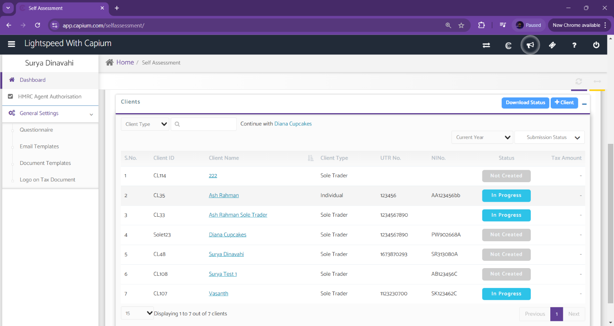

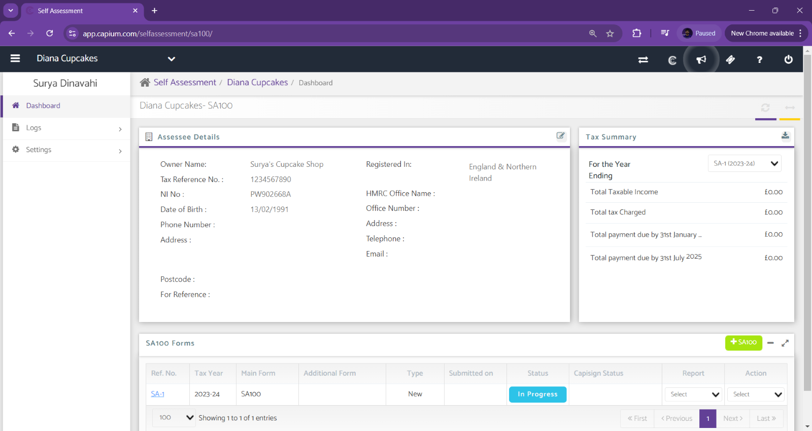

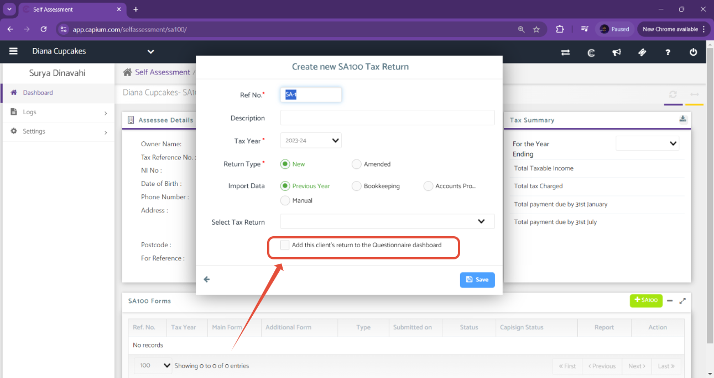

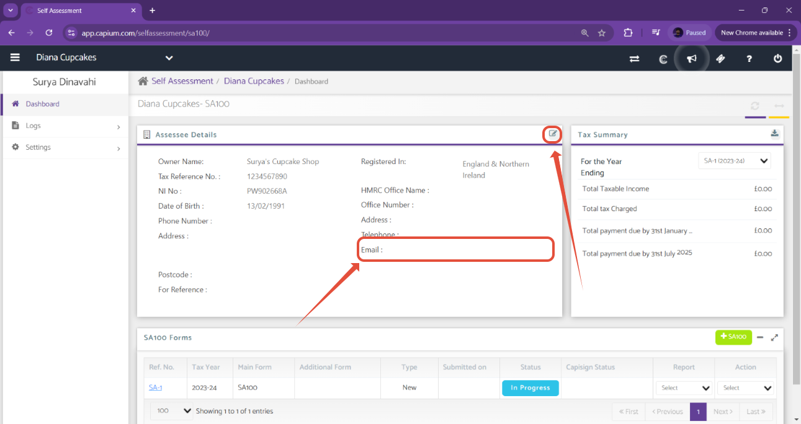

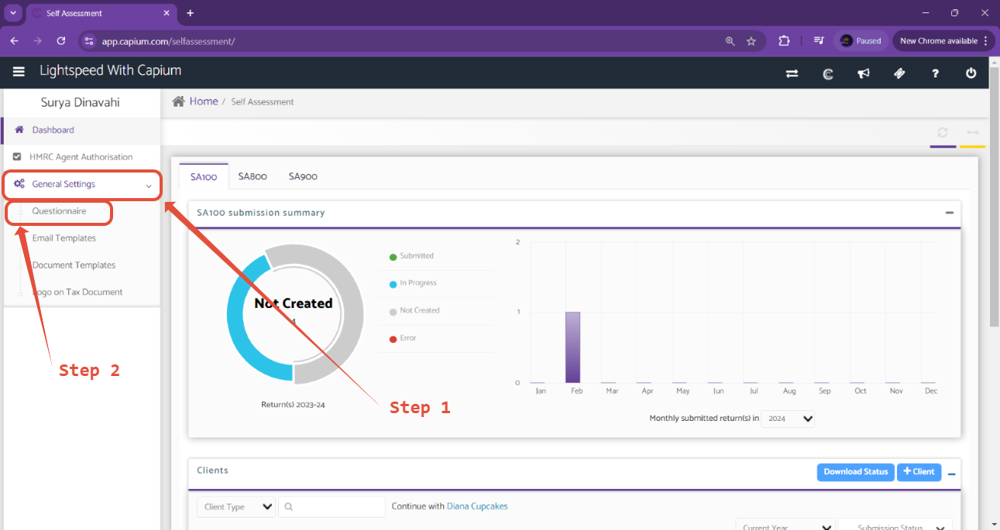

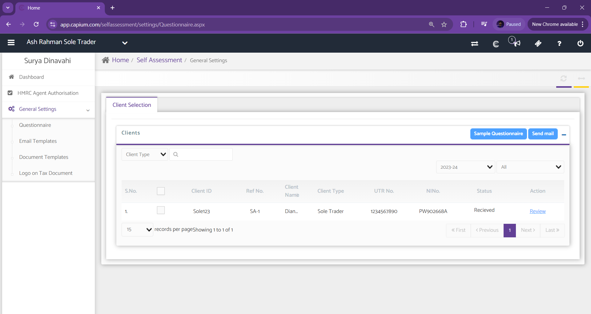

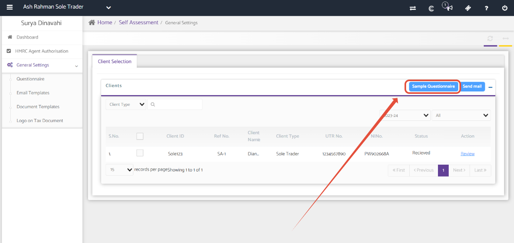

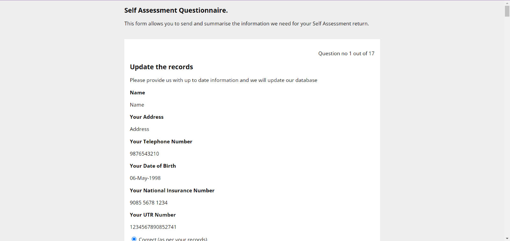

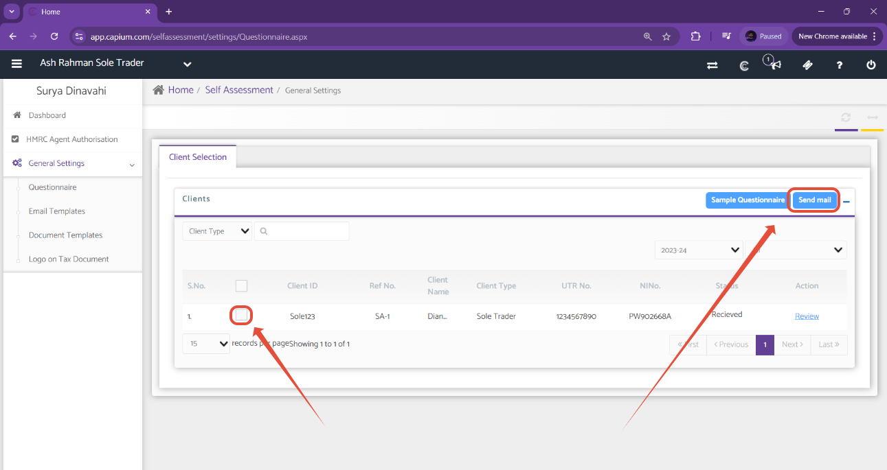

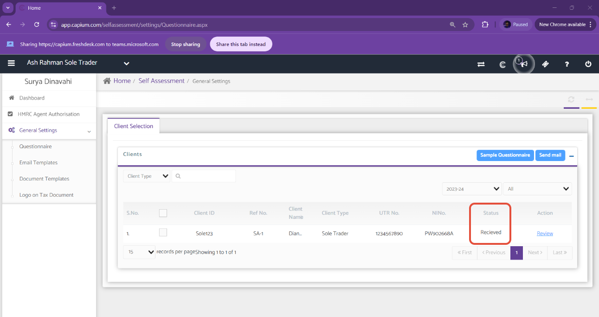

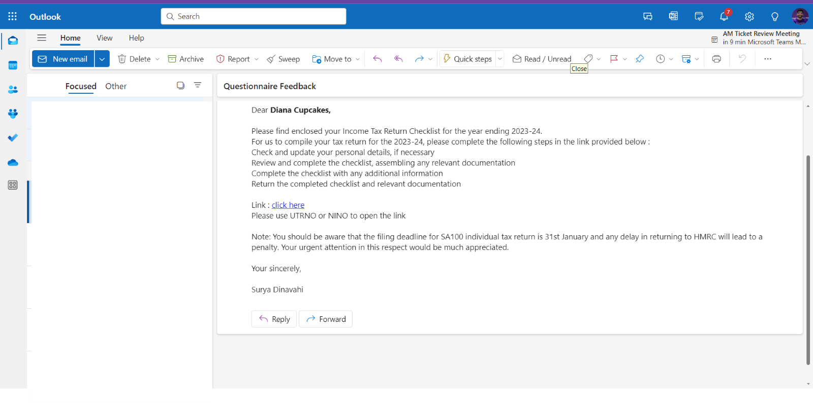

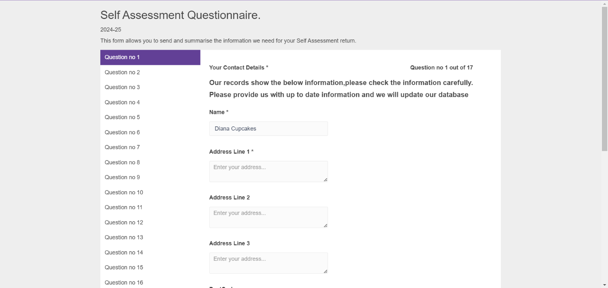

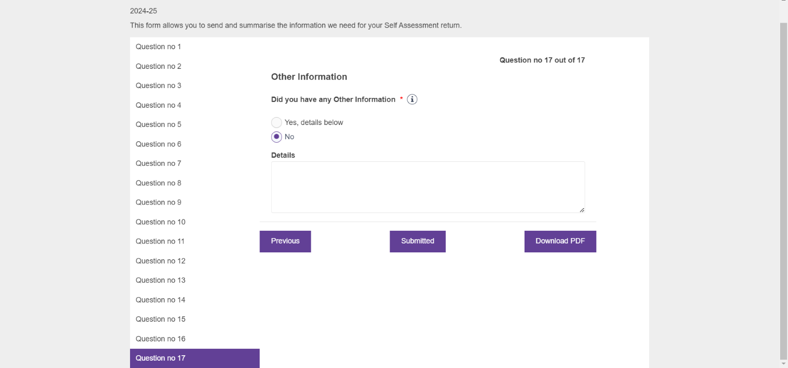

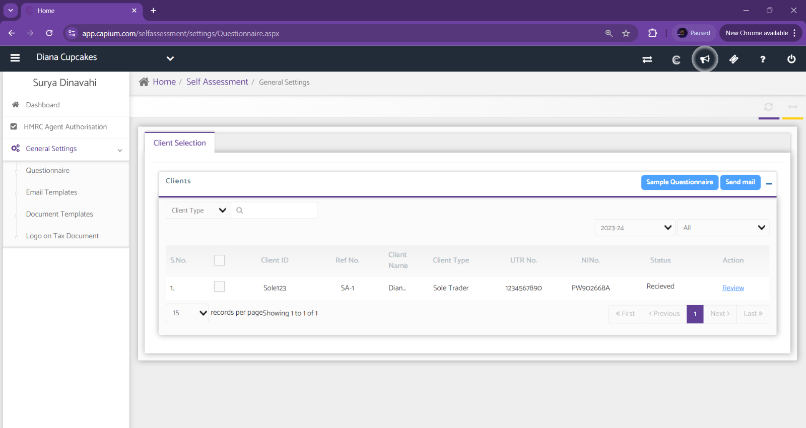

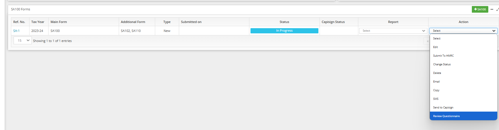

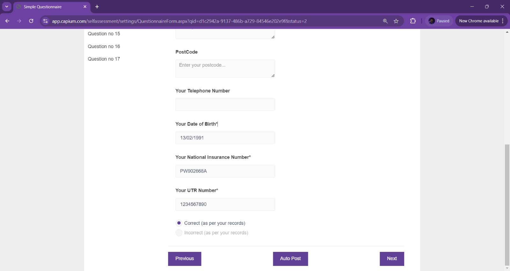

