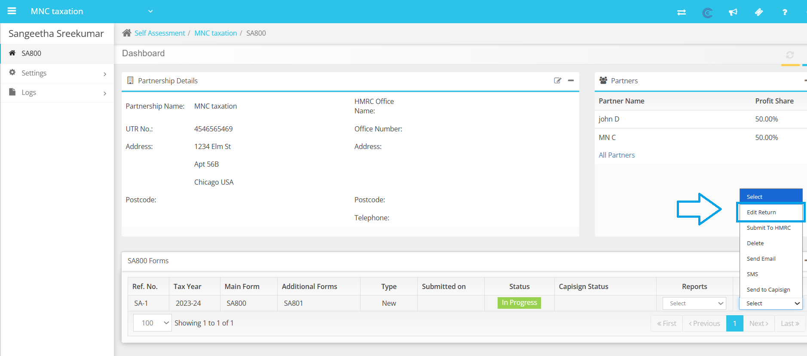
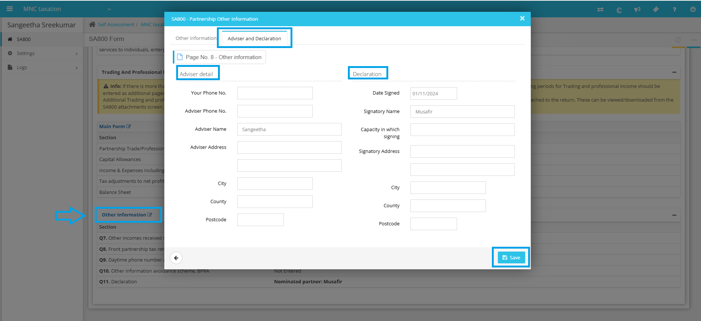

# Error - Must Enter Nominated Partner Name/Signatory Name
	 	
			
			Print

- **Category:** Self Assessment
- **Folder:** Self Assessment Help Guide
- **Source URL:** [https://capium.freshdesk.com/support/solutions/articles/9000271637-error-must-enter-nominated-partner-name-signatory-name](https://capium.freshdesk.com/support/solutions/articles/9000271637-error-must-enter-nominated-partner-name-signatory-name)
- **Article ID:** 9000271637

## Content

Solution home 
		Self Assessment 
		Self Assessment Help Guide

### Error - Must Enter Nominated Partner Name/Signatory Name

			Print

	Modified on: Wed, 22 Oct, 2025 at  4:32 PM

		If you are receiving the error message 'Must Enter Nominated Partner Name/Signatory Name' while submitting the S800, please follow the steps outlined below to resolve the issue.

1. Navigate to Self Assessment (SA800): Begin by logging into your account and navigating to the Self Assessment section.

2. Client Specific: Once in the Self Assessment section, select the Client.

3. Edit the Return: Within the Client Specific section, you will find the option to edit the return. Click on this option to proceed to the next step.

4. Select Other Information: Once you have chosen the edit return option, you can click the "Other Information" tab to view the advisor and declaration details.

5. Update the Advisor and Declaration Tab: Once in the Other Information tab, you can proceed to update the advisor and declaration information as needed.

6. Save: After making the necessary updates, be sure to save your changes to ensure that the information is properly recorded.

If you encounter any difficulties during this process, please do not hesitate to reach out to our customer support team for assistance. 

										Did you find it helpful?
								Yes
								No

Send feedback	Sorry we couldn't be helpful. Help us improve this article with your feedback.

## Screenshots & Diagrams (2)

