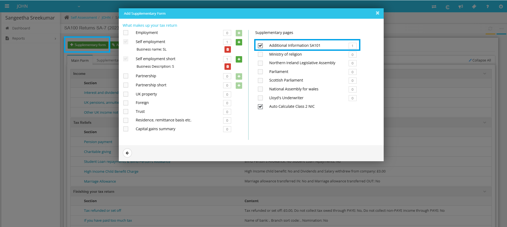
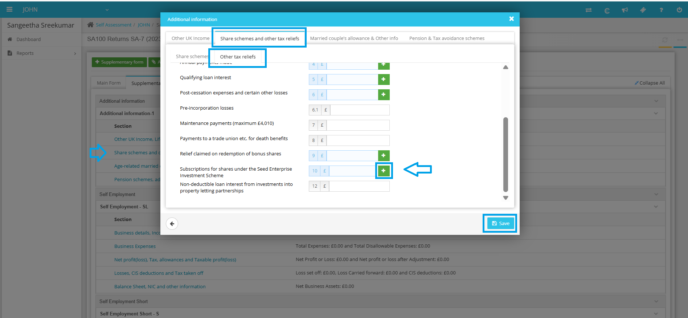

# SEIS: Seed Enterprise Investment Scheme
	 	
			
			Print

- **Category:** Self Assessment
- **Folder:** Self Assessment Help Guide
- **Source URL:** [https://capium.freshdesk.com/support/solutions/articles/9000271638-seis-seed-enterprise-investment-scheme](https://capium.freshdesk.com/support/solutions/articles/9000271638-seis-seed-enterprise-investment-scheme)
- **Article ID:** 9000271638

## Content

Solution home 
		Self Assessment 
		Self Assessment Help Guide

### SEIS: Seed Enterprise Investment Scheme

			Print

	Modified on: Wed, 22 Oct, 2025 at  3:47 PM

		To incorporate the SEIS information into your tax return, please adhere to the following steps:

1. You will need to add the Supplementary page - Additional Information SA101. 

2. Update the figures at Share schemes and other tax reliefs >> Other tax reliefs >> Box 10.

If you have any questions or need help, please feel free to contact our customer support team. 

										Did you find it helpful?
								Yes
								No

Send feedback	Sorry we couldn't be helpful. Help us improve this article with your feedback.

## Screenshots & Diagrams (2)

