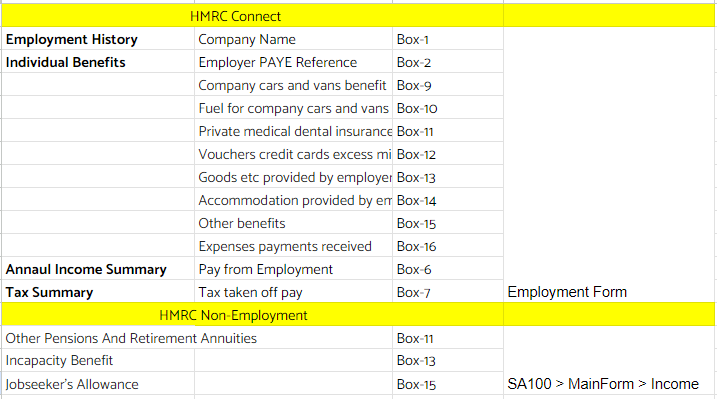

# Process to Follow for HMRC Connect - Self Assessment
	 	
			
			Print

- **Category:** Self Assessment
- **Folder:** Self Assessment FAQs
- **Source URL:** [https://capium.freshdesk.com/support/solutions/articles/9000272546-process-to-follow-for-hmrc-connect-self-assessment](https://capium.freshdesk.com/support/solutions/articles/9000272546-process-to-follow-for-hmrc-connect-self-assessment)
- **Article ID:** 9000272546

## Content

Solution home 
		Self Assessment 
		Self Assessment FAQs

### Process to Follow for HMRC Connect - Self Assessment

			Print

	Modified on: Thu, 27 Nov, 2025 at  3:06 PM

		Please refer to the user guides below for the complete HMRC Connect process. The attached image shows the data that will be pulled from HMRC into Capium. 

https://capium.freshdesk.com/a/solutions/articles/9000219272?portalId=9000044273

https://capium.freshdesk.com/a/solutions/articles/9000216260?portalId=9000044273

If you have any further questions or need assistance, please don't hesitate to reach out to our support team. We're here to help you make the most of your Capium experience!

										Did you find it helpful?
								Yes
								No

Send feedback	Sorry we couldn't be helpful. Help us improve this article with your feedback.

## Screenshots & Diagrams (1)

