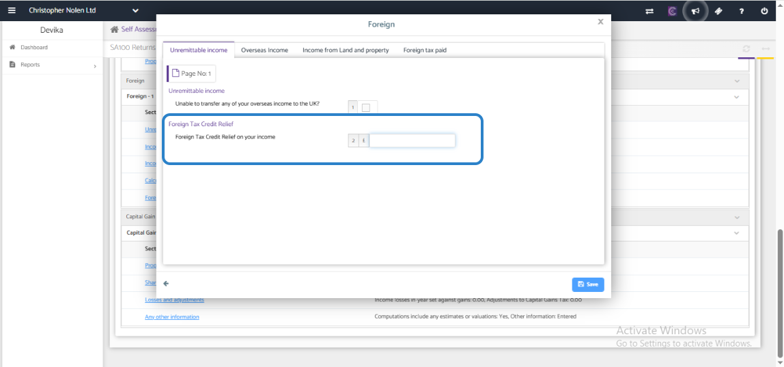

# Why Isn’t Foreign Tax Credit Relief Displayed in the Tax Return - Self Assessment
	 	
			
			Print

- **Category:** Self Assessment
- **Folder:** Self Assessment FAQs
- **Source URL:** [https://capium.freshdesk.com/support/solutions/articles/9000272554-why-isn-t-foreign-tax-credit-relief-displayed-in-the-tax-return-self-assessment](https://capium.freshdesk.com/support/solutions/articles/9000272554-why-isn-t-foreign-tax-credit-relief-displayed-in-the-tax-return-self-assessment)
- **Article ID:** 9000272554

## Content

Solution home 
		Self Assessment 
		Self Assessment FAQs

### Why Isn’t Foreign Tax Credit Relief Displayed in the Tax Return - Self Assessment

			Print

	Modified on: Thu, 27 Nov, 2025 at  2:58 PM

		If the  Foreign Tax Credit Relief Claim is not displaying in the computation, you may please update Box 2 - Foreign Tax Credit Relief on your income (FTCR) in the foreign supplementary page. Once completed, kindly review the SA302 computation and revert to us for any further assistance. 

										Did you find it helpful?
								Yes
								No

Send feedback	Sorry we couldn't be helpful. Help us improve this article with your feedback.

## Screenshots & Diagrams (1)

