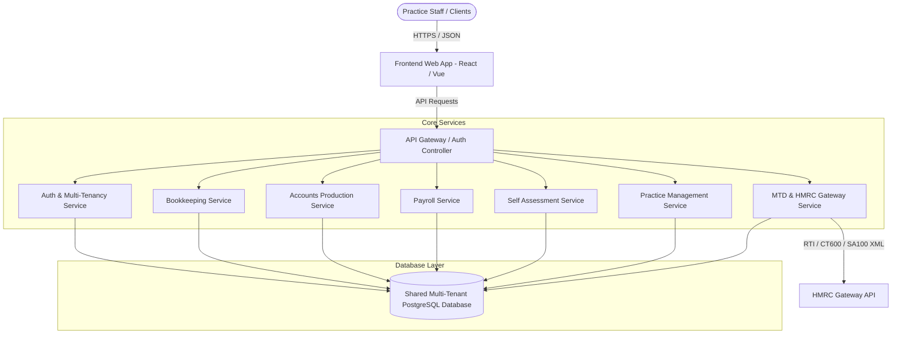

# SanSuite SaaS Clone - Software Blueprint & Analysis

This repository serves as the master software blueprint and analysis for rebuilding a complete web-based accounting and practice management software suite, modeled after [SanSuite UK](https://account.SanSuite.com/home).

---

## 1. System Architecture Overview

To support multiple accounting practices (tenants), client businesses, and external HMRC submissions, the application must be built on a secure, multi-tenant cloud architecture.

### Key Architectural Guidelines
- **Multi-Tenancy:** Isolation must happen at the `practice_id` level. All transactional and master tables must reference `practice_id` to prevent data leakage.
- **Micro-Frontends or Monolithic UI:** A unified single-page application dashboard containing tabs/routes corresponding to different modules.
- **RTI Submission Handler:** A dedicated background queue service (e.g., Celery, BullMQ) to handle secure SOAP XML payloads sent to HMRC's Gateway with retries and logging.

---

## 2. Directory Index of Modules

We analyzed and documented every functional module in the SanSuite ecosystem. Refer to the corresponding `.md` file for deep technical requirements, layout breakdowns, and database tables:

| Module Section | Module Name | Document Link | Screenshot Reference |
|---|---|---|---|
| **Ecosystem** | Main Portal Dashboard | [dashboard.md](docs/dashboard.md) | [dashboard/dashboard.png](screenshots/dashboard/dashboard.png) |
| **Ecosystem** | My Admin | [my_admin.md](docs/my_admin.md) | [my_admin/my_admin.png](screenshots/my_admin/my_admin.png) [my_admin/users_list.png](screenshots/my_admin/users_list.png) [my_admin/subscriptions.png](screenshots/my_admin/subscriptions.png) [my_admin/add_user_form.png](screenshots/my_admin/add_user_form.png) |
| **Architecture** | Subdomain Guide | [subdomains.md](docs/subdomains.md) | N/A (Concept Document) |
| **Accounting** | Accounts Production | [accounts_production.md](docs/accounts_production.md) | [accounts_production/accounts_production_home.png](screenshots/accounts_production/accounts_production_home.png) [accounts_production/accounts_production_client.png](screenshots/accounts_production/accounts_production_client.png) [accounts_production/trial_balance.png](screenshots/accounts_production/trial_balance.png) [accounts_production/report_settings.png](screenshots/accounts_production/report_settings.png) [accounts_production/accounts_submit.png](screenshots/accounts_production/accounts_submit.png) [accounts_production/add_trial_balance.png](screenshots/accounts_production/add_trial_balance.png) [accounts_production/directors_report_settings.png](screenshots/accounts_production/directors_report_settings.png) |
| **Accounting** | Bookkeeping | [bookkeeping.md](docs/bookkeeping.md) | [bookkeeping/bookkeeping_home.png](screenshots/bookkeeping/bookkeeping_home.png) [bookkeeping/bookkeeping_client.png](screenshots/bookkeeping/bookkeeping_client.png) [bookkeeping/sales_new_invoice.png](screenshots/bookkeeping/sales_new_invoice.png) [bookkeeping/sales_new_quote.png](screenshots/bookkeeping/sales_new_quote.png) [bookkeeping/sales_items.png](screenshots/bookkeeping/sales_items.png) [bookkeeping/purchases_list.png](screenshots/bookkeeping/purchases_list.png) [bookkeeping/journals_list.png](screenshots/bookkeeping/journals_list.png) [bookkeeping/bank_dashboard.png](screenshots/bookkeeping/bank_dashboard.png) [bookkeeping/vat_submit.png](screenshots/bookkeeping/vat_submit.png) [bookkeeping/new_purchase_form.png](screenshots/bookkeeping/new_purchase_form.png) [bookkeeping/add_bank_account.png](screenshots/bookkeeping/add_bank_account.png) [bookkeeping/add_vat_period.png](screenshots/bookkeeping/add_vat_period.png) |
| **Accounting** | Charity Accounts | [charity_accounts.md](docs/charity_accounts.md) | [charity_accounts/charity_accounts.png](screenshots/charity_accounts/charity_accounts.png) |
| **Accounting** | Corporation Tax | [corporation_tax.md](docs/corporation_tax.md) | [corporation_tax/corporation_tax_home.png](screenshots/corporation_tax/corporation_tax_home.png) [corporation_tax/corporation_tax_client.png](screenshots/corporation_tax/corporation_tax_client.png) [corporation_tax/ct600_returns.png](screenshots/corporation_tax/ct600_returns.png) [corporation_tax/ct600_submit.png](screenshots/corporation_tax/ct600_submit.png) [corporation_tax/create_ct600.png](screenshots/corporation_tax/create_ct600.png) |
| **Accounting** | Payroll | [payroll.md](docs/payroll.md) | [payroll/payroll_home.png](screenshots/payroll/payroll_home.png) [payroll/payroll_client.png](screenshots/payroll/payroll_client.png) [payroll/payroll_employees.png](screenshots/payroll/payroll_employees.png) [payroll/payroll_process.png](screenshots/payroll/payroll_process.png) |
| **Accounting** | Self Assessment | [self_assessment.md](docs/self_assessment.md) | [self_assessment/self_assessment_home.png](screenshots/self_assessment/self_assessment_home.png) [self_assessment/self_assessment_client.png](screenshots/self_assessment/self_assessment_client.png) [self_assessment/agent_authorisation.png](screenshots/self_assessment/agent_authorisation.png) [self_assessment/questionnaire.png](screenshots/self_assessment/questionnaire.png) [self_assessment/sample_questionnaire.png](screenshots/self_assessment/sample_questionnaire.png) |
| **My Practice** | Practice Management | [practice_management.md](docs/practice_management.md) | [practice_management/practice_management_home.png](screenshots/practice_management/practice_management_home.png) [practice_management/tasks_list.png](screenshots/practice_management/tasks_list.png) [practice_management/crm_clients.png](screenshots/practice_management/crm_clients.png) [practice_management/add_task_form.png](screenshots/practice_management/add_task_form.png) |
| **My Practice** | Time and Fees | [time_and_fees.md](docs/time_and_fees.md) | [time_and_fees/time_and_fees_home.png](screenshots/time_and_fees/time_and_fees_home.png) [time_and_fees/timesheet_grid.png](screenshots/time_and_fees/timesheet_grid.png) [time_and_fees/jobs_list.png](screenshots/time_and_fees/jobs_list.png) [time_and_fees/add_job_form.png](screenshots/time_and_fees/add_job_form.png) |
| **Addons** | 365 Client Portal | [addon_365.md](docs/addon_365.md) | [addon_365/addon_365.png](screenshots/addon_365/addon_365.png) |
| **Addons** | Capisign (E-Signature) | [capisign.md](docs/capisign.md) | [capisign/capisign_home.png](screenshots/capisign/capisign_home.png) |
| **New Features** | MTD IT (Making Tax Digital) | [mtd_it.md](docs/mtd_it.md) | [mtd_it/mtd_it_home.png](screenshots/mtd_it/mtd_it_home.png) [mtd_it/mtd_it_clients.png](screenshots/mtd_it/mtd_it_clients.png) [mtd_it/mtd_it_users.png](screenshots/mtd_it/mtd_it_users.png) |

---

## 3. Global Database Schema Strategies

Rather than isolated databases, we recommend a shared-schema database design featuring:
1. **`practices` (Tenants):** Core details of the accounting firm using the system.
2. **`clients`:** Master client register (linked to `practice_id`). Clients have a `client_type` (Limited, SoleTrader, Partnership, Trust, Individual) which dictates which modules they have access to.
3. **`users`:** Staff members belong to a practice; client users belong to a 365 Portal client.
4. **General Ledger (Bookkeeping Integration):** Both Bookkeeping and Accounts Production consume the double-entry transactional journal tables (`journal_entries` and `journal_lines`).

---

## 4. Step-by-Step Phased Implementation Plan

To construct the application incrementally, follow these development phases:

### Phase 1: Shared Core & Multi-Tenant Infrastructure
- Set up database migrations for `practices`, `clients`, `users`, and user permissions.
- Build Central Authentication Service (JWT tokens, password hashing, and invitation flow).
- Implement the Main Portal Dashboard UI to register and switch clients.

### Phase 2: Double-Entry Ledger & Bookkeeping Engine
- Implement Chart of Accounts (standard templates for Limited Companies, Sole Traders, etc.).
- Build transactions engine (Sales Invoice creator, Purchase invoice logs, bank feeds, journal entries).
- Add VAT return calculator (Standard, Cash, Flat Rate) with export capacity.

### Phase 3: Payroll & HMRC RTI Submission Queue
- Implement employee directory (with tax codes, NI records, and pay frequencies).
- Build payroll computation engine (calculating PAYE tax, National Insurance, pension auto-enrolment, and net pay).
- Construct the XML submission builder to generate RTI (FPS/EPS) files.

### Phase 4: Accounts Production & Tax Filing Systems
- Develop the Trial Balance compiler (reading directly from Bookkeeping journals).
- Build the financial statements engine (generating Balance Sheets, Profit & Loss accounts under FRS 102/105).
- Create the CT600 (Corporation Tax) calculation rules and SA100 (Self Assessment) forms.

### Phase 5: Practice Management & Client Collaborations (Addons)
- Build the task assignment system, timesheets tracker, and jobs manager.
- Implement the Capisign document signing engine (PDF viewer, signature placement coordinate mapper).
- Onboard the 365 Client Portal allowing external client uploads and secure message logs.
