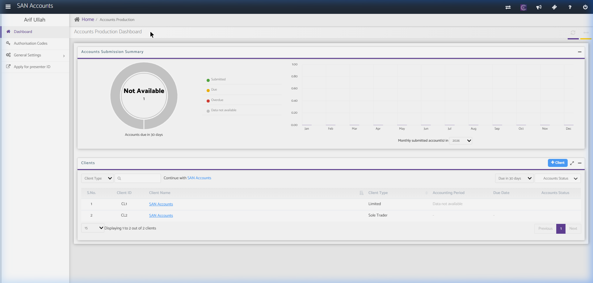
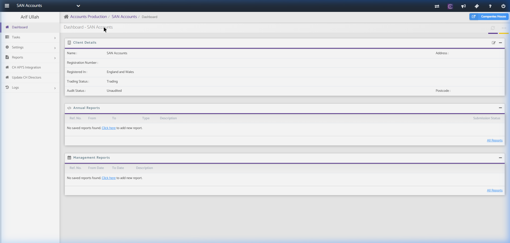
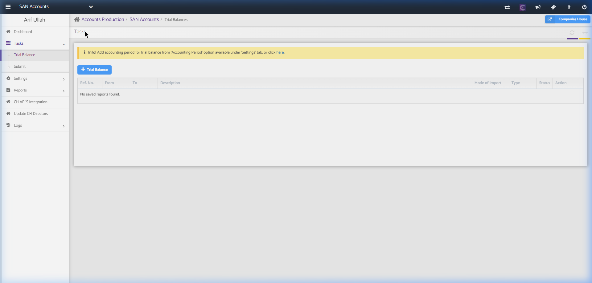
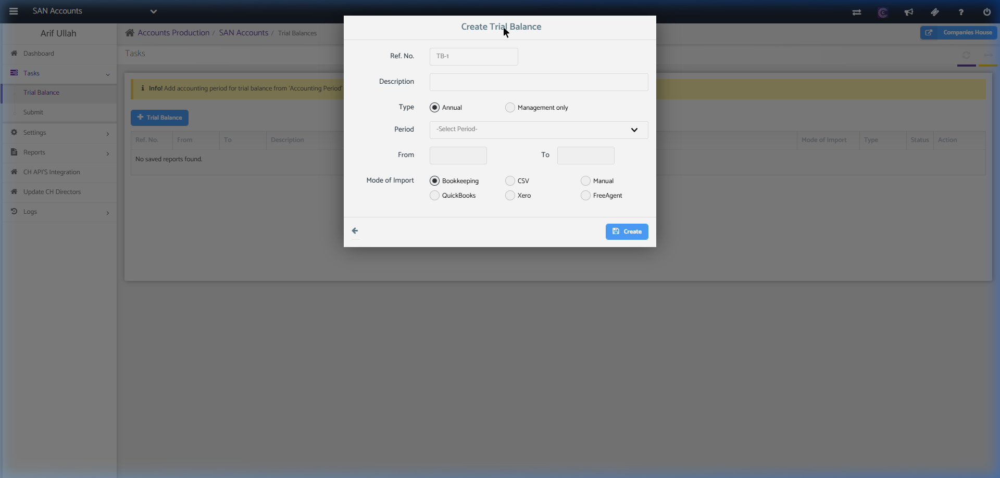
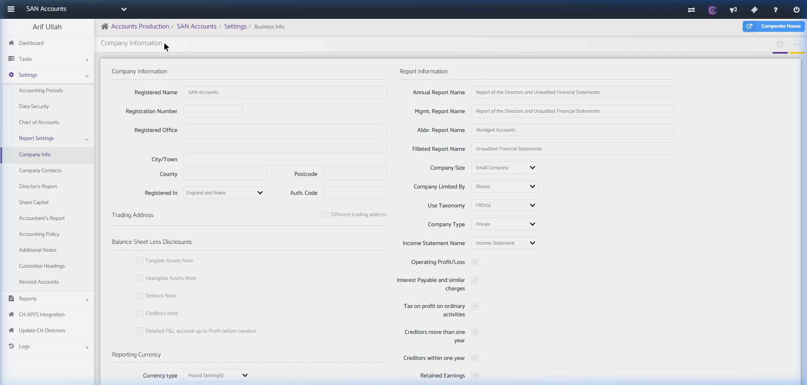
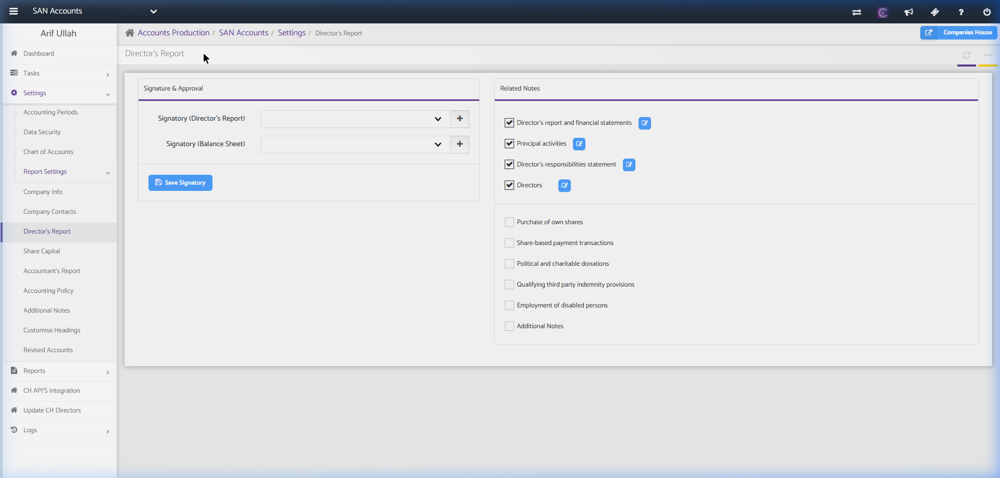
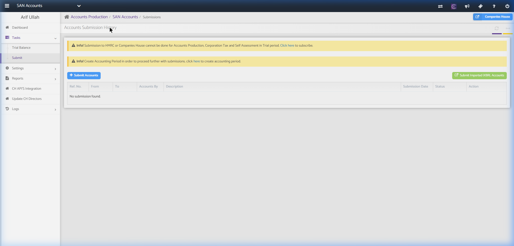

# Accounts Production Module

The Accounts Production module is used to prepare, format, and submit annual and management financial accounts for clients to regulatory authorities (like Companies House).

---

## 1. Accounts Production Home (Client List)

This is the landing page for the Accounts Production module. It allows managing and selecting clients.

### Screenshot Reference

### Key Components

#### A. Header / Navigation Path
- **Path:** `Home / Accounts Production`
- **Utility Bar:** Settings, help, notification icons, and active user profile.

#### B. Accounts Submission Summary Widget
- **Donut Chart:** Shows accounts due in 30 days.
  - **Statuses:** Submitted (Green), Due (Yellow), Overdue (Red), Data not available (Grey).
- **Line/Bar Chart:** Monthly submitted accounts in a selected year (dropdown selection, e.g., 2026).

#### C. Clients Table & Action Controls
- **Search Controls:**
  - **Client Type Dropdown:** Filter clients (e.g., Limited Company, Partnership, Sole Trader, etc.).
  - **Search Input Field:** Search by Client Name or Client ID.
  - **Client Status Dropdown:** Filters based on "Due in 30 days" or custom range.
  - **Accounts Status Dropdown:** Filter by submission progress.
- **Actions:**
  - **+ Client Button:** Button to add a new client to the system (launches client creation form).
- **Clients Table Columns:**
  - `S.No.` (Serial Number)
  - `Client ID` (Unique system ID)
  - `Client Name` (Clickable link navigating to client-specific workspace)
  - `Client Type` (e.g., Limited)
  - `Accounting Period` (e.g., Data not available or current dates)
  - `Due Date`
  - `Accounts Status`
- **Pagination:** Handles displaying results (e.g., "Displaying 1 to 1 out of 1 clients", pagination buttons).

---

## 2. Client Accounts Dashboard (SAN Accounts)

Clicking a client in the list opens the specific accounts preparation dashboard for that client.

### Screenshot Reference

### Key Components

#### A. Breadcrumb / Client Name Indicator
- **Navigation Path:** `Accounts Production / SAN Accounts / Dashboard`
- **Companies House Button:** Fast-access link to the UK Companies House WebFiling portal.

#### B. Left Navigation Sidebar
- **Dashboard:** Returns to the current client's accounts landing page.
- **Tasks Dropdown:**
  - **Trial Balance:** Form for entering and reviewing trial balances.
  - **Submit:** Workflow for electronic submissions to Companies House.
- **Settings Dropdown:**
  - **Accounting Periods:** Set and edit active financial years.
  - **Data Security:** User permissions.
  - **Chart of Accounts:** Setup accounts codes, nominal keys, and groupings.
  - **Report Settings (Sub-menu):**
    - Company Info, Company Contacts, Director's Report, Share Capital, Accountant's Report, Accounting Policy, Additional Notes, Customise Headings, Revised Accounts.
- **Reports Dropdown:**
  - Annual Accounts, Management Accounts, Trial Balance, Nominal Ledger.
- **CH API'S Integration:** Integrates with Companies House Gateway credentials.
- **Update CH Directors:** Pulls and syncs directors list from public registers.
- **Logs Dropdown:**
  - Email Log, User Audit Log.

#### C. Client Details Panel
- Displays static and editable metadata:
  - `Name` (e.g., SAN Accounts)
  - `Registration Number`
  - `Registered In` (e.g., England and Wales)
  - `Trading Status` (e.g., Trading)
  - `Audit Status` (e.g., Unaudited)
  - `Address` & `Postcode`
  - **Edit Button (Pencil Icon):** Opens form to edit client details.

#### D. Annual Reports Panel
- Shows list of saved annual accounts.
- **Add New Report:** "Click here to add new report" link.
- **Columns:** `Ref. No.`, `From`, `To`, `Type`, `Description`, `Submission Status`, `All Reports`.

#### E. Management Reports Panel
- Shows list of saved management accounts.
- **Add New Report:** "Click here to add new report" link.
- **Columns:** `Ref. No.`, `From Date`, `To Date`, `Description`, `All Reports`.

---

## 2.1. Key Accounts Production Sub-Pages

### A. Trial Balance Entry & Import Page
Used to review, manually record, or import trial balance figures for accounts preparation.

#### Screenshot Reference

#### Fields & Features
- **Core Actions:**
  - `+ Trial Balance` Button: Starts a wizard to input a new Trial Balance. Clicking this launches the **Create Trial Balance Modal**.
  - Alert banner warning: *"Info! Add accounting period for trial balance from 'Accounting Period' option available under 'Settings' tab."*
- **Table Columns:** `Ref. No.`, `From`, `To`, `Description`, `Mode of Import` (e.g., CSV, manual, bookkeeping sync), `Type`, `Status`, `Action`.

#### Sub-Action: Create Trial Balance Modal
A configuration dialogue to specify the import method and tax period.

##### Screenshot Reference

##### Form Fields & Features
- `Ref. No.`: Auto-generated code (e.g. TB-1).
- `Description`: Custom reference name.
- `From` and `To` date boxes.
- `Mode of Import` Radio Buttons:
  - `Bookkeeping` (pulls figures from SanSuite Bookkeeping module ledger balances).
  - `CSV` (upload a trial balance matrix from a standard spreadsheet file).
  - `Manual` (opens a ledger list grid for custom debit/credit cell input).
  - Integrations: `QuickBooks`, `Xero`, `FreeAgent` (connects API to pull raw balances directly).
- `Create` submission button.

---

### B. Report Settings (Company Information & Setup)
Manages disclosure choices, reporting currency, and company structure details required to format and generate the annual accounts report.

#### Screenshot Reference

#### Fields & Features
- **Company Information (Left Column):** `Registered Name`, `Registration Number`, `Registered Office`, `City/Town`, `County`, `Postcode`, `Registered In` (England and Wales), `Auth Code` (Companies House auth code).
- **Report Information (Right Column):**
  - Text fields: `Annual Report Name`, `Mgmt. Report Name`, `Abbr. Report Name`, `Filleted Report Name`.
  - Dropdown options: `Company Size` (Small, Micro, Medium, Large), `Company Limited By` (Shares, Guarantee), `Use Taxonomy` (FRS102, FRS105), `Company Type`.
- **Disclosure Options:** Checkboxes to include or omit notes (Tangible Assets Note, Intangible Assets Note, Debtors Note, Creditors Note, etc.).
- **Reporting Currency:** Dropdown selecting currency type (e.g., Pound Sterling £).

#### Sub-Action: Director's Report Settings Panel
A settings workspace located under `Settings` -> `Report Settings` -> `Director's Report` to configure signatures and paragraphs for the statutory directors report.

##### Screenshot Reference

##### Fields & Features
- **Signature & Approval:**
  - `Signatory (Director's Report)`: Selects which registered Director signs the report. Includes a quick `+` button to add contacts.
  - `Signatory (Balance Sheet)`: Selects the Director signing the balance sheet.
  - `Save Signatory` action button.
- **Related Notes checklist (with Edit buttons to modify pre-templated text):**
  - `Director's report and financial statements` (checked).
  - `Principal activities` (checked) — edit statement on core business operations.
  - `Director's responsibilities statement` (checked).
  - `Directors` (checked) — lists active directors.
  - Unchecked notes options: `Purchase of own shares`, `Share-based payment transactions`, `Political and charitable donations`, `Qualifying third party indemnity provisions`, `Employment of disabled persons`, `Additional Notes`.

---

### C. Accounts Submission History Page
The filing center where finalized annual accounts are signed off and submitted electronically to HMRC and Companies House.

#### Screenshot Reference

#### Fields & Features
- **Core Actions:**
  - `+ Submit Accounts` Button: Submits the prepared accounts pack.
  - `Submit Imported iXBRL Accounts` Button: Allows uploading external pre-prepared iXBRL documents for direct submission.
- **Filing History Grid:** Displays `Ref. No.`, `From`, `To`, `Accounts By`, `Description`, `Submission Date`, `Status` (HMRC Ack/Pending/Error), `Action`.

---

## 3. Recommended Database Schema / Data Models

To implement this module, we require the following tables:

### `clients`
- `id` (INT, Primary Key)
- `client_id` (VARCHAR, Unique - e.g., CL1)
- `client_name` (VARCHAR)
- `client_type` (ENUM - Limited, Partnership, SoleTrader, Charity)
- `registration_number` (VARCHAR, Nullable)
- `registered_office_address` (TEXT, Nullable)
- `postcode` (VARCHAR, Nullable)
- `trading_status` (ENUM - Trading, Dormant, Ceased)
- `audit_status` (ENUM - Unaudited, Audited)
- `created_at` (TIMESTAMP)

### `accounting_periods`
- `id` (INT, Primary Key)
- `client_id` (INT, Foreign Key referencing `clients.id`)
- `start_date` (DATE)
- `end_date` (DATE)
- `is_locked` (BOOLEAN)
- `due_date` (DATE)

### `annual_reports`
- `id` (INT, Primary Key)
- `client_id` (INT, Foreign Key referencing `clients.id`)
- `period_id` (INT, Foreign Key referencing `accounting_periods.id`)
- `ref_no` (VARCHAR)
- `report_type` (VARCHAR - e.g., Full, Abbreviated, Micro-entity)
- `description` (TEXT)
- `submission_status` (ENUM - Draft, Pending, Submitted, Rejected)
- `submission_ref` (VARCHAR, Nullable)

### `management_reports`
- `id` (INT, Primary Key)
- `client_id` (INT, Foreign Key referencing `clients.id`)
- `from_date` (DATE)
- `to_date` (DATE)
- `description` (TEXT)
