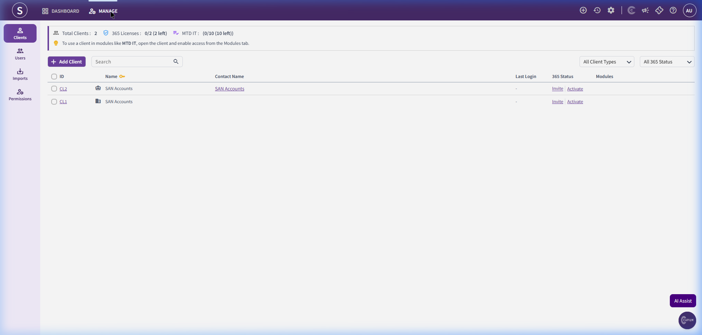

# SanSuite 365 Client Portal Addon

The SanSuite 365 Client Portal is an addon that allows the practice to collaborate directly with their clients. Through this portal, clients can upload documents, review tax returns, communicate, and manage their own MTD (Making Tax Digital) tasks.

---

## 1. Client Portal Dashboard (Manage Clients)

This screen manages client invitations and licenses for the 365 Portal.

### Screenshot Reference

### Key Components

#### A. Status & Licensing Banner
- Displays active licensing stats for the practice:
  - **365 Licenses:** `0/2` (2 left) - represents client-facing portal seats.
  - **MTD IT:** `0/10` (10 left) - represents client-facing Making Tax Digital seats.
  - **Information Notice:** *"To use a client in modules like MTD IT, open the client and enable access from the Modules tab."*

#### B. Sidebar Navigation Menu
- **Clients (Active):** Lists clients available to be onboarded to the portal.
- **Users:** Internal staff or external portal administrators.
- **Imports:** Tool to batch import client users.
- **Permissions:** Granular role controls for portal access.

#### C. Clients Table & Action Controls
- **Search Controls:**
  - **Search Bar:** Input to search client list.
  - **Filters:**
    - Client Type (e.g., All Client Types, Limited, Sole Trader)
    - 365 Status (e.g., All 365 Status, Invited, Active, Inactive)
  - **+ Add Client Button:** Launches portal onboarding form.
- **Table Columns:**
  - `S.No.`
  - `Client ID` (e.g., CL1)
  - `Client Name` (e.g., SAN Accounts)
  - `Client Type` (e.g., Limited)
  - `Action` (Contains buttons to **Invite** or **Activate** portal access)

---

## 2. Recommended Database Schema / Data Models

To implement the 365 Portal addon, we require the following database tables:

### `portal_licenses`
- `id` (INT, Primary Key)
- `license_type` (ENUM - Portal365, MtdIt)
- `total_allocated` (INT)
- `used_count` (INT)

### `portal_client_invitations`
- `id` (INT, Primary Key)
- `client_id` (INT, FK)
- `invite_email` (VARCHAR)
- `token` (VARCHAR, Unique)
- `status` (ENUM - Pending, Accepted, Expired)
- `invited_at` (TIMESTAMP)
- `accepted_at` (TIMESTAMP, Nullable)

### `portal_users`
- `id` (INT, Primary Key)
- `client_id` (INT, FK)
- `email` (VARCHAR, Unique)
- `password_hash` (VARCHAR)
- `first_name` (VARCHAR)
- `last_name` (VARCHAR)
- `is_active` (BOOLEAN)
- `created_at` (TIMESTAMP)
