# Bookkeeping Module

The Bookkeeping module is the core transactional recording system. It manages sales invoices, purchases/bills, bank accounts, VAT returns, contact lists (customers/suppliers), CIS (Construction Industry Scheme), and generates general ledger reports.

---

## 1. Bookkeeping Home (Client List)

This page lists all clients enabled for Bookkeeping, along with their VAT status and filing summaries.

### Screenshot Reference
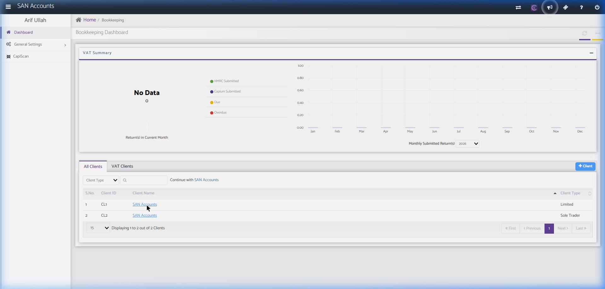

### Key Components

#### A. VAT Summary Widget
- **Donut Chart:** Shows returns in the current month.
  - **Statuses:** HMRC Submitted (Green), SanSuite Submitted (Purple), Due (Yellow), Overdue (Red).
- **Line/Bar Chart:** Monthly submitted VAT returns in a selected year (dropdown selection, e.g., 2026).

#### B. Clients Table & Action Controls
- **Tabs:**
  - **All Clients:** Displays all bookkeeping clients.
  - **VAT Clients:** Filters to only show clients registered for VAT.
- **Search Controls:**
  - **Client Type Dropdown:** Filter by business entity type.
  - **Search Input Field:** Search by Client Name or Client ID.
  - **+ Client Button:** Create a new client.
- **Table Columns:**
  - `S.No.`, `Client ID`, `Client Name` (Clickable link), `Client Type` (e.g., Limited).

---

## 2. Client Bookkeeping Dashboard (SAN Accounts)

Clicking a client opens their transaction recording system.

### Screenshot Reference
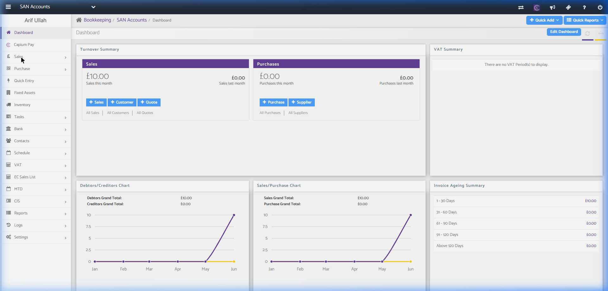

### Key Components

#### A. Top Bar Buttons
- **+ Quick Add Dropdown:** Quick-access links to create Invoice, Quote, Receipt, Purchase, Payment, Customer, Supplier, Journal, Bank Account, or Bank Transfer.
- **Quick Reports Dropdown:** Quick links to Audit Trail, Trial Balance, Profit & Loss, Balance Sheet, Aged Debtors, Aged Creditors.
- **Edit Dashboard Button:** Customizes widgets visibility.

#### B. Sidebar Navigation Menu Structure
The Bookkeeping system has the following sub-menus:

1. **Dashboard:** Active workspace overview.
2. **SanSuite Pay:** Setup credit card / bank payment integrations.
3. **Sales:**
   - *Dashboard:* Sales graphs, outstanding invoices.
   - *Invoices:* List and create sales invoices.
   - *Quotations:* Prepare and send client estimates.
   - *Recurring Invoices:* Set up templates for automated invoicing.
   - *Receipts:* Record client payments received.
   - *Items:* Manage product/service stock catalogs and pricing.
4. **Purchase:**
   - *Dashboard:* Purchase summaries.
   - *Purchases:* List and create purchase invoices / bills.
   - *DocScan:* Document processing (receipt OCR).
   - *Recurring Purchases:* Automation for standing/fixed bills.
   - *Payments:* Record payments made to suppliers.
5. **Quick Entry:** Grid interface for bulk adding multiple sales/purchase items quickly.
6. **Fixed Assets:** Track asset depreciation, acquisitions, and disposals.
7. **Inventory:** Manage stock levels, quantities, and cost of goods sold.
8. **Tasks:**
   - *Journals:* Record double-entry nominal journal adjustments.
   - *Budgeting:* Set up monthly/annual financial targets.
   - *Dividends:* Log dividend distributions to shareholders.
   - *Bulk Edit:* Mass-modify transactions (reclassification tool).
9. **Bank:**
   - *Dashboard:* View bank accounts, cash accounts, and credit card registers.
   - *Bank Transfer:* Record movements between bank accounts.
   - *Bank Feeds:* Link direct bank feeds (Open Banking integration).
10. **Contacts:**
    - Customers, Suppliers, Directors, Shareholders lists.
11. **Schedule:**
    - *Minutes of Meetings:* Log shareholder/board resolutions.
    - *Notes:* General practice/internal notes.
12. **VAT:**
    - *Submit VAT:* Run standard VAT calculation and file returns.
    - *VAT Return Report:* Pre-filing summary reports.
    - *VAT Transactions Detail:* Detailed transaction log grouped by tax box.
    - *VAT Settings:* Configure tax codes (Standard, Zero-rated, Exempt, etc.).
13. **EC Sales List:** Generate reporting for sales to EU countries.
14. **MTD:**
    - *Submit VAT / Bridging VAT / View VAT Details:* Dedicated HMRC Making Tax Digital API connection portal.
15. **CIS:**
    - *Subcontractor:* Manage subcontractor profiles, verification numbers.
    - *CIS300:* File monthly subcontractor deduction returns to HMRC.
    - *Reports:* Statement of payment and deduction.
    - *Contractor Settings:* Configure CIS tax rates and credentials.
16. **Reports:**
    - Access to Customer Reports (Ledgers, Ageing), Supplier Reports, Financials (P&L, Balance Sheet, Trial Balance, Ledger Account), and Additional reports (Audit Trail, Nominal Ledger).
17. **Logs:** Email log, User audit logs.
18. **Settings:** Edit Company Info, Accounting Periods, and custom Chart of Accounts.

---

## 3. Specific Bookkeeping Pages

### A. Sales Invoice Creation Page
Used to generate and customize customer invoices. It supports single-row or batch invoicing, VAT reverse charge applications, direct payment integrations, and PDF attachments.

#### Screenshot Reference
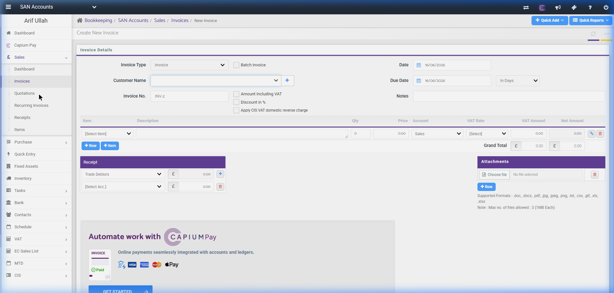

#### Fields & Features
- **Invoice Type:** Dropdown (Invoice, Credit Note, etc.).
- **Batch Invoice Checkbox:** Allows batch invoice entry.
- **Customer Name & Date Fields:** Select customer from a searchable dropdown or add one on-the-fly (`+` button). Date and Due Date picker options.
- **Invoice Items Grid:**
  - **Item Dropdown:** Pre-defined products/services.
  - **Qty & Price:** Numeric inputs.
  - **Account:** Chart of Accounts nominal code selector (defaults to Sales).
  - **VAT Rate & VAT Amount:** Tax options selector (e.g., Standard 20%, Zero 0%, Exempt) with auto-calculated VAT.
- **Receipt Options:** Record a full or partial customer payment immediately at the time of invoicing. Select payment ledger (e.g., Trade Debtors) and destination Bank account.
- **SanSuite Pay Banner:** Call-to-action to link online card payments (Visa, Mastercard, Apple Pay).
- **Attachments Block:** Upload supporting files (drag-and-drop or file selector).

---

### B. Sales Quote Creation Page
Allows preparing estimates/quotes for customers. It has a layout similar to the invoice form but does not post transactional journals until accepted and converted.

#### Screenshot Reference
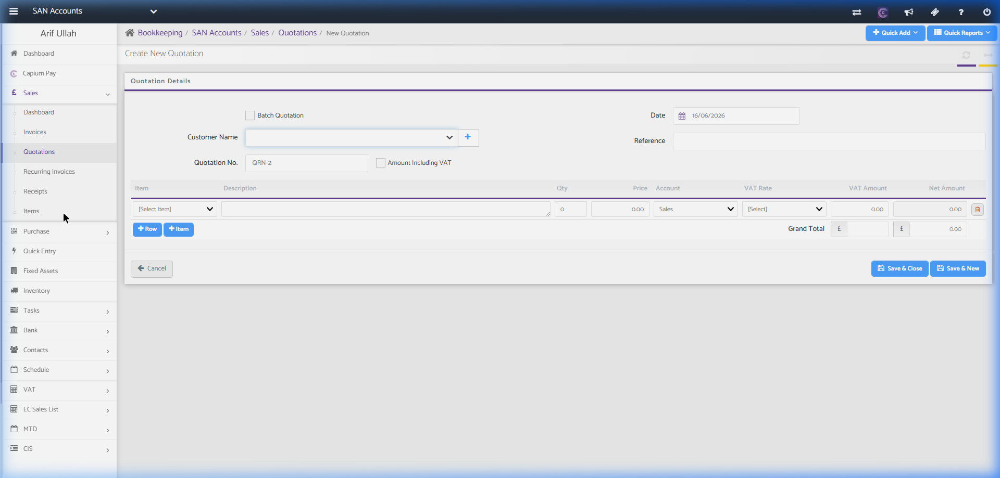

#### Fields & Features
- **Customer Selection:** Dropdown selector.
- **Quote Identification:** Auto-sequenced Quote number (e.g., QRN-2).
- **Reference & Date Fields:** Log customer purchase order references and validity dates.
- **Items Grid:** Select items, quantities, and pricing similar to invoicing.

---

### C. Sales Items List Page
Displays the catalog of items/products sold by the business.

#### Screenshot Reference
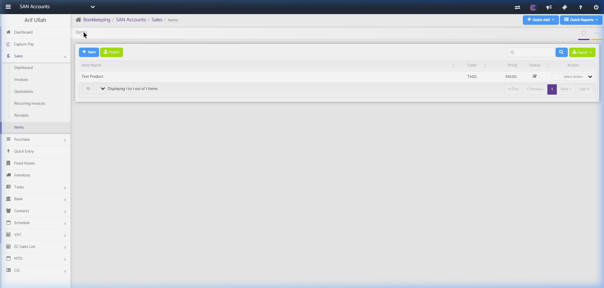

#### Fields & Features
- **Action Buttons:**
  - `+ Item` (Create new product/service catalog item).
  - `Import` (Import catalog list via CSV).
  - `Export` (Export items list to Excel).
- **Search:** Search bar to filter the catalog list.
- **Item Grid:** Displays item Name, Item Code, price, active/inactive status checkbox, and context action dropdowns.

---

### D. Purchases List Page
Displays all supplier invoices and bills. Supports recording new purchases, document imports, and exporting transaction records.

#### Screenshot Reference
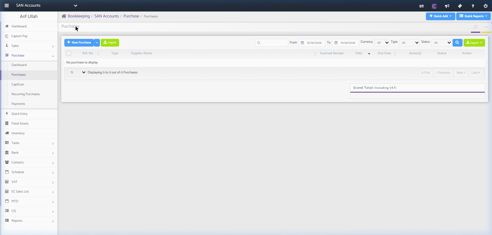

#### Fields & Features
- **Core Actions:**
  - `+ New Purchase` Dropdown: Allows registering a standard purchase invoice, quick payment, or quick credit note. Clicking this launches the **Create New Purchase Form** detail view.
  - `Import`: Mass upload purchases via CSV.
  - `Export`: Export the current filtered list to Excel/CSV.
- **Search & Filters:** Search field + filter parameters (From/To dates, Currency, Type: Cash/Credit, Status: All/Unpaid/Paid).
- **Purchases Table:** Columns include `Ref No.`, `Type`, `Supplier Name`, `Scanned Receipt` (link to OCR attachment if processed), `Date`, `Due Date`, `Amount`, `Status`, and `Action` controls.

#### Sub-Action: Create New Purchase Form
A detailed document creation view accessed by selecting `+ New Purchase` -> `Purchase`.

##### Screenshot Reference
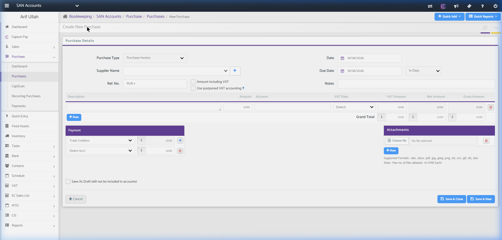

##### Form Fields & Features
- **Purchase Header:**
  - `Purchase Type` Dropdown (e.g. Purchase Invoice, Credit Note).
  - `Supplier Name` dropdown (searchable list with a quick `+` add supplier modal option).
  - `Ref. No.` (pre-sequenced code, e.g., PUR-1).
  - Date selectors: `Date` (invoice date), `Due Date`, or `In Days` term dropdown.
  - `Amount Including VAT` and `Use postponed VAT accounting` checkboxes.
  - `Notes` input area.
- **Items Grid Matrix:** Column inputs for `Description`, `Amount`, nominal `Account` code dropdown, `VAT Rate` selection (20%, 5%, 0%, exempt), auto-computed `VAT Amount`, `Net Amount`, and `Gross Amount` row summation. Support for `+ Row` and row deletion.
- **Payment Split Block:** Allows allocating payments to ledgers like `Trade Creditors` on-the-fly.
- **Attachments Widget:** Choose file or drag-and-drop supporting PDF, JPEG, PNG, CSV, Excel.
- **Save Actions:** `Save & Close`, `Save & New`, and `Save As Draft` checkbox option.

---

### E. Nominal Journal Entries Page
Used to post custom double-entry nominal accounting adjustments, wages journals, and corrections.

#### Screenshot Reference
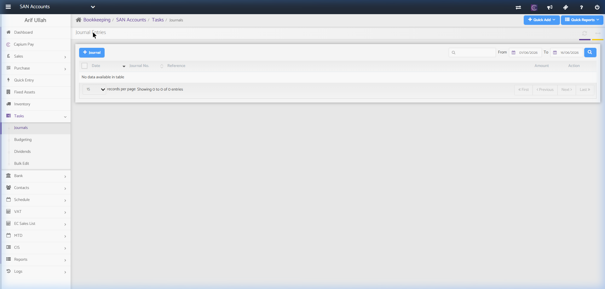

#### Fields & Features
- **Core Actions:**
  - `+ Journal`: Open double-entry journal voucher editor modal.
- **Search & Filters:** Reference/journal number search input + Date Range filter (From/To).
- **Journals Grid:** Displays `Date`, `Journal No.`, `Reference`, `Amount` (total debits/credits balance), and `Action` controls (view, edit, delete).

---

### F. Bank Dashboard Page
Central hub for checking cash in hand, bank accounts, credit card accounts, and link state of Open Banking feeds.

#### Screenshot Reference
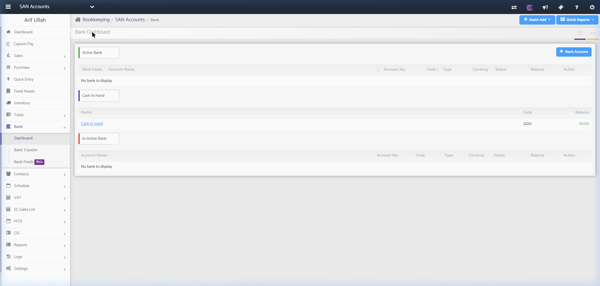

#### Fields & Features
- **Core Actions:**
  - `+ Bank Account`: Register a new asset/bank account ledger. Clicking this opens the **Add Bank Account Modal**.
- **Sections:**
  - **Active Bank:** Lists active bank accounts with `Account Name`, `Account No.`, `Code`, `Type`, `Currency`, feed connection `Status`, ledger `Balance`, and actions (Reconcile, Upload Statement).
  - **Cash In Hand:** Displays current cash-box/petty-cash balance.
  - **In-Active Bank:** Archive section containing deactivated bank account ledgers.

#### Sub-Action: Add Bank Account Modal
A popup dialogue form to create a new financial account ledger.

##### Screenshot Reference
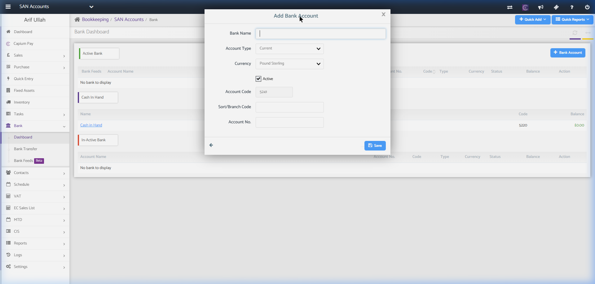

##### Form Fields & Features
- `Bank Name`: Free text entry.
- `Account Type`: Dropdown selection (Current, Savings, Credit Card, Loan, PayPal, etc.).
- `Currency`: Base currency selector (default: Pound Sterling).
- `Active`: Boolean checkbox state control.
- `Account Code`: Nominal ledger ID (auto-allocated based on bank account class, e.g., 5241).
- `Sort/Branch Code` and `Account No.`: Validation fields for standard bank clearance.

---

### G. VAT Submission Page
Handles statutory tax return calculations and filing submissions directly to HMRC under Making Tax Digital (MTD) protocols.

#### Screenshot Reference
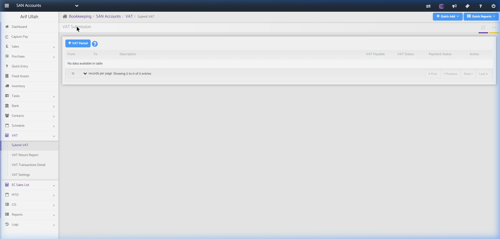

#### Fields & Features
- **Core Actions:**
  - `+ VAT Period`: Setup a new VAT calculation interval (Quarterly, Monthly, or Annual scheme alignment). Clicking this opens the **VAT Period Setup Wizard**.
- **VAT Submission Table:** Columns include `From` date, `To` date, period `Description`, calculated `VAT Payable`, submission `VAT Status` (Draft, Calculated, Filed), `Payment Status` (Unpaid, Paid), and filing `Action` triggers.

#### Sub-Action: VAT Period Setup Wizard
A 4-step structured wizard process to verify and submit tax data.

##### Screenshot Reference
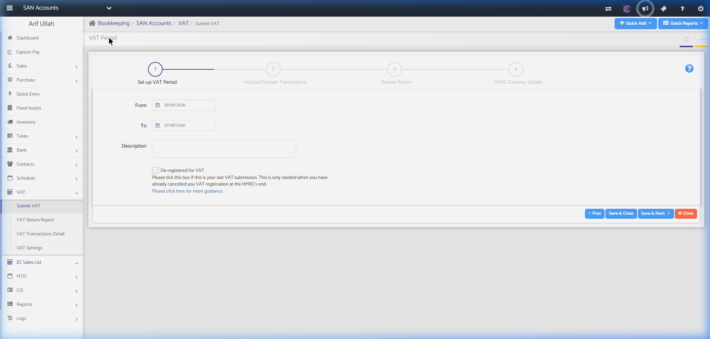

##### Wizard Steps
- **Step 1: Set-up VAT Period:** Select date range (`From` and `To`), add a custom `Description`, and checkbox for `De-registered for VAT` if filing a final return.
- **Step 2: Include/Exclude Transactions:** Review and select which bookkeeping transactions fall within this return period.
- **Step 3: Review Return:** Formats the 9-box VAT return values (VAT due on sales, VAT reclaimed on purchases, net tax due/reclaimed).
- **Step 4: HMRC Gateway Details:** Connects credentials and signs the declaration submission to HMRC.
- **Navigation Controls:** `< Prev`, `Save & Close`, `Save & Next >`, `Close`.

---

## 4. Recommended Database Schema / Data Models

To implement Bookkeeping, we need the following core database tables:

### `sales_invoices`
- `id` (INT, Primary Key)
- `client_id` (INT, FK)
- `customer_id` (INT, FK)
- `invoice_number` (VARCHAR, Unique)
- `invoice_date` (DATE)
- `due_date` (DATE)
- `sub_total` (DECIMAL(15,2))
- `vat_total` (DECIMAL(15,2))
- `grand_total` (DECIMAL(15,2))
- `status` (ENUM - Draft, Unpaid, Paid, PartiallyPaid, Void)
- `created_at` (TIMESTAMP)

### `invoice_items`
- `id` (INT, Primary Key)
- `invoice_id` (INT, FK referencing `sales_invoices.id`)
- `item_description` (TEXT)
- `quantity` (DECIMAL(10,2))
- `unit_price` (DECIMAL(15,2))
- `vat_rate` (DECIMAL(5,2) - e.g., 20.00)
- `vat_amount` (DECIMAL(15,2))
- `net_amount` (DECIMAL(15,2))
- `nominal_code` (VARCHAR - e.g., 4000)

### `purchases`
- `id` (INT, Primary Key)
- `client_id` (INT, FK)
- `supplier_id` (INT, FK)
- `bill_number` (VARCHAR)
- `bill_date` (DATE)
- `due_date` (DATE)
- `sub_total` (DECIMAL(15,2))
- `vat_total` (DECIMAL(15,2))
- `grand_total` (DECIMAL(15,2))
- `status` (ENUM - Unpaid, Paid, PartiallyPaid)

### `bank_transactions`
- `id` (INT, Primary Key)
- `client_id` (INT, FK)
- `bank_account_id` (INT, FK)
- `transaction_date` (DATE)
- `description` (TEXT)
- `debit` (DECIMAL(15,2) - Receipt)
- `credit` (DECIMAL(15,2) - Payment)
- `balance` (DECIMAL(15,2))
- `is_reconciled` (BOOLEAN)
- `matched_to_type` (VARCHAR - e.g., Invoice, Expense)
- `matched_to_id` (INT, Nullable)

### `contacts`
- `id` (INT, Primary Key)
- `client_id` (INT, FK)
- `contact_type` (ENUM - Customer, Supplier, Director, Shareholder)
- `name` (VARCHAR)
- `email` (VARCHAR, Nullable)
- `phone` (VARCHAR, Nullable)
- `address` (TEXT, Nullable)
- `vat_number` (VARCHAR, Nullable)
