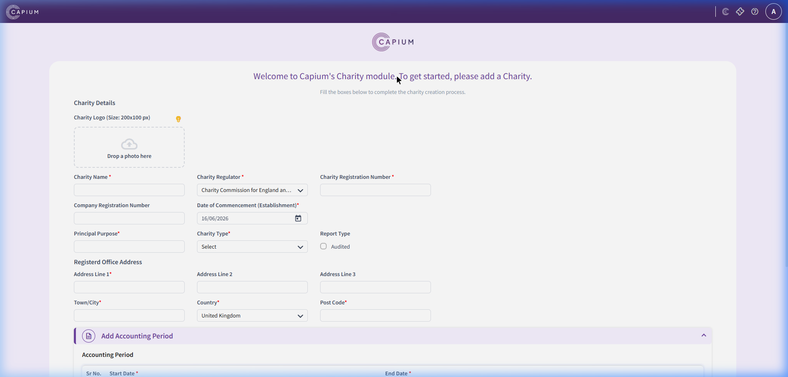

# Charity Accounts Module

The Charity Accounts module is a specialized version of the Accounts Production module tailored to meet SORP (Statement of Recommended Practice) reporting guidelines for registered charities in the UK.

---

## 1. Charity Onboarding / Setup Form

Since no charity is initially configured, the module prompts the user to add their first charity.

### Screenshot Reference

### Form Sections & Fields

#### A. Charity Details
- **Charity Logo:** Drag-and-drop zone (recommended size: 200x100 pixels).
- **Charity Name (`*` Required):** Text input.
- **Charity Regulator (`*` Required):** Dropdown menu containing:
  - Charity Commission for England and Wales
  - Office of the Scottish Charity Regulator (OSCR)
  - Charity Commission for Northern Ireland
- **Charity Registration Number (`*` Required):** Text input.
- **Company Registration Number (Optional):** Text input (for incorporated charities).
- **Date of Commencement (Establishment) (`*` Required):** Date input picker.
- **Principal Purpose (`*` Required):** Text input (describing the charity's mission).
- **Charity Type (`*` Required):** Dropdown select (e.g., Trust, Association, CIO, Company Limited by Guarantee).
- **Report Type (Optional):** Checkbox for "Audited" (to indicate if accounts require an independent audit report instead of just an examiner's report).

#### B. Registered Office Address
- **Address Line 1 (`*` Required):** Text input.
- **Address Line 2 & 3 (Optional):** Text inputs.
- **Town/City (`*` Required):** Text input.
- **Country (`*` Required):** Dropdown select (defaulted to "United Kingdom").
- **Post Code (`*` Required):** Text input.

#### C. Add Accounting Period (Accordion Panel)
- Grid table to configure the financial years:
  - **Columns:** `Sr No.`, `Start Date *`, `End Date *`

#### D. Add Contact Info (Accordion Panel)
- **Contact Person:** Text input.
- **Phone:** Text input.
- **Mobile Number:** Text input.
- **Email:** Email input.
- **Alternative Email:** Email input.
- **Website:** URL input.

#### E. Add Accounting Details (Accordion Panel)
- **Accounting Method (`*` Required):** Dropdown select (e.g., Accrual Basis, Receipts and Payments Basis).
- **Currency (`*` Required):** Dropdown select (default: "United Kingdom - Pounds - GBP").
- **Is this charity registered for VAT? (`*` Required):** Toggle switch (Yes/No).

#### F. Actions
- **Get Started Button:** Submits the form to instantiate the charity workspace.
- **Reset Button:** Clears all fields.

---

## 2. Recommended Database Schema / Data Models

To implement this module, we require the following tables:

### `charities`
- `id` (INT, Primary Key)
- `name` (VARCHAR)
- `logo_path` (VARCHAR, Nullable)
- `regulator` (VARCHAR)
- `charity_reg_number` (VARCHAR)
- `company_reg_number` (VARCHAR, Nullable)
- `commencement_date` (DATE)
- `principal_purpose` (TEXT)
- `charity_type` (VARCHAR)
- `is_audited` (BOOLEAN)
- `address_line1` (VARCHAR)
- `address_line2` (VARCHAR, Nullable)
- `address_line3` (VARCHAR, Nullable)
- `town_city` (VARCHAR)
- `country` (VARCHAR)
- `postcode` (VARCHAR)
- `accounting_method` (ENUM - Accrual, ReceiptsPayments)
- `currency` (VARCHAR)
- `is_vat_registered` (BOOLEAN)
- `created_at` (TIMESTAMP)

### `charity_accounting_periods`
- `id` (INT, Primary Key)
- `charity_id` (INT, FK referencing `charities.id`)
- `start_date` (DATE)
- `end_date` (DATE)
- `is_locked` (BOOLEAN)

### `charity_contacts`
- `id` (INT, Primary Key)
- `charity_id` (INT, FK referencing `charities.id`)
- `contact_person` (VARCHAR)
- `phone` (VARCHAR, Nullable)
- `mobile` (VARCHAR, Nullable)
- `email` (VARCHAR, Nullable)
- `website` (VARCHAR, Nullable)
