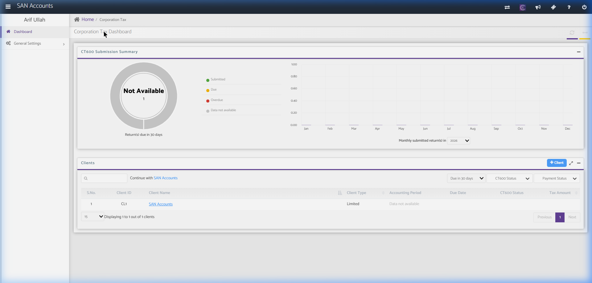
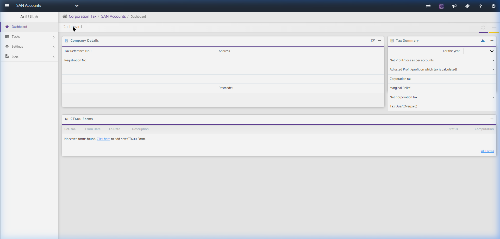
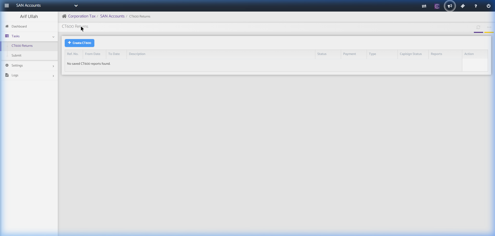
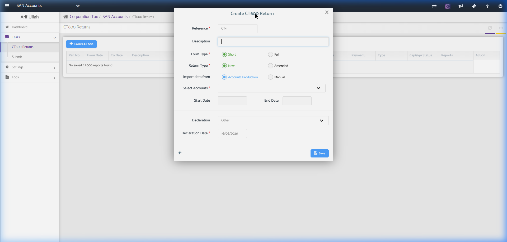
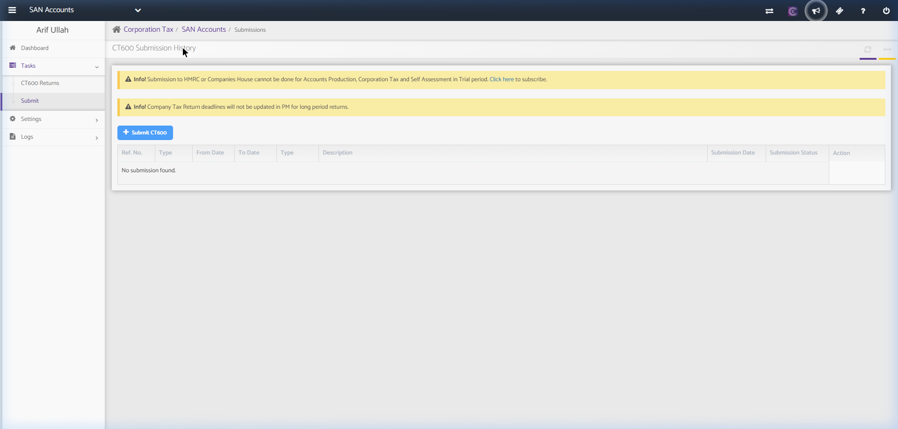

# Corporation Tax Module

The Corporation Tax module calculates tax liabilities for limited companies and automates the preparation and submission of HMRC Form CT600 alongside iXBRL tax computations.

---

## 1. Corporation Tax Home (Client List)

This page displays the list of clients and summarizes their CT600 submission statuses.

### Screenshot Reference

### Key Components

#### A. CT600 Submission Summary Widget
- **Status Categories:** Submitted (Green), Due (Yellow), Overdue (Red), Data not available (Grey).
- **Line/Bar Chart:** Monthly submitted CT600 returns in a selected year (dropdown selection).

#### B. Clients Table & Action Controls
- **Search Controls:**
  - **Search Input Field:** Search by Client Name or Client ID.
  - **Filter Dropdowns:**
    - Due Date Range (e.g., Due in 30 days)
    - CT600 Status
    - Payment Status
  - **+ Client Button:** Adds a new client to the corporation tax ledger.
- **Table Columns:**
  - `S.No.`, `Client ID`, `Client Name` (Clickable link), `Client Type`, `Accounting Period`, `Due Date`, `CT600 Status`, `Tax Amount`.

---

## 2. Client Corporation Tax Dashboard (SAN Accounts)

Clicking a client opens their corporation tax dashboard.

### Screenshot Reference

### Key Components

#### A. Sidebar Navigation Menu Structure
- **Dashboard:** Returns to the current client's CT home page.
- **Tasks Dropdown:**
  - **CT600 Returns:** Interface to prepare tax calculations, add adjustments (capital allowances, depreciation, disallowable expenses), and generate the CT600 XML.
  - **Submit:** Handles the gateway validation and electronic submission of CT600 & accounts to HMRC.
- **Settings Dropdown:**
  - **Accounting Periods:** Setup and configure the Corporation Tax accounting periods (usually aligned with the financial year but capped at 12 months for CT purposes).
  - **Data Security:** Adjust roles/permissions.
- **Logs Dropdown:**
  - **Email Log:** Tracks emails sent from this module.
  - **User Log:** Audit trail of user actions within this client's CT environment.

#### B. Company Details Panel
- Displays reference details:
  - `Tax Reference No.` (e.g., 10-digit UTR - Unique Taxpayer Reference)
  - `Registration No.` (Companies House company number)
  - `Address` & `Postcode`
  - **Edit Button (Pencil Icon):** Modifies company reference details.

#### C. Tax Summary Panel
- **Tax Year Dropdown:** Selects the period to display.
- **Financial Rows:**
  - `Net Profit/Loss as per accounts` (imported from Bookkeeping/Accounts Production)
  - `Adjusted Profit (profit on which tax is calculated)` (after tax adjustments)
  - `Corporation tax` (calculated at the prevailing corporate tax rate)
  - `Marginal Relief` (if applicable)
  - `Net Corporation tax`
  - `Tax Due/(Overpaid)`
- **Download Button (Tray Icon):** Downloads the summary sheet.

#### D. CT600 Forms Panel
- Shows list of prepared CT600 forms.
- **Add New Form Link:** "Click here to add new CT600 Form."
- **Columns:** `Ref. No.`, `From Date`, `To Date`, `Description`, `Status`, `Computation`.

---

## 2.1. Key Corporation Tax Sub-Pages

### A. CT600 Returns List Page
Displays all created CT600 forms and calculations for the selected client.

#### Screenshot Reference

#### Fields & Features
- **Core Actions:**
  - `+ Create CT600` Button: Launches the wizard to create a new CT600 return. Clicking this opens the **Create CT600 Return Modal**.
- **CT600 Returns Grid:** Columns include `Ref. No.`, `From Date`, `To Date`, `Description`, filing `Status` (Draft, Ready, Filed), `Payment` Status, `Type`, `Capisign Status` (e.g., Sent for Sign, Signed), generated tax computation `Reports`, and `Action` controls.

#### Sub-Action: Create CT600 Return Modal
A setup configuration dialogue to define the scope and parameters of the statutory company tax return.

##### Screenshot Reference

##### Form Fields & Features
- `Reference *`: Sequenced code (default: CT-1).
- `Description`: Custom label.
- `Form Type *`: Radio selection between `Short` (default, standard simple return) and `Full` (for companies with complex capital allowances, group relief, etc.).
- `Return Type *`: Radio selection between `New` (original submission) and `Amended` (for correcting previous submissions).
- `Import data from`: Radio selection between `Accounts Production` (default, auto-populates financial figures from AP) and `Manual` (allows keying values in).
- `Select Accounts *`: Dropdown listing matching accounting period packs generated in Accounts Production.
- `Start Date` & `End Date`: Automatically populated based on the selected Accounts Production period.
- `Declaration` Dropdown: Specify the declarant role (e.g. Director, Other).
- `Declaration Date *`: Date field (defaulted to current date).
- `Save` confirmation button.

---

### B. CT600 Submission History Page
Handles gateway validation, XML schema checking, and electronic submission of CT600 + Accounts packages to HMRC.

#### Screenshot Reference

#### Fields & Features
- **Core Actions:**
  - `+ Submit CT600` Button: Submits the selected CT600 return.
- **Submissions Grid:** Columns include `Ref. No.`, return `Type`, period `From Date`, `To Date`, return `Type`, `Description`, `Submission Date`, HMRC Gateway `Submission Status`, and `Action` logs.
- **Warning and Info Alerts:**
  - *"Info! Submission to HMRC or Companies House cannot be done for Accounts Production, Corporation Tax and Self Assessment in Trial period. Click here to subscribe."*
  - *"Info! Company Tax Return deadlines will not be updated in PM for long period returns."*

---

## 3. Recommended Database Schema / Data Models

To implement Corporation Tax, we require the following database tables:

### `ct600_returns`
- `id` (INT, Primary Key)
- `client_id` (INT, FK)
- `period_id` (INT, FK referencing `accounting_periods.id`)
- `ref_no` (VARCHAR, Unique)
- `description` (TEXT)
- `net_profit_loss` (DECIMAL(15,2))
- `disallowable_expenses` (DECIMAL(15,2))
- `capital_allowances` (DECIMAL(15,2))
- `adjusted_profit` (DECIMAL(15,2))
- `tax_rate` (DECIMAL(5,2))
- `tax_liability` (DECIMAL(15,2))
- `marginal_relief` (DECIMAL(15,2))
- `net_tax_due` (DECIMAL(15,2))
- `status` (ENUM - Draft, Calculated, Submitted, Rejected)
- `xml_payload` (LONGTEXT - the generated CT600 XML)
- `created_at` (TIMESTAMP)

### `ct_submissions`
- `id` (INT, Primary Key)
- `return_id` (INT, FK referencing `ct600_returns.id`)
- `correlation_id` (VARCHAR)
- `submitted_at` (TIMESTAMP)
- `hmrc_status` (ENUM - Pending, Accepted, Rejected)
- `response_message` (TEXT, Nullable)
