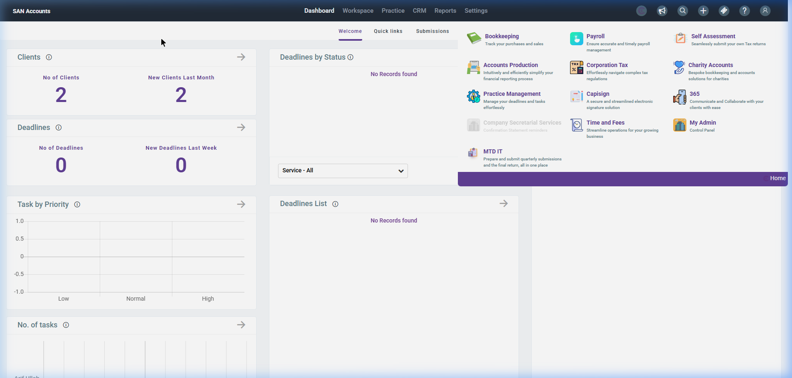

# SanSuite Ecosystem Dashboard

The primary entry point after authentication, presenting the user (Arif Ullah) with the SanSuite Ecosystem dashboard. It is categorized into accounting modules, practice management tools, addons, and new features.

## Screenshot Reference

## Page Layout & Components

### 1. Global Header Navbar
- **Brand Logo:** SanSuite logo on the top-left.
- **Utility Indicators:**
  - `C` Icon: Likely SanSuite Hub or Settings indicator.
  - `AU` (User Profile Avatar): Arif Ullah. Displays account settings, profile, or logout menu upon click.

### 2. Main Navigation Grid
The core workspace is divided into four structural panels:

#### A. ACCOUNTING (Simplify compliance, optimise finances and elevate your Practice)
- **Accounts Production**
  - *Description:* Fast, integrated accounts filing.
  - *Action:* Navigates to the Accounts Production suite for client accounts generation and filing.
- **Bookkeeping**
  - *Description:* Track client Finances.
  - *Action:* Opens the client bookkeeping ledgers, transaction records, and reconciliations.
- **Charity Accounts**
  - *Description:* Easy SORP-compliant reporting.
  - *Action:* Launches the charity specific accounts production workflow.
- **Corporation Tax**
  - *Description:* Auto-filled CT600 & iXBRL submissions.
  - *Action:* Opens corporation tax module for preparing and submitting CT600 tax forms.
- **Payroll**
  - *Description:* Fully automated, compliant payroll.
  - *Action:* Accesses payroll management for managing payslips, pension, RTI submissions.
- **Self Assessment**
  - *Description:* Quick tax returns with HMRC data.
  - *Action:* Directs to SA100 and related schedules preparation.

#### B. MY PRACTICE (Manage communication, records and deadlines within Practice)
- **Company Secretarial**
  - *Description:* Smooth formations & compliance.
  - *Status:* Disabled / Greyed out (indicates lack of subscription or disabled feature).
- **Practice Management**
  - *Description:* Simplified deadlines & client tasks.
  - *Action:* Manages tasks, clients, deadlines, and workflow automation.
- **Time and Fees**
  - *Description:* Track time, bill, and get paid.
  - *Action:* Tracks time sheets, billing, invoicing, and fee recovery.

#### C. ADDONS (Which elevates what it gets added to)
- **365**
  - *Description:* Communicate and Collaborate with your clients with ease.
  - *Action:* Launches client collaboration/communication portal.
- **Capisign**
  - *Description:* A secure and streamlined electronic signature solution.
  - *Action:* Directs to e-signature workflow and signed document tracking.

#### D. NEW (New featured modules)
- **MTD IT**
  - *Description:* Prepare and submit quarterly submissions and the final return, all in one place.
  - *Action:* Launches Making Tax Digital for Income Tax (MTD ITSA) module.
