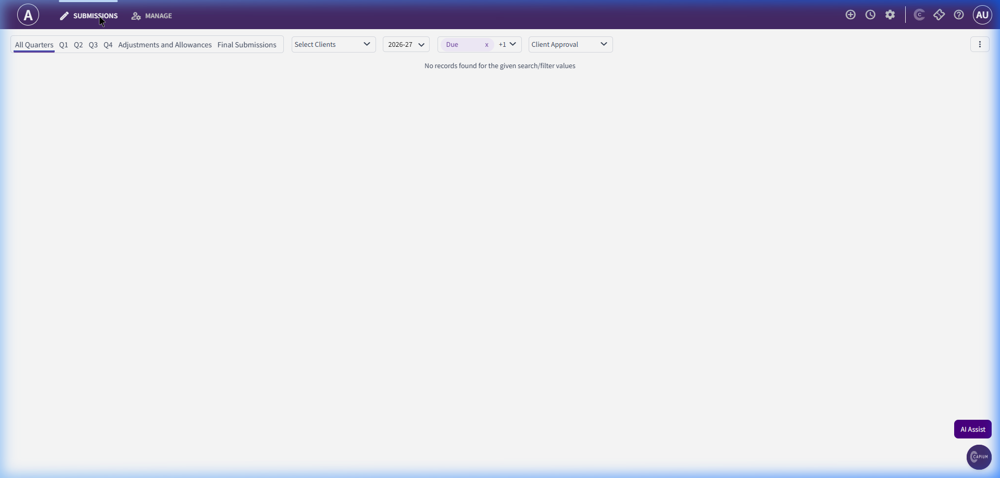
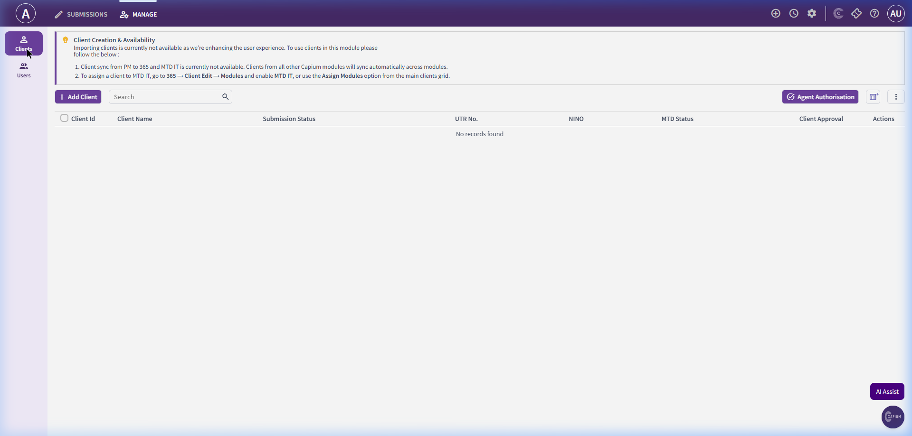
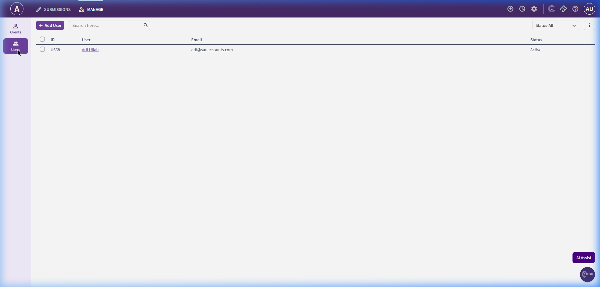

# MTD IT Module (Making Tax Digital for Income Tax)

Making Tax Digital for Income Tax (MTD IT / MTD ITSA) is HMRC's initiative requiring sole traders and landlords with qualifying income to keep digital records and submit quarterly summaries. SanSuite's MTD IT module manages client registration, logs quarterly transactions, tracks submission schedules, and submits quarterly returns to HMRC.

---

## 1. MTD IT Workspaces

### A. Submissions Dashboard (Home Page)
The default view upon entering the MTD IT module.

#### Screenshot Reference

#### Key Components
- **Quarterly Submission Tabs:**
  - `All Quarters`
  - `Q1` (Quarter 1)
  - `Q2` (Quarter 2)
  - `Q3` (Quarter 3)
  - `Q4` (Quarter 4)
  - `Adjustments and Allowances` (For year-end corrections)
  - `Final Submissions` (Replaces the traditional SA100 return)
- **Dashboard Filter Controls:**
  - **Select Clients:** Dropdown filter to isolate individual client submissions.
  - **Tax Year:** Dropdown list (default: `2026-27`).
  - **Due Status:** Filter by Overdue, Due, Filed, or Pending.
  - **Client Approval:** Filter by Approved, Pending Client, or Not Sent.

---

### B. Manage Clients Screen
This page displays clients currently registered under MTD IT.

#### Screenshot Reference

#### Key Components
- **Client Creation Notice Banner:**
  - *"Importing clients is currently not available... To assign a client to MTD IT, go to 365 -> Client Edit -> Modules and enable MTD IT, or use the Assign Modules option from the main clients grid."*
- **Action Buttons:**
  - `+ Add Client` (Launches manual onboarding form)
  - `Agent Authorisation` (Links HMRC Agent credentials)
  - **Search:** Text input field to filter the active grid.
- **Client Grid Columns:**
  - `Client ID`
  - `Client Name`
  - `Submission Status`
  - `UTR No.` (Unique Taxpayer Reference)
  - `NINO` (National Insurance Number)
  - `MTD Status` (e.g., Active, Registered, Unregistered)
  - `Client Approval`
  - `Actions`

---

### C. Manage Users Screen
Controls access privileges for internal accountants within the MTD IT workspace.

#### Screenshot Reference

#### Key Components
- **Action Buttons:**
  - `+ Add User`
  - **Search:** Filter the staff user list.
- **User Grid Columns:**
  - `ID`
  - `User` (Name)
  - `Email`
  - `Status` (Active, Inactive)

---

## 2. Recommended Database Schema / Data Models

To implement MTD IT, we require the following database tables:

### `mtd_it_clients`
- `id` (INT, Primary Key)
- `client_id` (INT, FK referencing `clients.id`)
- `utr_number` (VARCHAR, 10-digit)
- `nino` (VARCHAR)
- `mtd_status` (ENUM - Unregistered, Active, Suspended)
- `agent_authorised` (BOOLEAN)
- `created_at` (TIMESTAMP)

### `mtd_it_quarters`
- `id` (INT, Primary Key)
- `mtd_client_id` (INT, FK referencing `mtd_it_clients.id`)
- `tax_year` (VARCHAR - e.g., 2026-27)
- `quarter_number` (INT - 1, 2, 3, 4)
- `start_date` (DATE)
- `end_date` (DATE)
- `due_date` (DATE)
- `status` (ENUM - Open, Due, Submitted, Overdue)

### `mtd_it_quarter_submissions`
- `id` (INT, Primary Key)
- `mtd_quarter_id` (INT, FK referencing `mtd_it_quarters.id`)
- `gross_income` (DECIMAL(15,2))
- `allowable_expenses` (DECIMAL(15,2))
- `net_profit` (DECIMAL(15,2))
- `submitted_at` (TIMESTAMP)
- `hmrc_submission_id` (VARCHAR)
- `status` (ENUM - Draft, Pending, Success, Error)
- `error_log` (TEXT, Nullable)

### `mtd_it_adjustments`
- `id` (INT, Primary Key)
- `mtd_client_id` (INT, FK)
- `tax_year` (VARCHAR)
- `adjustment_type` (VARCHAR - e.g., Capital Allowances, Balancing Charges)
- `amount` (DECIMAL(15,2))
- `submitted_at` (TIMESTAMP)
