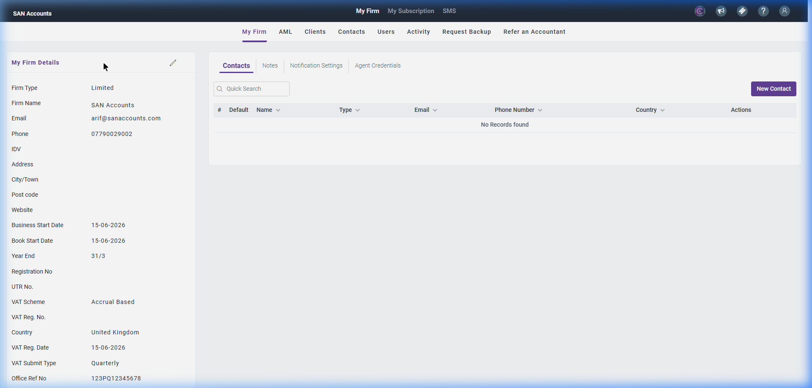
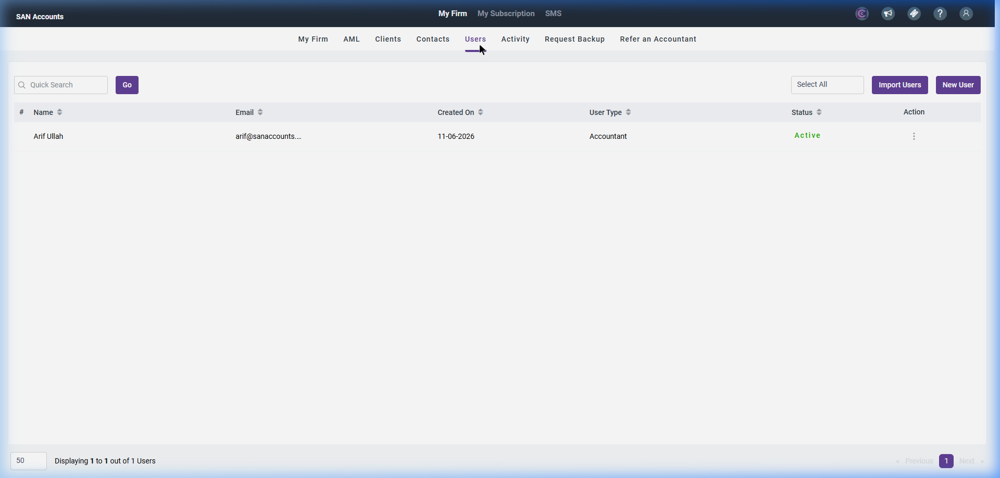
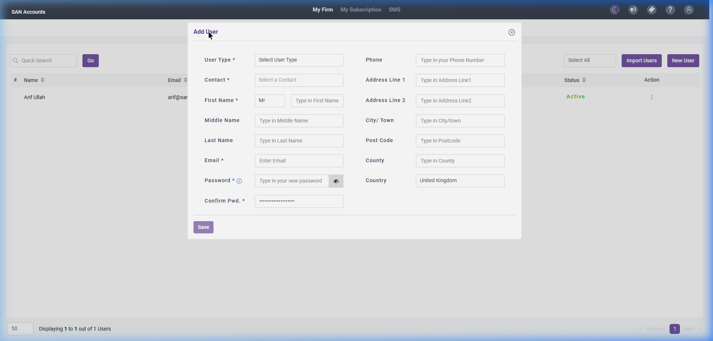
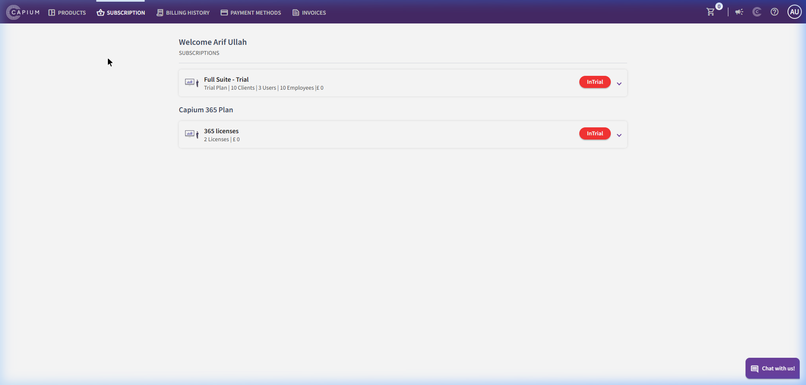

# My Admin Module

The My Admin module manages the global settings of the accounting firm tenant. It handles firm-level details, HMRC Agent credentials, user access, anti-money laundering (AML) portal integrations, practice subscription/billing, and outgoing bulk SMS communications.

---

## 1. My Admin Workspaces

### A. My Firm (Firm Settings)
This section manages the core profile of the accountancy practice.

#### Screenshot Reference

#### Key Components
- **My Firm Details (Left Panel):**
  - `Firm Type` (e.g., Limited, Partnership, Sole Proprietorship)
  - `Firm Name` (e.g., SAN Accounts)
  - `Email`, `Phone`, `Address`, `City`, `Post Code`
  - `Business Start Date`, `Book Start Date`
  - `Year End` (e.g., 31/3)
  - `VAT Scheme` (e.g., Accrual Based, Cash Based)
  - `VAT Reg. No.`, `VAT Reg. Date`, `VAT Submit Type` (e.g., Quarterly)
- **Settings Tabs (Right Panel):**
  - **Contacts:** Internal/External administrative contacts list.
  - **Notes:** Practice admin notes.
  - **Notification Settings:** Controls system alert routing.
  - **Agent Credentials:** Settings to store agent-level HMRC credentials for automated filing.
- **My Firm Sub-Navigation Tabs:**
  - **My Firm (Active):** Displays firm details and administrative contacts.
  - **AML:** Connects to Veriphy or other AML compliance verification portals.
  - **Clients:** Displays practice license limits (e.g., `Total 10, Used 0, Remaining 10`) and list of registered client companies.
  - **Contacts:** Central address book of contacts.
  - **Users:** Master directory of staff users, roles, and status (Active/Inactive).
  - **Activity:** Detailed audit logs showing logins, modifications, and timestamps.
  - **Request Backup:** Allows downloading full SQL/zipped data backups of the tenant workspace.

---

### B. My Subscription
Manages billing and software licenses.

#### Key Components
- **Products Tab:** View or upgrade tiers (e.g., Small - 100 Clients, Medium - 300 Clients, Large - 500 Clients).
- **Billing History Tab:** Download invoices for software fees.
- **Payment Methods Tab:** Manage credit cards or Direct Debit authorizations.
- **Invoices Tab:** History of payments to SanSuite.

---

### C. SMS (Bulk SMS Settings)
Used to send automated tax notifications or reminders to clients.

#### Key Components
- **Dashboard:** Balance monitoring and send SMS wizard.
- **Scheduled:** Outgoing queue management.
- **Templates:** Set up standard SMS message templates (e.g., *"Dear client, your VAT return is due..."*).

---

## 1.2. Key My Admin Sub-Pages

### A. Users Directory Page
A master control panel to manage internal staff users, designate permission profiles (Admin, Accountant, Staff), and monitor account states.

#### Screenshot Reference

#### Fields & Features
- **Core Actions:**
  - `+ Add User` Button: Launches the user setup modal to register a new staff login. Clicking this opens the **Add User Modal** (New User).
  - Search field: Fast filter staff list by name or email.
- **Users Table:** Columns include `Staff Name`, `Email`, `User Role`, `Access Permissions`, `Last Login Date`, `Status` (Active, In-Active toggle), and `Action` controls.

#### Sub-Action: Add User Modal (New User)
A detailed registration profile sheet to create credentials and personal files for a new user.

##### Screenshot Reference

##### Form Fields & Features
- `User Type *`: Dropdown role profile (Admin, Accountant, Auditor, Staff).
- `Contact *`: Searchable list linking user profile to CRM contact lists.
- `First Name *`: Title dropdown (Mr, Mrs, Ms, Miss, Dr) and text input.
- `Middle Name` & `Last Name`: Text inputs.
- `Email *`: Unique email address for registration and login notifications.
- `Password *` & `Confirm Pwd. *`: Secure password assignment fields with a visibility toggle button.
- Contact Details: `Phone`, `Address Line 1`, `Address Line 2`, `City/Town`, `Post Code`, `County`, `Country` (United Kingdom defaulted).
- `Save` submission trigger.

---

### B. Practice Subscriptions Page (SanSuite Store)
The billing and licensing dashboard where practices buy, upgrade, or renew SanSuite module licenses, client count limits, and SMS credits.

#### Screenshot Reference

#### Fields & Features
- **Sections & Tabs:**
  - **Products / Subscriptions:** Displays package tiers (e.g., Accounts Production, Bookkeeping, Payroll) and active client capacities.
  - **Billing History / Invoices:** List of historical payments to SanSuite with download buttons.
  - **Direct Debit Setup:** Interface to save bank accounts for auto-payments.

---

## 2. Recommended Database Schema / Data Models

To implement My Admin, we require the following database tables:

### `firm_details`
- `id` (INT, Primary Key)
- `practice_id` (INT, FK)
- `firm_name` (VARCHAR)
- `firm_type` (VARCHAR)
- `email` (VARCHAR)
- `phone` (VARCHAR)
- `address_line_1` (VARCHAR)
- `post_code` (VARCHAR)
- `business_start_date` (DATE)
- `vat_scheme` (VARCHAR)
- `vat_reg_number` (VARCHAR)
- `agent_credentials_hmrc_id` (VARCHAR, Nullable)
- `agent_credentials_hmrc_password_encrypted` (VARCHAR, Nullable)

### `firm_backups`
- `id` (INT, Primary Key)
- `practice_id` (INT, FK)
- `requested_by_user_id` (INT)
- `requested_at` (TIMESTAMP)
- `backup_file_path` (VARCHAR, Nullable)
- `status` (ENUM - Pending, Running, Ready, Expired)

### `sms_logs`
- `id` (INT, Primary Key)
- `practice_id` (INT, FK)
- `recipient_phone` (VARCHAR)
- `message_text` (TEXT)
- `sent_at` (TIMESTAMP)
- `status` (ENUM - Sent, Delivered, Failed)

### `practice_subscriptions`
- `id` (INT, Primary Key)
- `practice_id` (INT, FK)
- `tier_name` (VARCHAR - e.g., Small, Medium)
- `max_clients` (INT)
- `start_date` (DATE)
- `expiry_date` (DATE)
- `payment_status` (ENUM - Active, Delinquent, Cancelled)
