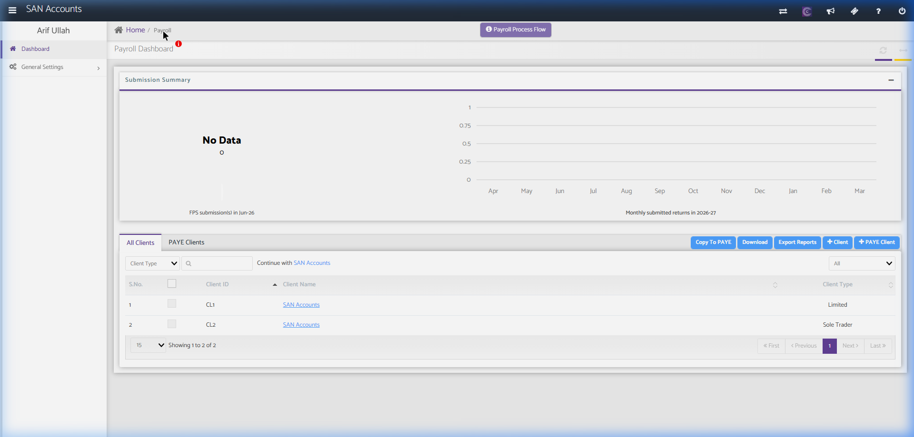
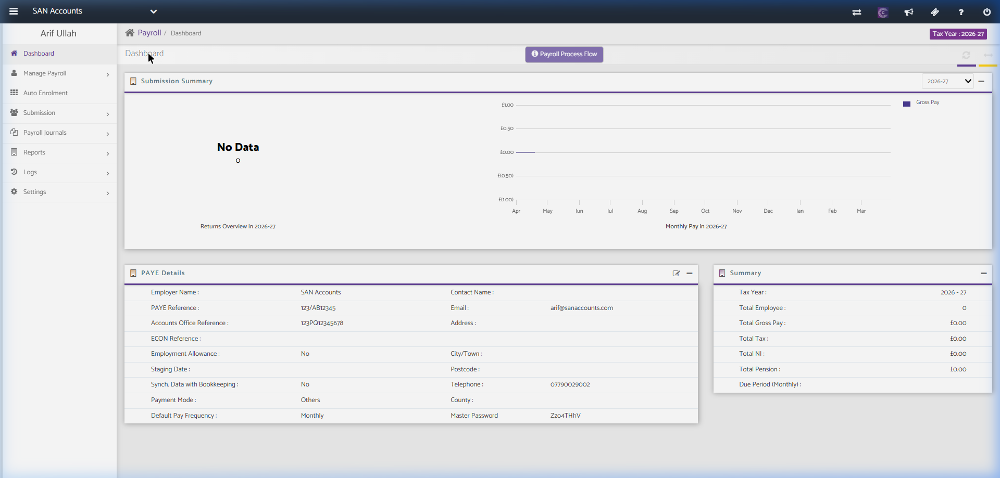
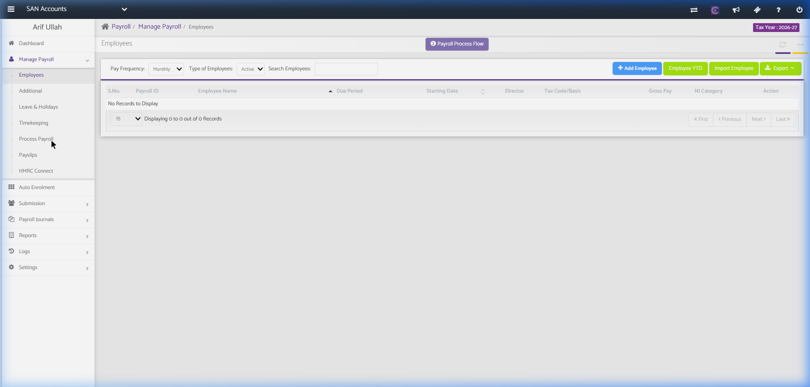
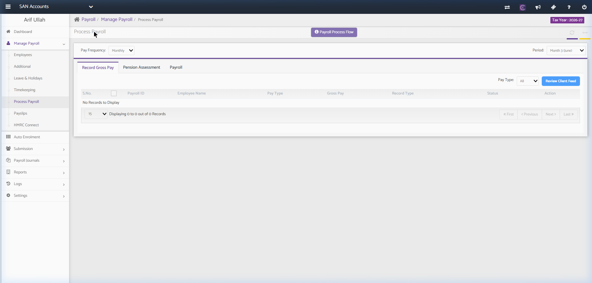

# Payroll Module

The Payroll module handles employer PAYE schemes, employee profiles, monthly/weekly wages calculations, tax & NI deductions, payslips distribution, auto-enrolment pension contributions, and RTI (Real Time Information) submissions to HMRC.

---

## 1. Payroll Home (Client List)

Lists all employers and summarizes their RTI submissions.

### Screenshot Reference

### Key Components
- **Submission Summary Widget:** Shows monthly RTI (FPS/EPS) submission statistics.
- **Employer Actions:**
  - `Copy To PAYE`
  - `Download` / `Export Reports`
  - `+ Client` / `+ PAYE Client` (Registers a new payroll entity)
- **Table Columns:**
  - `S.No.`, `Client ID`, `Client Name` (Clickable link), `Client Type` (e.g., Limited).

---

## 2. Client Payroll Workspace (General Settings)

When PAYE settings are not configured, opening the client workspace redirects to the General Settings setup tab.

### Screenshot Reference

### Key Components

#### A. Sidebar Navigation Menu Structure
- **Dashboard:** Main payroll summary (after PAYE setup).
- **Manage Payroll (Dropdown):**
  - **Employees:** Employee profile records, tax codes, salaries.
  - **Departments:** Group employees into cost centers.
  - **Additional:** Set up additions (bonuses, overtime) and deductions (student loans, union fees).
  - **Leave & Holidays:** Record sick leave, maternity/paternity leave, and unpaid absences.
  - **Timekeeping:** Log timesheets / hours worked.
  - **Process Payroll:** Run weekly/monthly pay cycles.
  - **Payslips:** Generate, print, or email PDF payslips.
  - **HMRC Connect:** Direct connection status to HMRC account.
- **Auto Enrolment:** Manage Workplace Pension schemes, assess employees, calculate contributions, and export pension files.
- **Submission (Dropdown):**
  - **FPS (Full Payment Submission):** File pay details to HMRC on or before pay day.
  - **EPS (Employer Payment Summary):** Claim recovery/offset amounts (SSP, SMP) or declare nil return.
  - **EYU / Earlier Year Update:** Adjust previous tax years.
- **Payroll Journals:** Interface to post pay summaries to Bookkeeping ledgers.
- **Reports:** P32, P45, P60, Gross-to-Net, Pension Contribution summaries.
- **Logs:** Email logs, Audit logs.
- **Settings (Dropdown):**
  - **General Settings:** (Active workspace panel).
  - **Employee YTD:** Enter Year-to-Date mid-year transition values.

#### B. General Settings Sub-Tabs & Fields

##### PAYE Details Tab (Shown in Screenshot):
- **Employer Name (`*` Required):** Autopopulated name (e.g., SAN Accounts).
- **HMRC Office Number (`*` Required):** 3-digit HMRC district code.
- **PAYE Reference (`*` Required):** Employer tax reference code.
- **Accounts Office Reference (`*` Required):** 13-character Accounts Office code.
- **ECON Reference / COTAX Reference:** Optional national insurance reference codes.
- **Tax Year:** Dropdown list (e.g., 2026-27).
- **Default Pay Frequency:** Monthly, Weekly, Bi-weekly, Four-weekly.
- **Payment Mode:** Cash, Cheque, BACS, Other.
- **Bank Details:** Bank Name, Sort Code, Account Number, Service User Number.
- **Feature Checkboxes:**
  - *Synchronise data with Bookkeeping:* Auto-post payroll journals.
  - *Qualify for Small Employer's Relief:* Offset statutory payments at 103%.
  - *Qualify for Apprenticeship:* Apply apprenticeship levy rules.
  - *Enable Departmental Accounts:* Split payroll costs by department codes.

##### Other Settings Tabs (Not active but documented):
- **Contact Details:** Manage employer address, phone, email.
- **HMRC Credentials:** Store Government Gateway ID and password for RTI filing.
- **Payslip Templates:** Select HTML/PDF styles for employees' payslips.
- **Pay Rate:** Standard hourly, overtime, and holiday rates configurations.

---

## 2.1. Key Payroll Sub-Pages & Redirection Workflows

### A. Employees List Page (PAYE Setup Redirect)
Contains the directory of all workers, pay rates, tax codes, and starters/leavers declarations.

#### Screenshot Reference

#### Redirection Logic
- **Condition:** If the employer's PAYE Scheme reference, accounts office reference, or HMRC credentials are not yet configured in the General Settings, clicking `Employees` or `Manage Employees` will automatically redirect the user back to the **PAYE Details Configuration Form** with a warning highlighting missing required fields.
- Once configured, this page renders a searchable employee table showing `Employee ID`, `Name`, `Tax Code`, `Pay Cycle`, `Gross Salary`, `Department`, and `Status` (Active, Leaver).

---

### B. Process Payroll Page (PAYE Setup Redirect)
The processing panel to run payroll cycles, compute tax/NI deductions, and prepare RTI (Real Time Information) files.

#### Screenshot Reference

#### Redirection Logic
- **Condition:** Similar to the Employees page, attempting to run pay cycles before saving valid HMRC credentials and PAYE scheme configurations triggers a redirect to the **PAYE Details Configuration Form**.
- Once unlocked, this page displays the current payroll run period (Weekly/Monthly), lists all employees due to be paid, shows interactive gross/net hour entries, calculates statutory payments, and displays the "Run Payroll" submission control.

---

## 3. Recommended Database Schema / Data Models

To implement Payroll, we require the following tables:

### `paye_schemes`
- `id` (INT, Primary Key)
- `client_id` (INT, FK)
- `hmrc_office_number` (VARCHAR)
- `paye_reference` (VARCHAR)
- `accounts_office_reference` (VARCHAR)
- `econ` (VARCHAR, Nullable)
- `cotax` (VARCHAR, Nullable)
- `default_pay_frequency` (VARCHAR)
- `payment_mode` (VARCHAR)
- `bank_name` (VARCHAR, Nullable)
- `bank_sort_code` (VARCHAR, Nullable)
- `bank_account_number` (VARCHAR, Nullable)
- `sync_bookkeeping` (BOOLEAN)
- `small_employers_relief` (BOOLEAN)

### `employees`
- `id` (INT, Primary Key)
- `paye_scheme_id` (INT, FK referencing `paye_schemes.id`)
- `first_name` (VARCHAR)
- `last_name` (VARCHAR)
- `ni_number` (VARCHAR)
- `tax_code` (VARCHAR - e.g., 1257L)
- `gender` (VARCHAR)
- `birth_date` (DATE)
- `hire_date` (DATE)
- `leaving_date` (DATE, Nullable)
- `pay_frequency` (ENUM - Weekly, Monthly)
- `salary_type` (ENUM - Hourly, AnnualSalary)
- `gross_rate` (DECIMAL(15,2))

### `pay_runs`
- `id` (INT, Primary Key)
- `paye_scheme_id` (INT, FK)
- `tax_year` (VARCHAR)
- `pay_period` (INT - e.g., Month 1, Month 2)
- `start_date` (DATE)
- `end_date` (DATE)
- `payment_date` (DATE)
- `status` (ENUM - Draft, Calculated, Approved, Filed)

### `payslips`
- `id` (INT, Primary Key)
- `pay_run_id` (INT, FK referencing `pay_runs.id`)
- `employee_id` (INT, FK referencing `employees.id`)
- `gross_pay` (DECIMAL(15,2))
- `income_tax` (DECIMAL(15,2))
- `employee_ni` (DECIMAL(15,2))
- `employer_ni` (DECIMAL(15,2))
- `pension_employee` (DECIMAL(15,2))
- `pension_employer` (DECIMAL(15,2))
- `net_pay` (DECIMAL(15,2))
- `student_loan` (DECIMAL(15,2), Nullable)

### `rti_submissions`
- `id` (INT, Primary Key)
- `pay_run_id` (INT, FK)
- `submission_type` (ENUM - FPS, EPS)
- `correlation_id` (VARCHAR)
- `submitted_at` (TIMESTAMP)
- `status` (ENUM - Pending, Accepted, Rejected)
