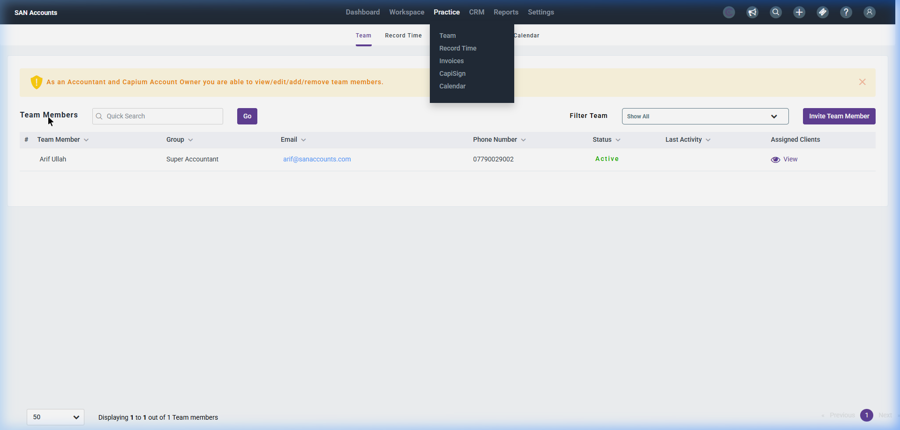
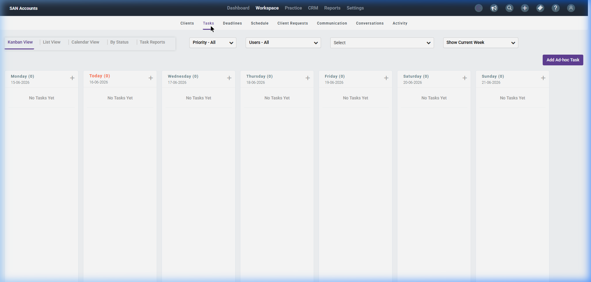
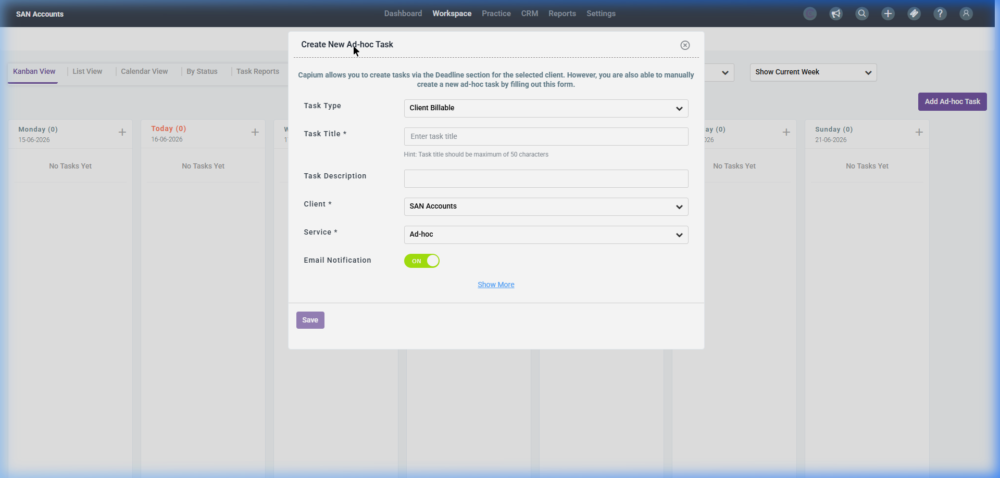
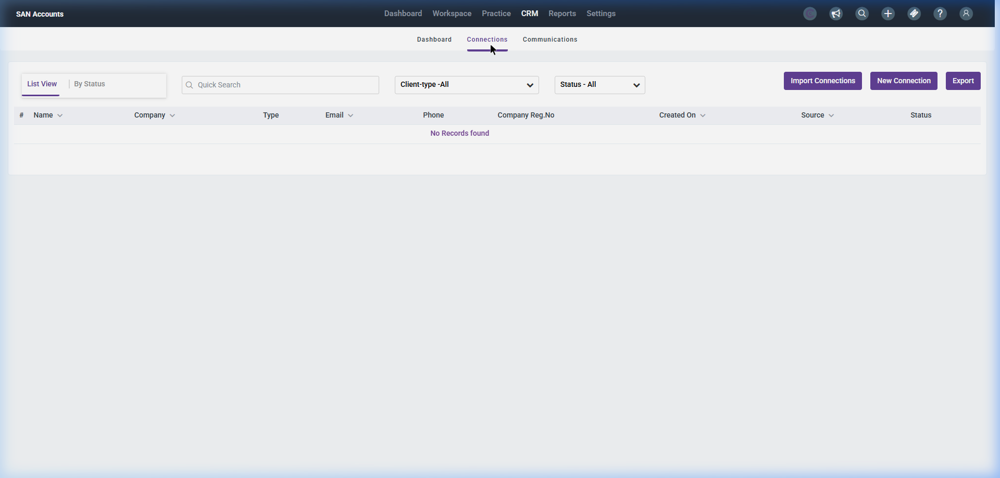

# Practice Management Module

The Practice Management module serves as the central administrative hub for the accounting practice. It coordinates tasks, tracks regulatory filing deadlines, monitors staff activity, manages client relationships (CRM), and stores documents.

---

## 1. Practice Management Dashboard (Welcome Screen)

This is the primary home screen of the practice management environment.

### Screenshot Reference

### Key Components

#### A. Top Global Navigation
- **Dashboard:** Returns to the welcome dashboard.
- **Workspace:** Task lists, client workflows, and document folders.
- **Practice:** Internal practice settings, staff roles, and capacity planning.
- **CRM:** Lead management, client onboarding, AML checks, and proposals.
- **Reports:** Practice performance reports, timesheet summaries.
- **Settings:** General practice customization, letter templates, and integrations.

#### B. Sub-Navigation Tabs
- **Welcome:** Active dashboard.
- **Quick links:** Custom action shortcuts (e.g., +Task, +Client).
- **Submissions:** Gateway status monitor for all HMRC and Companies House filings.

#### C. Dashboard Widgets
- **Clients Widget:** Displays the total client count and count of new clients added in the last month.
- **Deadlines Widget:** Shows total deadlines tracked and new deadlines configured in the past week.
- **Task by Priority Chart:** Graphical representation of tasks segmented by Low, Normal, and High priority.
- **No. of Tasks Chart:** Displays task counts grouped by employee owner.
- **Deadlines by Status:** Shows pie chart breakdown of upcoming deadlines filtered by service type.
- **Deadlines List:** Table displaying upcoming regulatory due dates with filters.
- **Activity Log:** Recent system audits and actions taken across the practice.

---

## 1.1. Key Practice Management Sub-Pages

### A. Workspace Tasks List Page
A centralized task board used to allocate, monitor, and update the status of internal staff tasks.

#### Screenshot Reference

#### Fields & Features
- **Core Actions:**
  - `+ Add Task` Button (e.g. Add Ad-hoc Task): Launches the task creation modal. Clicking this opens the **Create New Ad-hoc Task Modal**.
  - Search bar + filters: Search by keyword, filter by Assignee (staff member), Status (To-do, In Progress, Review, Completed), and Priority.
- **Tasks Grid Table:** Columns include `Task Title`, `Assigned To`, `Client Name`, `Due Date`, `Priority`, `Status`, and `Action` controls.

#### Sub-Action: Create New Ad-hoc Task Modal
A form-based dialogue window to quickly assign a task that is not tied to a formal statutory compliance deadline.

##### Screenshot Reference

##### Form Fields & Features
- **Header Description Banner:** Explains that tasks can be created via the Deadline section or manually created via this ad-hoc form.
- `Task Type` Dropdown: Categorizes the task (e.g. Client Billable, Internal).
- `Task Title *`: Required input text (limited to 50 characters).
- `Task Description`: Textarea to list detailed instructions or deliverables.
- `Client *`: Required searchable dropdown selection listing all active practice clients.
- `Service *`: Required dropdown category (default: Ad-hoc).
- `Email Notification` Toggle: A simple ON/OFF switch to toggle whether the assignee is notified immediately by email.
- `Show More` link: Clickable to expand advanced task configurations (e.g. priority, start date, target due date).
- `Save` submission trigger.

---

### B. CRM Connection / Clients Page
Manages the CRM pipeline, contacts, business relationship statuses, and onboarding AML checks for prospective and active clients.

#### Screenshot Reference

#### Fields & Features
- **Core Actions:**
  - `+ Connection` Button: Register a new prospect/lead.
  - `Send Proposal`: Prepare engagement letters and pricing documents.
- **Connections Table:** Columns include `Name`, `Connection Type` (Lead, Client, Contact), `Email`, `Phone`, `Account Manager`, `Onboarding Status` (Pending, Active), and `Action` logs.

---

## 2. Recommended Database Schema / Data Models

To implement Practice Management, we require the following tables:

### `tasks`
- `id` (INT, Primary Key)
- `title` (VARCHAR)
- `description` (TEXT, Nullable)
- `priority` (ENUM - Low, Normal, High)
- `status` (ENUM - Todo, InProgress, Review, Completed)
- `assigned_to` (INT - User/Staff ID)
- `client_id` (INT, FK)
- `due_date` (DATE)
- `created_at` (TIMESTAMP)

### `deadlines`
- `id` (INT, Primary Key)
- `client_id` (INT, FK)
- `service_type` (ENUM - Accounts, VAT, PAYE, CT600, SA100)
- `due_date` (DATE)
- `status` (ENUM - Pending, Done, Overdue)
- `notified_at` (TIMESTAMP, Nullable)

### `activities`
- `id` (INT, Primary Key)
- `user_id` (INT)
- `action_type` (VARCHAR)
- `description` (TEXT)
- `created_at` (TIMESTAMP)
