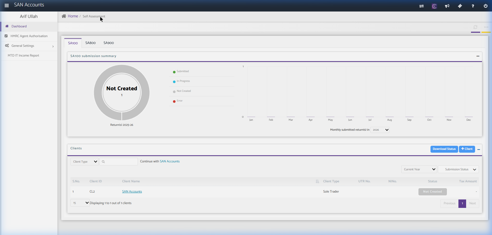
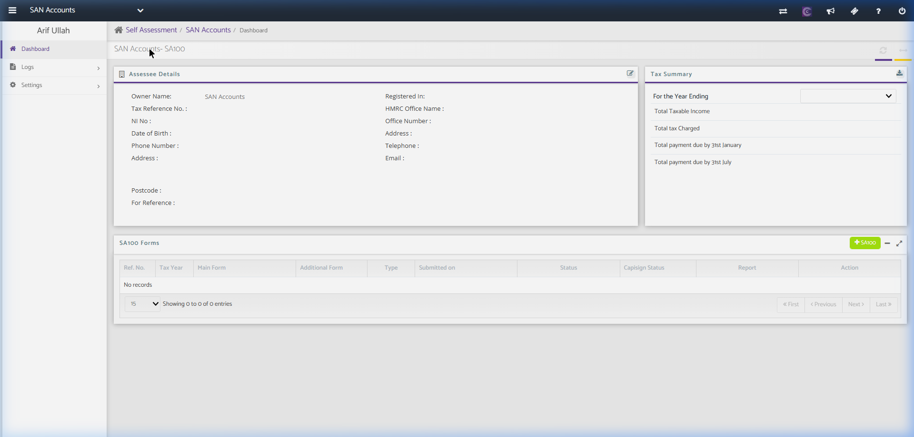
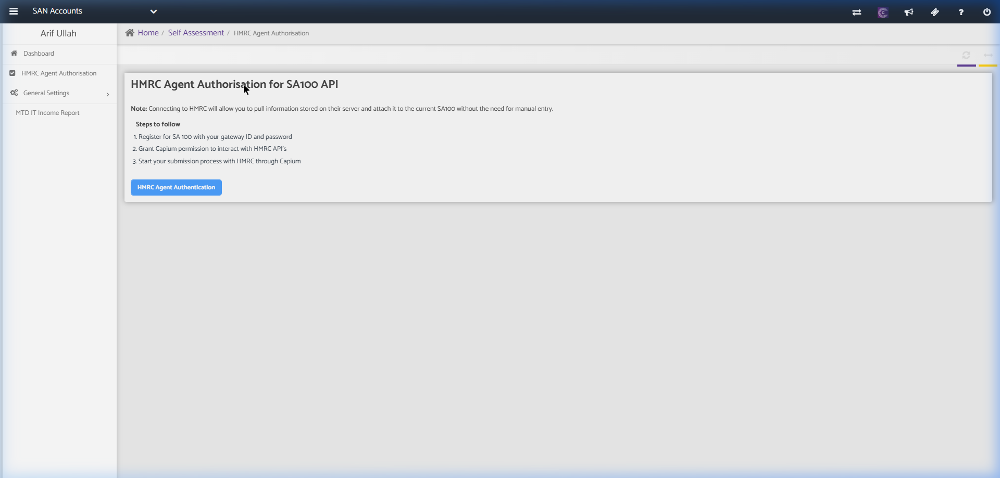
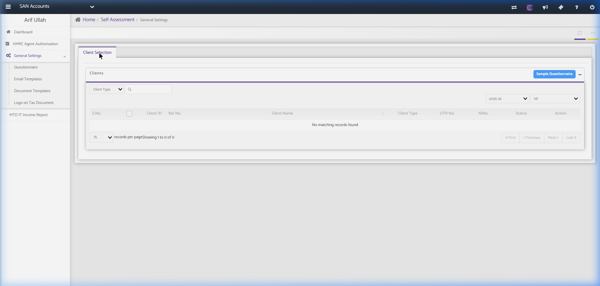
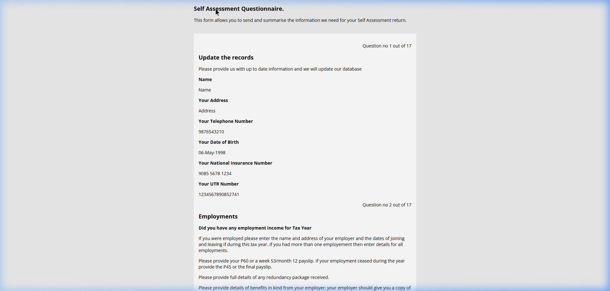

# Self Assessment Module

The Self Assessment module prepares and submits personal tax returns (SA100), partnership tax returns (SA800), and trust/estate tax returns (SA900) directly to HMRC.

---

## 1. Self Assessment Home (Dashboard)

This dashboard lists individuals and non-corporate entities and manages tax filings.

### Screenshot Reference

### Key Components

#### A. Submission Summary Widgets
- **Tabs:**
  - **SA100:** Individual Tax Return (e.g., Sole Traders, Directors, Landlords).
  - **SA800:** Partnership Tax Return.
  - **SA900:** Trust & Estate Tax Return.
- **Status Categories:** Submitted (Green), In Progress (Blue), Not Created (Grey), Error (Red).
- **Line/Bar Chart:** Monthly submitted returns in the selected year.

#### B. Sidebar Navigation Menu Structure
- **Dashboard:** Returns to the Self Assessment dashboard.
- **HMRC Agent Authorisation:** Configures agent authorisation links (64-8 links or online agent authorization codes).
- **General Settings (Dropdown):**
  - **Questionnaire:** Setup client intake tax questionnaires.
  - **Email Templates:** Custom templates for communicating tax liabilities.
  - **Document Templates:** Custom letterheads and tax summary documents.
  - **Logo on Tax Document:** Logo uploading tool for reports.
- **MTD IT Income Report:** Preparation for MTD Income Tax Self Assessment (ITSA) returns.

#### C. Clients Table & Action Controls
- **Search Controls:**
  - **Search Input Field:** Search by Client Name or Client ID.
  - **Filter Dropdowns:**
    - Client Type (Sole Trader, Individual)
    - Tax Year (e.g., 2025-26)
    - Submission Status (In Progress, Draft, Submitted, Error)
  - **Download Status Button:** Downloads client list in CSV/Excel.
  - **+ Client Button:** Adds an individual/partnership client.
- **Table Columns:**
  - `S.No.`, `Client ID`, `Client Name` (Clickable link), `Client Type` (Individual / Partnership / Trust), `UTR No.` (10-digit Unique Taxpayer Reference), `NINo.` (National Insurance Number), `Status`, `Tax Amount`.

---

## 2. Client Self Assessment Workspace (SA100 Preparation)
Clicking on an individual client launches their tax preparation dashboard.

### Screenshot Reference

### Key Components
- **Client Details Widget:** Displays Name, Client Type, UTR, NINO, Address, Email, and Phone.
- **Tax Returns Grid:** Lists prepared returns. Columns: `Ref. No.`, `Tax Year`, `Submission Status`, `Tax Amount`, `Actions`.
- **Forms/Schedules Checklist:** Sidebar options to attach supplementary schedules:
  - Employment (SA102), Self-Employment (SA103S/SA103F), Partnership (SA104S/SA104F), Land & Property (SA105), Foreign Income (SA106), Capital Gains (SA108), Residence/Non-residence (SA109).

## 2.1. Key Self Assessment Sub-Pages

### A. HMRC Agent Authorisation for SA100 Page
This page is used to authenticate the firm's Agent gateway credentials with HMRC to authorize filing SA100 returns on behalf of clients.

#### Screenshot Reference

#### Fields & Features
- **HMRC Agent Authentication Button:** Button that redirects to HMRC OAuth login portal.
- **Onboarding Instructions:** Displays step-by-step HMRC connection guide (Register for SA100 with gateway ID, grant SanSuite permission, submit returns).

---

### B. Client Intake Questionnaire Page
Allows generating and sending tax questionnaires to clients to collect details about their income, expenses, and allowances for the tax year.

#### Screenshot Reference

#### Fields & Features
- **Sample Questionnaire Button:** View or download the standardized client intake questionnaire. Clicking this opens the **Sample Questionnaire View** in a new tab.
- **Client Selection Table:** Grid to filter and select clients (by Client Type, Tax Year, and Status) to send questionnaires. Columns include `Client ID`, `Ref No.`, `Client Name`, `Client Type`, `UTR No.`, `NINo.`, and `Status`.

#### Sub-Action: Sample Questionnaire View
The customer-facing digital tax questionnaire portal layout.

##### Screenshot Reference

##### Sections & Features (17 Total Questions)
- **Question 1: Update the records:** Asks the client to confirm their personal details: `Name`, `Address`, `Telephone Number`, `Date of Birth`, `National Insurance Number`, and `UTR Number`.
- **Question 2: Employments:** Checklist question: *"Did you have any employment income for Tax Year?"* Prompts to provide P60, P45, week 53/month 12 payslips, and details of any company benefits-in-kind (P11D).
- **Subsequent Questions (3-17):** Collects details for Self-Employment income/expenses, Partnership shares, Rental property profits, Foreign Income, Capital Gains, Dividends, Interest, Pension contributions, and specific tax reliefs.

---

## 3. Business Logic & Redirection
- **Limited Company Client Behavior:** Clicking "Continue with SAN Accounts" or any Limited Company client redirects the user to the SanSuite Ecosystem Home page. This is because Self Assessment returns (SA100, SA800, SA900) are legally restricted to Individuals, Partnerships, and Trusts. Limited companies are taxed via Corporation Tax (CT600).

---

## 4. Recommended Database Schema / Data Models

To implement Self Assessment, we require the following database tables:

### `self_assessment_clients`
- `id` (INT, Primary Key)
- `client_id` (INT, FK referencing `clients.id` or separate individuals table)
- `first_name` (VARCHAR)
- `last_name` (VARCHAR)
- `utr_number` (VARCHAR, 10-digit, Unique)
- `ni_number` (VARCHAR, Unique)
- `client_type` (ENUM - Individual, Partnership, Trust)
- `created_at` (TIMESTAMP)

### `sa100_returns`
- `id` (INT, Primary Key)
- `sa_client_id` (INT, FK referencing `self_assessment_clients.id`)
- `tax_year` (VARCHAR - e.g., 2025-26)
- `net_income` (DECIMAL(15,2))
- `allowances` (DECIMAL(15,2))
- `taxable_income` (DECIMAL(15,2))
- `tax_due` (DECIMAL(15,2))
- `status` (ENUM - Draft, Approved, Submitted, Error)
- `xml_payload` (LONGTEXT)
- `created_at` (TIMESTAMP)

### `sa800_returns`
- `id` (INT, Primary Key)
- `partnership_client_id` (INT, FK referencing `self_assessment_clients.id`)
- `tax_year` (VARCHAR)
- `gross_receipts` (DECIMAL(15,2))
- `net_profit` (DECIMAL(15,2))
- `status` (ENUM - Draft, Approved, Submitted, Error)

### `sa_submissions`
- `id` (INT, Primary Key)
- `return_type` (ENUM - SA100, SA800, SA900)
- `return_id` (INT)
- `submitted_at` (TIMESTAMP)
- `status` (ENUM - Success, Failed)
- `error_message` (TEXT, Nullable)
