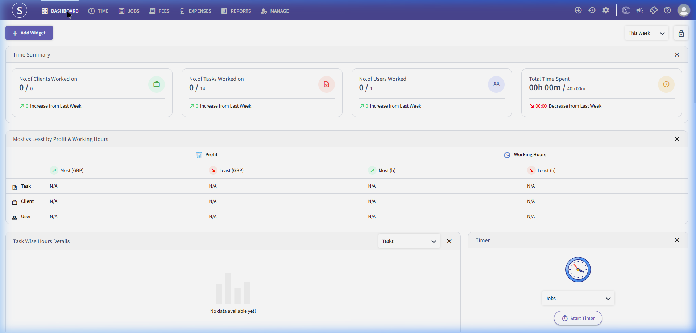
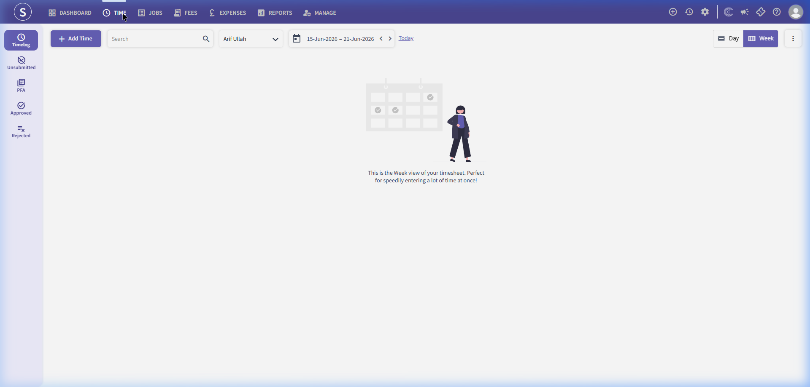
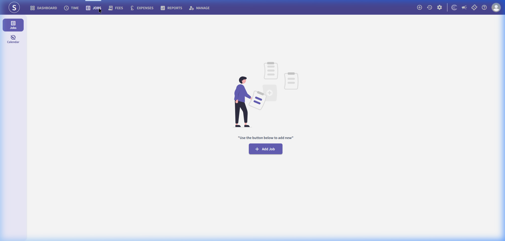
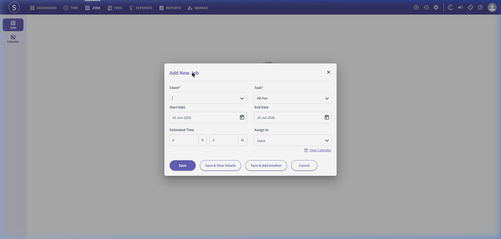

# Time and Fees Module

The Time and Fees module enables practices to track billable and non-billable hours, manage ongoing client jobs, track staff expenses, and handle practice-level invoicing.

---

## 1. Time and Fees Dashboard

This dashboard displays summaries of active time tracking, profitability indicators, and a live timer.

### Screenshot Reference

### Key Components

#### A. Top Navigation Bar
- **Dashboard:** Returns to the Time and Fees home page.
- **Time:** Handles timesheet entries (weekly grid or daily entry views).
- **Jobs:** Job management, budget constraints, milestones, and task checklists.
- **Fees:** Prepares fee invoices, records billing write-offs, and tracks payments.
- **Expenses:** Log staff expenses, mileage claims, and client disbursements.
- **Reports:** Generate time sheet, utilization, recovery rate, and wip (work-in-progress) reports.
- **Manage:** Settings for clients, staff users, custom tasks, expense categories, and permissions.

#### B. Dashboard Widgets
- **Time Summary:**
  - `No. of Clients Worked on`
  - `No. of Tasks Worked on`
  - `No. of Users Worked`
  - `Total Time Spent` (compared to target, e.g., 40h 00m)
- **Most vs Least by Profit & Working Hours:**
  - Table matrix comparing tasks, clients, and staff users across two segments: *Profit* (Most/Least in GBP) and *Working Hours* (Most/Least in hours).
- **Task Wise Hours Details:**
  - Bar chart showing breakdown of hours across various tasks (with a task filter dropdown).
- **Timer:**
  - Quick-track widget with a Job selector dropdown and a **Start Timer** button.

---

## 1.1. Key Time and Fees Sub-Pages

### A. Timesheet Weekly Grid Entry Page
The input interface where employees enter timesheet logs on a weekly grid format, distributed across days, clients, and projects.

#### Screenshot Reference

#### Fields & Features
- **Core Actions:**
  - `+ Row`: Insert a new row to log hours against a different client/task.
  - `Submit`: Submits the weekly timesheet to managers for authorization.
- **Weekly Grid Matrix:** Columns include `Client Name` dropdown, `Task/Job` dropdown, days of the week (Mon to Sun input fields for hours), `Total Hours` (auto-calculated per row), and `Actions` (delete row).

---

### B. Manage Jobs List Page
A dashboard to view, configure, and manage active service jobs, contracts, and assignments for the clients.

#### Screenshot Reference

#### Fields & Features
- **Core Actions:**
  - `+ Add Job` Button: Create and configure a new job/assignment. Clicking this opens the **Add New Job Modal**.
  - Search bar + filters: Search by job title, filter by Client and Status (Not Started, In Progress, On Hold, Completed).
- **Jobs Table:** Columns include `Job Name`, `Client Name`, `Assigned Team/User`, `Start Date`, `Target End Date`, `WIP Balance`, and `Action` icons.

#### Sub-Action: Add New Job Modal
A configuration dialogue to assign and schedule specific client jobs.

##### Screenshot Reference

##### Form Fields & Features
- `Client *`: Required dropdown list to choose which client the job is created for.
- `Task *`: Required dropdown (e.g. Ad-hoc, Accounts Production, Bookkeeping, Payroll, VAT).
- Date Pickers: `Start Date` (defaulted to current date) and `End Date` (defaulted to one month later).
- `Estimated Time`: Numeric input split into hours (`h`) and minutes (`m`).
- `Assign to`: Dropdown to delegate the job to a specific team member/user. Includes a link to `View Calendar` for staff availability checks.
- Buttons: `Save`, `Save & View Details`, `Save & Add Another`, `Cancel`.

---

## 2. Recommended Database Schema / Data Models

To implement Time and Fees, we require the following database tables:

### `timesheets`
- `id` (INT, Primary Key)
- `user_id` (INT)
- `client_id` (INT, FK)
- `job_id` (INT, FK, Nullable)
- `task_id` (INT, FK)
- `date` (DATE)
- `hours` (DECIMAL(5,2))
- `hourly_rate` (DECIMAL(10,2))
- `is_billable` (BOOLEAN)
- `description` (TEXT, Nullable)
- `created_at` (TIMESTAMP)

### `jobs`
- `id` (INT, Primary Key)
- `client_id` (INT, FK)
- `job_name` (VARCHAR)
- `budget_hours` (DECIMAL(10,2))
- `budget_cost` (DECIMAL(15,2))
- `start_date` (DATE)
- `due_date` (DATE)
- `status` (ENUM - Planning, Active, Completed, OnHold)

### `fees_invoices`
- `id` (INT, Primary Key)
- `client_id` (INT, FK)
- `invoice_number` (VARCHAR, Unique)
- `date` (DATE)
- `net_amount` (DECIMAL(15,2))
- `vat_amount` (DECIMAL(15,2))
- `total_amount` (DECIMAL(15,2))
- `status` (ENUM - Draft, Issued, Paid, Void)

### `expenses`
- `id` (INT, Primary Key)
- `user_id` (INT)
- `client_id` (INT, FK, Nullable - if billable to client)
- `expense_date` (DATE)
- `category` (VARCHAR - e.g., Travel, Meals)
- `amount` (DECIMAL(15,2))
- `receipt_path` (VARCHAR, Nullable)
- `is_reimbursed` (BOOLEAN)
