# SanSuite Time & Fees — Capium Gap Closure & Enterprise Parity Master Plan

## 1. Executive Summary & Audit Context
Following the exhaustive line-by-line audit between **Capium Time & Fees** (15 Freshdesk Articles in `capium info/Time and Fees/raw_articles/`) and the existing **SanSuite Time & Fees** module, 5 specific operational gaps were identified. While SanSuite has successfully implemented core time tracking, WIP-to-invoice billing, staff rate cards, 4-pillar reporting, and a 19-widget dashboard, addressing these 5 remaining gaps will achieve **100% functional parity with Capium** while preserving SanSuite's premium modern design system.

All phases strictly adhere to:
- **Rule 1**: Verified reality — 0 errors on `npm run check` (`tsc`).
- **Rule 2**: **Zero Emojis** anywhere in UI, toasts, modals, badges, or labels (Lucide React SVG icons only).
- **Rule 6**: **Zero Mock Data** mandate — 100% authentic MySQL database records and clean zero states.
- **Rule 7**: **Capium-Inspired Functional Parity** without visual copying (SanSuite Slate/Purple/Emerald design tokens).

---

## 2. Gap Closure System Architecture

```mermaid
graph TD
    subgraph "Gap 1: Credit Notes Engine"
        A1["Finalized Invoice Disputed / Cancelled"] --> A2["Issue Credit Note Modal"]
        A2 --> A3["POST /api/time-fees/invoices/:id/credit-note"]
        A3 --> A4["Insert fees_credit_notes"]
        A4 --> A5["Reverse Ledger & Adjust Debtors Balance"]
        A5 --> A6["Statutory Credit Note PDF & Print Engine"]
    end

    subgraph "Gap 2: Expense Receipts & Voucher Preview"
        B1["Staff Expense Log Modal"] --> B2["Receipt Dropzone / Upload"]
        B2 --> B3["POST /api/time-fees/expenses/upload-receipt"]
        B3 --> B4["Store in /uploads/expenses/ & update receipt_path"]
        B4 --> B5["Approver Lightbox / Receipt Inspector Modal"]
    end

    subgraph "Gap 3: Email & Reminder Templates Visual Editor"
        C1["TimeFeesSettingsPage > Templates Tab"] --> C2["Template Selector: Invoice, Receipt, Reminders, Signature"]
        C2 --> C3["Rich Text Editor with Dynamic Merge Tags"]
        C3 --> C4["Store in time_fees_settings.email_templates_json"]
        C4 --> C5["Auto-Resolve Tags in InvoicesPage Email Modal"]
    end

    subgraph "Gap 4: Job Budget Overrun Sentinel"
        D1["Timesheet Hours Aggregator"] --> D2["Compare actualHours vs estimatedHours"]
        D2 --> D3{"actualHours > budget?"}
        D3 -->|Yes| D4["Rose/Amber Over Budget Badge (+X hrs / £Y)"]
        D3 -->|No| D5["Healthy Margin Progress Bar"]
        D4 --> D6["Timesheet Entry Selector Warning"]
    end

    subgraph "Gap 5: Timesheet Reminder Bot"
        E1["Unsubmitted Timesheets View"] --> E2["1-Click 'Send Timesheet Reminders'"]
        E2 --> E3["POST /api/time-fees/timesheets/send-reminders"]
        E3 --> E4["Batch Email / Notification to Defaulting Staff"]
    end
```

---

## 3. Comprehensive Phased Execution Plan

### Phase 1: Credit Notes (ক্রেডিট নোটস) Engine & Reverse Ledger Accounting
**Goal:** Deliver full UK HMRC statutory compliance for fee cancellations, adjustments, and disputes with formal credit notes and debtors ledger reversal.

- [x] **1.1. Database Schema Extension in [`shared/schema.ts`](file:///d:/xampp/htdocs/sansuite/shared/schema.ts):**
  - Define `feesCreditNotes` table:
    - `id`: `int("id").primaryKey().autoincrement()`
    - `practiceId`: `int("practice_id").notNull().references(() => practices.id)`
    - `invoiceId`: `int("invoice_id").notNull().references(() => feesInvoices.id)`
    - `clientId`: `int("client_id").notNull().references(() => clients.id)`
    - `creditNoteNumber`: `varchar("credit_note_number", { length: 50 }).notNull()` (e.g. `CN-0001`)
    - `creditNoteDate`: `date("credit_note_date").notNull()`
    - `reason`: `text("reason")`
    - `netAmount`: `decimal("net_amount", { precision: 15, scale: 2 }).default("0.00")`
    - `vatAmount`: `decimal("vat_amount", { precision: 15, scale: 2 }).default("0.00")`
    - `totalAmount`: `decimal("total_amount", { precision: 15, scale: 2 }).default("0.00")`
    - `lineItemsJson`: `json("line_items_json")`
    - `status`: `varchar("status", { length: 30 }).default("Issued")` // Issued, Allocated, Refunded
    - `createdAt`: `timestamp("created_at").defaultNow()`
  - Create table in MySQL database `sansuite` (Executed & verified).

- [x] **1.2. Backend Endpoints in [`server/api/timefees.ts`](file:///d:/xampp/htdocs/sansuite/server/api/timefees.ts):**
  - `GET /api/time-fees/credit-notes`: Fetch all practice credit notes with linked invoice and client info.
  - `POST /api/time-fees/invoices/:id/credit-note`:
    - Validate original invoice exists and has positive balance.
    - Generate auto-incrementing `CN-` number based on practice settings or sequence.
    - Insert `feesCreditNotes` record.
    - Update parent invoice `dueAmount = dueAmount - creditAmount`, update status to `Credited` (if 100%) or `Partially Credited`.
  - `GET /api/time-fees/credit-notes/:id`: Fetch individual credit note with full line items and client details.

- [x] **1.3. Frontend UI in [`InvoicesPage.tsx`](file:///d:/xampp/htdocs/sansuite/client/src/pages/time-fees/InvoicesPage.tsx):**
  - Add **"Credit Notes"** sub-tab alongside "Invoices" and "Estimates".
  - In Invoices table action menu: Add **"Issue Credit Note"** (`<RotateCcw />` icon).
  - Modal: "Issue Credit Note" with pre-filled line items, full vs partial credit amount toggle, reason selection, VAT summary.
  - Credit Note details view and Printable / PDF template with standard UK Credit Note header, reference to original invoice number, and negative ledger notation.

---

### Phase 2: Expense Receipts & Voucher File Attachment & Inspection Modal
**Goal:** Enable staff to attach photo/PDF receipts when logging expenses and give practice managers an in-app lightbox inspector before approving.

- [x] **2.1. Backend File Upload Endpoint in [`server/api/timefees.ts`](file:///d:/xampp/htdocs/sansuite/server/api/timefees.ts):**
  - Implement `POST /api/time-fees/expenses/upload-receipt` using multer disk storage (`uploads/expenses/`).
  - Implement `POST /api/time-fees/expenses/reject` with rejection reason.
  - Update `POST /api/time-fees/expenses` to save `receiptPath`, `miles`, and `mileageRate`.

- [x] **2.2. Frontend Receipt Upload Dropzone in [`ExpensesPage.tsx`](file:///d:/xampp/htdocs/sansuite/client/src/pages/time-fees/ExpensesPage.tsx):**
  - In "Log Expense" modal: Add an elegant drag-and-drop file upload zone (`<UploadCloud />`).
  - Supports image formats (PNG, JPG, WebP) and PDF documents.
  - Show upload progress and attached file preview pill with remove option.

- [x] **2.3. Receipt Inspector / Lightbox Modal:**
  - In the Expenses Table: Display an interactive receipt badge (`<Paperclip />` / `<Image />`) for items with `receiptPath`.
  - Clicking badge opens the **Receipt Inspector Modal**:
    - High-resolution image zoom / PDF viewer.
    - Displays claim metadata: Staff, Date, Category, Amount, Client, Recharging status.
    - Quick action buttons directly inside inspector: **"Approve Expense"** (`<CheckCircle2 />`) and **"Reject Expense"** (`<XCircle />`).

---

### Phase 3: Settings > Email & Reminder Templates Visual Editor
**Goal:** Empower practices to customize client-facing emails for invoices, payment receipts, overdue chase letters, and signatures with dynamic merge tags.

- [x] **3.1. Settings Model & UK Accounting Defaults:**
  - Persist `time_fees_settings.email_templates_json` in `GET /api/time-fees/settings` and `POST /api/time-fees/settings`.
  - Full UK statutory default templates provided:
    1. `invoice_dispatch`: Subject `Fee Invoice {InvoiceNo} from {PracticeName}`
    2. `payment_receipt`: Subject `Payment Receipt - Invoice {InvoiceNo}`
    3. `overdue_reminder_1`: Friendly reminder on due date / 3 days overdue
    4. `overdue_reminder_2`: Firm second chase at 7–14 days overdue
    5. `estimate_dispatch`: Proposal / quotation covering letter
    6. `global_signature`: Practice sign-off footer

- [x] **3.2. Frontend Templates Visual Editor in [`TimeFeesSettingsPage.tsx`](file:///d:/xampp/htdocs/sansuite/client/src/pages/time-fees/TimeFeesSettingsPage.tsx):**
  - Add dedicated **"Email & Reminder Templates"** tab (`<Mail />`).
  - Sidebar template picker with clear category badges.
  - Subject input field.
  - Template body editor with clickable dynamic merge tag pills:
    - `{ClientName}`, `{InvoiceNo}`, `{DueDate}`, `{TotalAmount}`, `{DueAmount}`, `{PracticeName}`, `{BankDetails}`, `{Signature}`.
  - Live side-by-side or tabbed preview showing resolved mock sample.
  - "Save Templates" button with persistence to `/api/time-fees/settings`.

- [x] **3.3. Integration with Invoicing & Estimates Dispatch:**
  - Update Email Invoice modal in `InvoicesPage.tsx` to automatically pull the configured template, replace tags with the active invoice's real values, and allow one-click sending.

---

### Phase 4: Job Budget Overrun Sentinel & Margin Variance Badges
**Goal:** Safeguard practice profitability by proactively alerting managers and staff whenever logged hours exceed the budgeted time for a job.

- [x] **4.1. Budget vs Actual Variance Engine in [`JobsListPage.tsx`](file:///d:/xampp/htdocs/sansuite/client/src/pages/time-fees/JobsListPage.tsx):**
  - Compute `actualHours` from linked timesheets.
  - Calculate `varianceHours = actualHours - estimatedHours` and `utilizationPct = (actualHours / estimatedHours) * 100`.
  - Render dynamic status badge:
    - Under budget (< 85%): Subtle Slate/Emerald badge.
    - Near budget (85%–100%): Amber warning badge (`<AlertCircle /> 92% Budget`).
    - Over budget (> 100%): Rose warning badge (`<AlertCircle /> Over Budget: +X hrs / £Y`).
  - Update Job Details Modal header with prominent Budget Overrun Sentinel Alert banner and dual-color overrun visualization.
  - Add Calendar View overrun badges.

- [x] **4.2. Timesheet Pre-Entry Warning in [`TimesheetPage.tsx`](file:///d:/xampp/htdocs/sansuite/client/src/pages/time-fees/TimesheetPage.tsx):**
  - In the "Log Time" modal: When a user selects a Job, display an informative budget badge below the selector:
    - e.g., `Budget: 25.0h | Logged to date: 23.5h (1.5h remaining)`.
    - If already exceeded or if this entry will exceed: Displays rose alert informing staff that this job will run over budget.

---

### Phase 5: Timesheet Submission Reminder Bot (1-Click Staff Reminder)
**Goal:** Automate weekly practice compliance by giving admins a 1-click tool to remind all staff members who have pending or unsubmitted timesheets.

- [x] **5.1. Backend Reminder Dispatch Endpoint in [`server/api/timefees.ts`](file:///d:/xampp/htdocs/sansuite/server/api/timefees.ts):**
  - `POST /api/time-fees/timesheets/send-reminders`:
    - Accepts `{ weekStartDate: string }`.
    - Identifies all active staff users in the practice who have either:
      a) Zero timesheets logged for the target week, or
      b) Timesheets still in `'Unsubmitted'` status.
    - Returns `{ success: true, remindedCount: number, defaultingStaff: [...] }`.

- [x] **5.2. Frontend Action & Confirmation in [`TimesheetPage.tsx`](file:///d:/xampp/htdocs/sansuite/client/src/pages/time-fees/TimesheetPage.tsx):**
  - In the action control toolbar:
    - Prominent action button: **"Send Timesheet Reminders"** (`<Send />` icon).
    - Dispatches automated reminders with live toast notification summary.

---

### Phase 6: Full Verification, Clean Zero States & Zero Emoji Gate
**Goal:** Ensure 100% production readiness across all new workflows.

- [x] **6.1. Zero Emoji Audit:**
  - Verify every single badge, button, label, and toast uses Lucide React SVG icons (Audited & Verified).
- [x] **6.2. Zero Mock Data Audit:**
  - Verify all lists render clean, purpose-built empty states when no records exist (Audited & Verified).
- [x] **6.3. TypeScript & Build Validation:**
  - Run `npm run check` (`tsc`) and confirm **0 errors** (Verified: 0 errors).
