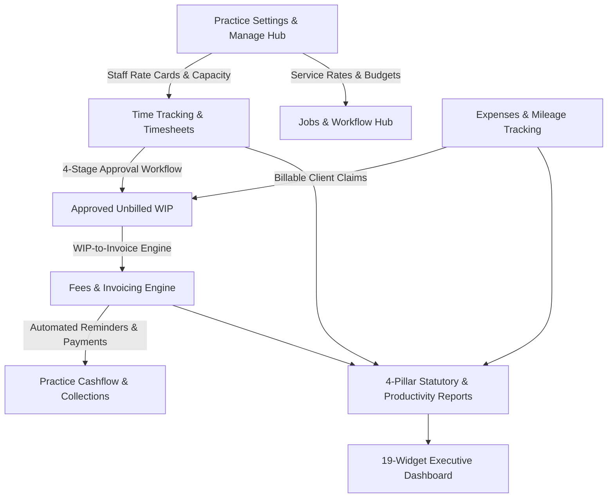

# SanSuite Time & Fees — Architectural Master Plan (100% Parity Roadmap)

## Executive Overview
This Master Plan defines the step-by-step engineering roadmap to elevate **SanSuite Time & Fees** to full operational and statutory parity with **Capium Time & Fees** (as documented in Capium Freshdesk Folders `9000199496` and `9000201918`). 

The implementation preserves SanSuite's premium purple/slate/emerald design system, strictly adheres to **Zero Emoji** (Rule 2), **Zero Mock Data** (Rule 6), and **Strict Intellectual Property & Copyright Compliance** (Rule 7).

---

## Architecture & System Flow

---

## 7-Phase Execution Plan

### Phase 1: Database Schema Expansion & Data Model Alignment
**Goal:** Establish the necessary database foundation to support per-user rate cards, WIP billing tracking, mileage records, and audit logs.

- [x] **1.1. Create `time_fees_staff_rates` table in [`shared/schema.ts`](file:///d:/xampp/htdocs/sansuite/shared/schema.ts):**
  - Columns:
    - `id`: Primary key, autoincrement
    - `practiceId`: References `practices.id`
    - `userId`: References `users.id`
    - `roleTier`: `'Admin' | 'Manager' | 'Staff'` (default `'Staff'`)
    - `capacityHoursPerWeek`: `decimal(5,2)` (default `'37.50'`)
    - `billableRatePerHour`: `decimal(10,2)` (default `'75.00'`)
    - `costRatePerHour`: `decimal(10,2)` (default `'35.00'`)
    - `assignedTasksJson`: JSON array of allowed task codes/names
    - `managerId`: References `users.id` (nullable)
    - `isActive`: Boolean (default `true`)
    - `createdAt`, `updatedAt`
- [x] **1.2. Update `timesheets` table:**
  - Add `invoiceId`: `int("invoice_id").references(() => feesInvoices.id)` (nullable, set when billed)
  - Add `withdrawnAt`: `timestamp("withdrawn_at")`
  - Add `withdrawnBy`: `int("withdrawn_by").references(() => users.id)`
- [x] **1.3. Update `expenses` table:**
  - Add `billedInvoiceId`: `int("billed_invoice_id").references(() => feesInvoices.id)`
  - Add `rejectionReason`: `text("rejection_reason")`
  - Add `miles`: `decimal("miles", { precision: 8, scale: 2 })`
  - Add `mileageRate`: `decimal("mileage_rate", { precision: 5, scale: 2 })`
- [x] **1.4. Update `jobs` table:**
  - Add `emailsJson`: `json("emails_json")` (array of sent/received job correspondence)
- [x] **1.5. Update `time_fees_settings` table:**
  - Add `columnCustomizationJson`: `json("column_customization_json")`
- [x] **1.6. TypeScript compilation validation:**
  - Run `npm run check` to verify 0 errors.

---

### Phase 2: Manage Hub & Staff Rate Cards (Settings & RBAC Foundation)
**Goal:** Allow practice administrators to configure individual staff capacity, billing rates, cost rates, and role tiers, replacing hardcoded global rates.

- [x] **2.1. Backend API Routes in [`server/api/timefees.ts`](file:///d:/xampp/htdocs/sansuite/server/api/timefees.ts):**
  - `GET /api/time-fees/manage/staff-rates`: Returns all practice users merged with their rate card, capacity hours, and role tier.
  - `POST /api/time-fees/manage/staff-rates`: Upserts rate card records for specific users.
  - `POST /api/time-fees/manage/sync-users`: Automatically registers active practice users from My Admin into the Time & Fees rate card registry.
- [x] **2.2. Frontend Settings UI in [`TimeFeesSettingsPage.tsx`](file:///d:/xampp/htdocs/sansuite/client/src/pages/time-fees/TimeFeesSettingsPage.tsx):**
  - Add dedicated **Staff Rate Cards & Capacity** tab.
  - Render an interactive staff table: Staff Name, Email, Role Tier badge (Admin/Manager/Staff), Capacity (hrs/week), Default Hourly Rate (£/hr), Cost Rate (£/hr), and Edit Modal.
  - Enable inline editing and batch saving.
- [x] **2.3. Dynamic Rate Propagation:**
  - In `TimesheetPage.tsx` and `JobsListPage.tsx`, auto-fill the logged-in user's personalized billable and cost rate when logging time instead of the generic £85/£40 fallback.

---

### Phase 3: The "Money Pipeline" — WIP-to-Invoice & Expense Recharging
**Goal:** Automate time and expense monetization by converting approved unbilled WIP into client fee invoices with one click.

- [x] **3.1. Backend WIP & Billing Endpoints in [`server/api/timefees.ts`](file:///d:/xampp/htdocs/sansuite/server/api/timefees.ts):**
  - `GET /api/time-fees/wip/unbilled?clientId=:id`: Returns all approved timesheets (`status = 'Approved'` and `invoice_id IS NULL`) and billable expenses (`billable = true` and `billed_invoice_id IS NULL`) grouped by job and task.
  - `POST /api/time-fees/invoices/generate-from-wip`:
    - Takes `{ clientId, timesheetIds: number[], expenseIds: number[], invoiceDate, dueDate, reference }`.
    - Computes aggregated line items with UK VAT.
    - Inserts a new record into `fees_invoices`.
    - Updates selected `timesheets` -> `invoice_id = newInvoiceId`, `status = 'Billed'`.
    - Updates selected `expenses` -> `billed_invoice_id = newInvoiceId`.
- [x] **3.2. Frontend WIP Billing Wizard in [`InvoicesPage.tsx`](file:///d:/xampp/htdocs/sansuite/client/src/pages/time-fees/InvoicesPage.tsx):**
  - Add an action button in the Invoices header: **"Bill from WIP"** (`<Clock />` + `<Receipt />`).
  - Modal workflow:
    - Step 1: Select Client -> Instantly display unbilled hours total, billable value, and rechargeable expenses.
    - Step 2: Interactive checklist to select/deselect specific timesheet entries and expenses.
    - Step 3: Choose line-item aggregation method (Consolidated summary line vs Detailed task-by-task lines).
    - Step 4: Click "Generate Invoice" -> Automatically switches to invoice preview and saves to DB.

---

### Phase 4: Jobs Management Upgrade — Calendar View & In-Job Quick Actions
**Goal:** Provide full workload visibility through a Job Calendar and streamline daily operations with in-job time logging.

- [x] **4.1. Job Calendar View in [`JobsListPage.tsx`](file:///d:/xampp/htdocs/sansuite/client/src/pages/time-fees/JobsListPage.tsx):**
  - Add view switcher: `List View` (`<Layers />`) vs `Calendar View` (`<Calendar />`).
  - Implement dynamic Month / Week / Today calendar view displaying scheduled jobs across start dates and target end dates.
  - Color-code job cards by status: Emerald (Completed), Blue (In Progress), Amber (On Hold), Indigo (Active).
  - Clicking a calendar job card opens the 8-Tab Job Details Workspace.
- [x] **4.2. In-Job Quick Action Header:**
  - Inside the Job Details Modal header, embed two direct action buttons:
    - **"Log Time"** modal pre-filled with the current Job and Subtask dropdown.
    - **"Start Timer"** that initiates the live stopwatch tied to this Job.
- [x] **4.3. Job Details Tabs Completion:**
  - **Email Tab:** Implement direct email sending with client/staff recipient selection and correspondence log.
  - **Invoice Tab:** Display all invoices linked to this job (`fees_invoices` matching `jobId` or line items).

---

### Phase 5: Timesheet Matrix & Global Persistent Stopwatch
**Goal:** Polish the weekly timesheet grid with direct inline cell editing and maintain timer continuity across browser navigation.

- [x] **5.1. Week View Inline Matrix Editing in [`TimesheetPage.tsx`](file:///d:/xampp/htdocs/sansuite/client/src/pages/time-fees/TimesheetPage.tsx):**
  - Ensure the Monday–Sunday grid allows direct keyboard input for daily hours.
  - Calculate daily column sums and row totals dynamically.
  - Visual indicator comparing weekly total against the user's capacity (e.g. `35.0h / 37.5h` with progress bar).
- [x] **5.2. Persistent Floating Stopwatch:**
  - Store timer state (running state, start timestamp, elapsed seconds, selected job/task) in `localStorage`.
  - Allow the user to navigate to other pages (Jobs, Invoices, Settings) without stopping or resetting the running timer.

---

### Phase 6: 4-Pillar Statutory Intelligence & Comprehensive Reports
**Goal:** Deliver Capium-grade analytical depth across all practice operations.

- [x] **6.1. Backend Reporting Endpoints in [`server/api/timefees.ts`](file:///d:/xampp/htdocs/sansuite/server/api/timefees.ts):**
  - `GET /api/time-fees/reports/time`: Time report aggregated by Client, Job, Task, Staff, or Date with billable/non-billable ratio and profit margin.
  - `GET /api/time-fees/reports/expenses`: Expenses report with Category, Client, Staff, and billable recharge status.
  - `GET /api/time-fees/reports/invoices-debtors`: Invoices aging analysis (Current, 1–30 days, 31–60 days, 61–90 days, 90+ days overdue).
- [x] **6.2. Frontend Reports Hub in [`TimeFeesReportsPage.tsx`](file:///d:/xampp/htdocs/sansuite/client/src/pages/time-fees/TimeFeesReportsPage.tsx):**
  - Implement 4 dedicated tabs:
    1. **Time Report** (Filter by Hours type, Group By Client/Job/Task/Staff/Date, Period selector).
    2. **Expenses Report** (Group by Category/Client/Staff, Period selector).
    3. **Invoices & Aged Debtors** (Aging buckets, outstanding balance, recovery rates).
    4. **Staff Profitability & WIP** (Capacity utilization, billable revenue vs staff cost).
  - Multi-format Export: CSV and Print for every report tab.

---

### Phase 7: 19-Widget Executive Dashboard & Final Quality Gate
**Goal:** Complete the 19 dashboard widgets and verify zero-defect performance.

- [x] **7.1. Dashboard Widgets Parity in [`TimeFeesHome.tsx`](file:///d:/xampp/htdocs/sansuite/client/src/pages/time-fees/TimeFeesHome.tsx):**
  - Integrate all 19 widgets:
    - Time Off Hours by Users
    - Revenue by Invoice Category
    - Invoiced Amount by Status
    - Payment Methods Breakdown
    - By Invoiced Amount vs By Due Amount
    - Top 5 Clients with Outstanding Balance
    - Staff Utilization & Billable Target
    - Billable vs Non-Billable Ratio
    - Recent Timesheets Activity
  - Dynamic `+ Add Widget` modal supporting all 19 widgets with real-time toggle and localStorage persistence.
- [x] **7.2. Quality Gate & Compilation:**
  - Run `npm run check` (TypeScript verification -> 0 errors verified).
  - Verify clean zero states across all tables (no mock data, 100% authentic DB calculations).
  - Verify zero emojis across all UI labels, toasts, and buttons (Lucide React SVG icons only).
