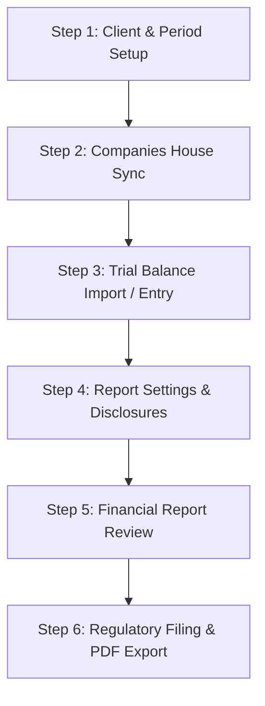

# Accounts Production Module — Purpose & End-to-End Workflow Guide

**SanSuite Accounting & Practice Management System**
*সামগ্রিক অ্যাকাউন্টিং এবং গভর্নিং রেগুলেশন ফাইল নির্দেশিকা*

---

## 🎯 ১. Accounts Production মডিউলের মূল উদ্দেশ্য (Purpose & Objectives)

**Accounts Production (অ্যাকাউন্টস প্রডাকশন)** মডিউলটি মূলত ইউকে (UK) একাউন্টিং স্ট্যান্ডার্ড এবং গভর্নিং রেগুলেশনস (*Companies Act 2006*, *FRS 102 Section 1A*, *FRS 105 Micro-entities*) অনুসরণ করে ক্লায়েন্টদের (Limited Company, Partnership, Sole Trader) বার্ষিক সংবিধিবদ্ধ ফাইনান্সিয়াল হিসাবপত্র প্রস্তুত এবং সরাসরি **Companies House**-এ সাবমিট করার জন্য তৈরি করা হয়েছে।

### প্রধান লক্ষ্য ও ফিচারসমূহ:
1. **Statutory Accounts Preparation:** বুককিপিং লেজার বা ট্রায়াল ব্যালেন্সের ডেটা থেকে স্বয়ংক্রিয়ভাবে Profit & Loss Account, Balance Sheet (Statement of Financial Position), এবং Notes to Financial Statements জেনারেট করা।
2. **Regulatory Compliance:** UK FRS 105 (Micro-entity) এবং FRS 102 1A (Small Entity) আইন অনুযায়ী ডিরেক্টরদের রিপোর্ট, শেয়ার ক্যাপিটাল এবং প্রয়োজনীয় ডিসক্লোজার নোটস যুক্ত করা।
3. **Direct Companies House Filing:** Companies House Gateway API Integration ব্যবহার করে প্রস্তুতকৃত বার্ষিক হিসাব সরাসরি ইলেকট্রনিক সাবমিশন করা।
4. **Professional Management & Annual Reporting:** পিক্সেল-পারফেক্ট A4 ফরম্যাটে ফাইনান্সিয়াল রিপোর্ট প্রিভিউ, সেভ এবং PDF প্রিন্ট ও এক্সপোর্ট করা।

---

## 🔄 ২. এন্ড-টু-এন্ড ওয়ার্কফ্লো (End-to-End Workflow)

### **Step 1: ক্লায়েন্ট নির্বাচন ও একাউন্টিং পিরিয়ড সেটআপ (Client & Period Setup)**
- **Accounts Production Home** পেজ থেকে নির্দিষ্ট ক্লায়েন্টকে সিলেক্ট করে তার ওয়ার্কস্পেসে প্রবেশ করা হয়।
- ক্লায়েন্টের বর্তমান ফিন্যান্সিয়াল ইয়ার বা একাউন্টিং পিরিয়ড (*যেমন: 01 April 2025 – 31 March 2026*) কনফিগার ও লক করা হয়।

### **Step 2: কোম্পানিজ হাউজ ডেটা সিঙ্ক (Companies House Sync & Directors)**
- **CH API'S Integration** সেকশনে গিয়ে কোম্পানির Registration Number, Auth Code এবং Presenter Credentials ভেরিফাই করা হয়।
- **Update CH Directors** অপশনে চাপ দিলে ইউকে পাবলিক রেজিস্টার থেকে কোম্পানিজ হাউজের বর্তমান ডিরেক্টর তালিকা সরাসরি সিঙ্ক হয়ে ইনপুট হয়।

### **Step 3: ট্রায়াল ব্যালেন্স ইনপুট বা সিঙ্ক (Trial Balance Import / Entry)**
- **Tasks -> Trial Balance** অপশনে গিয়ে ৪টি উপায়ে ট্রায়াল ব্যালেন্স আনা যায়:
  1. **SanSuite Bookkeeping Sync:** বুককিপিং মডিউলের লাইভ জেনারেল লেজার থেকে ডেবিট ও ক্রেডিট ব্যালেন্স স্বয়ংক্রিয়ভাবে ইমপোর্ট করা।
  2. **CSV Import:** বাইরের সফটওয়্যার থেকে এক্সপোর্ট করা ট্রায়াল ব্যালেন্স ফাইল আপলোড করা।
  3. **Manual Entry:** ম্যানুয়ালি নামিনাল কোড অনুযায়ী ডেবিট ও ক্রেডিট এন্ট্রি দেওয়া।
  4. **Third-Party API Sync:** QuickBooks, Xero, অথবা FreeAgent API থেকে র ব্যালেন্স ইমপোর্ট করা।

### **Step 4: রিপোর্ট সেটিংস ও ডিসক্লোজার নোটস কনফিগারেশন (Report Settings & Disclosures)**
- **Settings -> Report Settings**-এ কোম্পানির সাইজ (*Micro-entity*, *Small Company*), লিমিটেশন (*By Shares*, *Guarantee*) এবং একাউন্টিং স্ট্যান্ডার্ড (*FRS 105* / *FRS 102*) সিলেক্ট করা হয়।
- **Director's Report Settings:** ডিরেক্টরদের স্টেটমেন্ট, দায়িত্ব এবং স্বাক্ষরের অনুচ্ছেদ প্রস্তুত করা হয়।
- **Disclosure Notes:** Tangible Assets Note, Debtors Note, Creditors Note, Share Capital ইত্যাদি ডিসক্লোজার যুক্ত করা হয়।

### **Step 5: ফাইনান্সিয়াল রিপোর্ট প্রিভিউ ও রিভিশন (Report Generation & Review)**
- **Reports** ট্যাবে **Profit & Loss Account**, **Balance Sheet (Statement of Financial Position)**, এবং **Directors' Report** ডাইনামিকালি প্রিভিউ করা হয়।
- সিস্টেমে অন্তর্নির্মিত স্মুথ স্ক্রোলবার ও কন্টেইনার দিয়ে ডকুমেন্টের প্রতি লাইন নিরীক্ষা করা হয়।

### **Step 6: গভর্নমেন্ট ফাইলিং ও PDF এক্সপোর্ট (Regulatory Filing & Export)**
- **Print / Save PDF** বাটন চেপে ক্লিয়ার প্রফেশনাল A4 ফরম্যাটে PDF এক্সপোর্ট করে ক্লায়েন্টের অনুমোদনের জন্য পাঠানো হয়।
- **Tasks -> Submit** থেকে Companies House-এ iXBRL ফরম্যাটে সরাসরি সরকারি ই-ফাইলিং সম্পন্ন করা হয়।

---

## 🧩 ৩. মডিউলের প্রধান সেকশনসমূহের সংক্ষিপ্ত বিবরণ (Module Components)

| সেকশন | বিবরণ ও মূল কাজ |
| :--- | :--- |
| **Accounts Production Home** | সকল ক্লায়েন্টের তালিকা, ৩০ দিনের মধ্যে ডিউ হওয়া সাবমিশনের ডোনাট চার্ট এবং স্ট্যাটাস ফিল্টার। |
| **Client Workspace Dashboard** | ক্লায়েন্ট মেটাডেটা (নাম, ইউটিআর, অ্যাড্রেস), অ্যানুয়াল রিপোর্ট তালিকা এবং ম্যানেজমেন্ট রিপোর্ট প্যানেল। |
| **Trial Balance Engine** | ডাবল-এন্ট্রি লেজার ব্যালেন্সিং, ডেবিট-ক্রেডিট সামঞ্জস্য এবং বুককিপিং সিঙ্ক। |
| **Report Settings** | FRS Taxonomies, ডিসক্লোজার পলিসি, কোম্পানির মেটাডেটা ও ডিরেক্টর রিপোর্ট কনফিগারেশন। |
| **Companies House Gateway** | অনলাইন ফাইলিং কানেক্টর এবং ডিরেক্টর সিঙ্ক্রোনাইজেশন এনজিন। |
| **Financial Report Generator** | A4 প্রিন্ট-রেডি পিক্সেল-পারফেক্ট রিপোর্ট প্রিভিউ এবং সাবমিশন প্যাকেজার। |

---
*SanSuite Platform Documentation — Version 2026.1*
