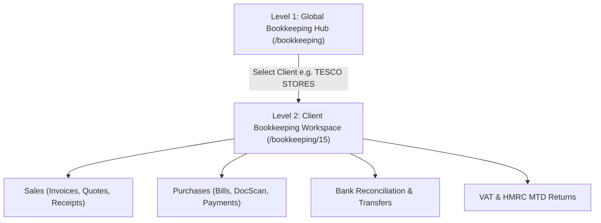

# Bookkeeping Module — End-to-End Architecture & Workflow Guide

**SanSuite Accounting & Practice Management System**
*বুককিপিং ওয়ার্কফ্লো, ক্লায়েন্ট কনটেক্সট এবং ড্যাশবোর্ড নেভিগেশন ফাইল গাইড*

---

## 📌 ১. সমস্যার মূল কারণ ও সমাধান (The Issue & Fix Explained)

### ❓ সমস্যা (The Problem)
বুককিপিং ড্যাশবোর্ডে (`/bookkeeping`) কোনো কোম্পানিতে (যেমন: **TESCO STORES LIMITED**, Client ID `15`) ক্লিক করার পর ডিরেক্ট সেন্ট্রাল ড্যাশবোর্ডে (`/bookkeeping/15`) চলে যেতেন। কিন্তু যখন সাইডবার থেকে **Sales -> Dashboard**-এ ক্লিক করতেন, তখন স্ক্রিনে ভেসে উঠত:
> **`Please select a client from the dashboard first.`**

### 🔍 আসল কারণ (Root Cause)
১. সাইডবার নেভিগেশন লিংক যাচ্ছিল `/bookkeeping/15/sales` ইউআরএল-এ।
২. কিন্তু ব্যাকএন্ড পেজ কম্পোনেন্ট `SalesDashboardPage.tsx` টি কেবল `/bookkeeping/:id/sales-dashboard` রাউট শুনছিল।
৩. ফলে রাউট ম্যাচ না করায় সিস্টেম ক্লায়েন্ট আইডি (`clientId`) হারিয়ে ফেলত এবং মনে করত কোনো ক্লায়েন্ট সিলেক্ট করা হয়নি!

### 💡 সমাধান (Fix Implemented)
আমরা `SalesDashboardPage.tsx` এবং `PurchaseDashboardPage.tsx`-এ রাউট মেচিং ফিক্স করেছি যেন এগুলো ইউআরএল `/bookkeeping/:id/sales` এবং `/bookkeeping/:id/sales-dashboard` উভয়ক্ষেত্রেই ক্লায়েন্ট আইডি সঠিকভাবে ধরে ফেলে এবং সম্পূর্ণ ক্লায়েন্ট ডেটাবেস ডিসপ্লে করে।

---

## 🎯 ২. Bookkeeping মডিউলের মূল আর্কিটেকচার (How Bookkeeping Works)

বুককিপিং মডিউলটি ২টি স্তরে (Two Levels) কাজ করে:

---

## 🔄 ৩. অ্যান্ড-টু-অ্যান্ড বুককিপিং ওয়ার্কফ্লো (Step-by-Step Workflow)

### **ধাপ ১: ক্লায়েন্ট বা কোম্পানি নির্বাচন (Global Hub -> Client Selection)**
1. প্রথমে ইউজার নেভিগেট করবেন `/bookkeeping` (Global Bookkeeping Hub)।
2. সেখানে সকল বুককিপিং ক্লায়েন্টের তালিকা ও সামগ্রিক **VAT Summary** চার্ট দেখতে পাবেন।
3. তালিকার যেকোনো ক্লায়েন্ট (যেমন: `TESCO STORES LIMITED`) এর নামের ওপর ক্লিক করলে সিস্টেম ওই কোম্পানির নির্দিষ্ট ওয়ার্কস্পেসে (`/bookkeeping/15`) চলে যাবে।

### **ধাপ ২: ক্লায়েন্ট ড্যাশবোর্ড দেখা (Client Workspace Dashboard)**
1. `/bookkeeping/15` ড্যাশবোর্ডে পৌঁছানোর পর ওই ক্লায়েন্টের:
   - **Unpaid Invoices** (বকেয়া কাস্টমার ইনভয়েস)
   - **Overdue Bills** (বকেয়া সাপ্লায়ার বিল)
   - **VAT Liability** (এইচএমআরসি ভ্যাট দায়)
   - **Quick Actions** (New Invoice, Add Purchase, Bank Reconcile)
2. বামপাশের সাইডবার এখন সম্পূর্ণভাবে ওই কোম্পানির জন্য লকড হয়ে যাবে (ইউআরএল ফরম্যাট: `/bookkeeping/15/...`)।

### **ধাপ ৩: সেলস ও পারচেজ লেনদেন এন্ট্রি (Sales & Purchase Management)**
1. **Sales -> Dashboard (`/bookkeeping/15/sales`):** ক্লায়েন্টের মোট বিক্রয়, পরিশোধিত অর্থ, বকেয়া এবং ওভারডিউ ইনভয়েস গ্রাফিকাল চার্টে দেখা যাবে।
2. **Sales -> Invoices / Create (`/bookkeeping/15/invoices/new`):** গ্রাহকের নামে বিক্রয় ইনভয়েস তৈরি ও ডাবল-এন্ট্রি লেজারে পোস্টিং।
3. **Purchase -> Purchases (`/bookkeeping/15/purchases`):** সাপ্লায়ার বিল এন্ট্রি এবং **DocScan** ব্যবহার করে এআই দিয়ে বিল স্ক্যান ও অটো-ফিল করা।

### **ধাপ ৪: ব্যাংক রিকনসিলিয়েশন (Bank Reconciliation)**
1. **Bank -> Dashboard (`/bookkeeping/15/bank`):** কোম্পানির সকল ব্যাংক অ্যাকাউন্ট দেখা।
2. **Reconcile (`/bookkeeping/15/bank/1/reconcile`):** ব্যাংক স্টেটমেন্টের লেনদেনের সাথে তৈরি করা সেলস ইনভয়েস বা পারচেজ বিল ম্যাচ (Match & Reconcile) করা।

### **ধাপ ৫: ভ্যাট ও এইচএমআরসি ফাইলিং (VAT & MTD Filing)**
1. **VAT -> Submit VAT (`/bookkeeping/15/vat`):** সেলস ও পারচেজ লেনদেন থেকে অটো-জেনারেটেড **HMRC MTD 9-Box VAT Return** জেনারেট করা।
2. ১-ক্লিকে **Submit to HMRC MTD Gateway** সম্পন্ন করা।

---

## 🧩 ৪. নেভিগেশন রাউটিং ফাইল ম্যাপ (Routing Reference)

| মেনু নেভিগেশন | ইউআরএল রাউট (URL Route) | কাজের বিবরণ |
| :--- | :--- | :--- |
| **Global Bookkeeping** | `/bookkeeping` | সব ক্লায়েন্টের তালিকা ও ভ্যাট সামারি। |
| **Client Dashboard** | `/bookkeeping/:id` | নির্দিষ্ট ক্লায়েন্টের ওভারভিউ ও কুইক অ্যাকশন। |
| **Sales Dashboard** | `/bookkeeping/:id/sales` | ক্লায়েন্টের বিক্রয় চার্ট, সেলস মেট্রিক্স ও সামারি। |
| **Sales Invoices** | `/bookkeeping/:id/invoices` | সেলস ইনভয়েস তালিকা ও নতুন ইনভয়েস ক্রিয়েটর। |
| **Purchase Dashboard** | `/bookkeeping/:id/purchase-dashboard` | ক্লায়েন্টের কেনাকাটা ও সাপ্লায়ার বিল মেট্রিক্স। |
| **Bank Accounts** | `/bookkeeping/:id/bank` | ব্যাংক বিবরণী ও ডাবল-এন্ট্রি রিকনসিলিয়েশন। |
| **Submit VAT** | `/bookkeeping/:id/vat` | ৯-বক্স এমটিডি ভ্যাট রিটার্ন জেনারেটর ও ফাইল এনজিন। |

---
*SanSuite Platform Documentation — Version 2026.1*
