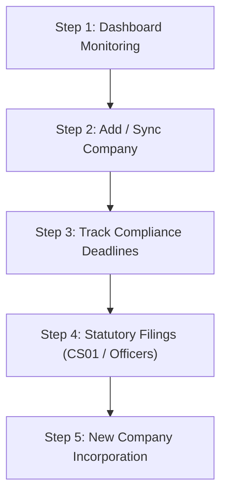

# Company Secretarial Module — Purpose & End-to-End Workflow Guide

**SanSuite Accounting & Practice Management System**
*ইউকে কর্পোরেট সেক্রেটারিয়াল এবং কোম্পানি ইনকর্পোরেশন ফাইল নির্দেশিকা*

---

## 🎯 ১. Company Secretarial মডিউলের মূল উদ্দেশ্য (Purpose & Objectives)

**Company Secretarial (কোম্পানি সেক্রেটারিয়াল)** মডিউলটি মূলত ইউকে (UK) কর্পোরেট আইন (*Companies Act 2006*) অনুসরণ করে লিমিটেড কোম্পানি ক্লায়েন্টদের সংবিধিবদ্ধ ফাইলসমূহ (Statutory Filings, Confirmation Statements CS01, Director/Officer Appointments) পরিপালন করা এবং নতুন কোম্পানি ই-ইনকর্পোরেশন (Company Incorporation) সম্পন্ন করার জন্য তৈরি করা হয়েছে।

### প্রধান লক্ষ্য ও ফিচারসমূহ:
1. **Manage Corporate Clients:** ফার্মের আওতাধীন সকল লিমিটেড কোম্পানির লাইভ ডেটাবেস প্রস্তুত করা এবং কোম্পানি নম্বর (CRN) দিয়ে ডেটা সিঙ্ক রাখা।
2. **Statutory Deadline Tracking:** ইউকে কোম্পানিজ হাউজের পাবলিক রেজিস্টার থেকে প্রতিটি কোম্পানির **Next Confirmation Statement Due Date** এবং **Accounts Due Date** রিয়েল-টাইমে ট্র্যাক করা।
3. **Electronic CS01 Filing:** ১-ক্লিকে অনলাইন গভর্নমেন্ট এপিআই দিয়ে Confirmation Statement (CS01) ফাইলিং সম্পন্ন করা।
4. **Company Formations Wizard:** ৪-স্টেপ অনলাইন উইজার্ডের মাধ্যমে নতুন ইউকে প্রাইভেট লিমিটেড কোম্পানি সরাসরি কোম্পানিজ হাউজে রেজিস্ট্রেশন বা তৈরি করা।

---

## 🔄 ২. এন্ড-টু-এন্ড ওয়ার্কফ্লো (End-to-End Workflow)

### **Step 1: ড্যাশবোর্ড মনিটরিং (Secretarial Dashboard)**
- **Secretarial Dashboard** সেকশনে ক্লিক করলে লাইভ সামারি দেখা যায়:
  - **Managed Companies:** ডাটাবেসে মোট একটিভ ইউকে কোম্পানির সংখ্যা।
  - **Confirmation Statements Due:** ৩০ দিনের মধ্যে কমপ্লায়েন্স ডিউ থাকা কোম্পানির তালিকা।
  - **Accounts Due:** ওভারডিউ বা অন-ট্র্যাক ফাইলিং ডেট সামারি।
  - **Upcoming Deadlines:** আগামী ফাইলিংগুলোর ডাইনামিক তালিকা।

### **Step 2: কোম্পানি রেজিস্ট্রেশন ও ডেটা সিঙ্ক (Add / Sync Company)**
- **Companies** ট্যাবে গিয়ে **+ Add Company** বাটনে চাপ দিলে **Add New Client Modal** ওপেন হয়।
- **Company Reg Number (CRN)** ঘরে ইউকে কোম্পানি নম্বর (যেমন: `09599941` বা `SO301131`) লিখে **Lookup** বাটনে চাপলে সরাসরি ইউকে গভর্নমেন্ট এপিআই থেকে কোম্পানির নাম, ঠিকানা, Next CS Due এবং Accounts Due ডেট চলে আসে।
- প্রয়োজনে **Sync Live Data** অপশন ব্যবহার করে কোম্পানিজ হাউজের সাম্প্রতিক পরিবর্তন সিঙ্ক করা যায়।

### **Step 3: ফাইল কমপ্লায়েন্স জেনারেশন (File CS01 & Officer Management)**
- প্রতিটি কোম্পানির অপশন মেনু (`⋮`) থেকে:
  - **File CS01:** ১-ক্লিকে Confirmation Statement ফাইল সম্পন্ন করা হয় এবং পরবর্তী ফাইলিং ডেট আপডেট হয়ে যায়।
  - **Manage Officers:** কোম্পানির ডিরেক্টর ও সেক্রেটারিদের নিয়োগ বা পদত্যাগ ফাইল করা হয়।

### **Step 4: নতুন কোম্পানি ইনকর্পোরেশন (Company Formations Wizard)**
- **Formations** ট্যাবে গিয়ে **Start New Formation** বাটনে চাপ দিলে ৪-স্টেপ কোম্পানি রেজিস্ট্রেশন প্রসেস শুরু হয়:
  - **Step 1: Company Details** — কোম্পানির প্রস্তাবিত নাম (Name), টাইপ (Ltd), রেজিস্টার্ড অফিস ঠিকানা ও SIC কোড ইনপুট।
  - **Step 2: Officers & Directors** — ডিরেক্টর ও সেক্রেটারিদের তথ্য ও ঠিকানা যুক্ত করা।
  - **Step 3: Share Capital & PSC** — শেয়ারের সংখ্যা, মূল্য এবং Persons with Significant Control (PSC) নির্ধারণ করা।
  - **Step 4: Review & Submit** — সম্পূর্ণ ফর্মটি রিভিউ করে ১-ক্লিকে **Companies House Gateway**-এ নতুন কোম্পানি তৈরির রিকোয়েস্ট পাঠানো।

---

## 🧩 ৩. মডিউলের প্রধান সেকশনসমূহের সংক্ষিপ্ত বিবরণ (Module Components)

| সেকশন | বিবরণ ও মূল কাজ |
| :--- | :--- |
| **Secretarial Dashboard** | সামগ্রিক কমপ্লায়েন্স স্ট্যাটাস, মোট পরিচালিত কোম্পানি এবং আগত ফাইলিং ডেডলাইন টেবিল। |
| **Manage Companies** | কোম্পানি রেজিস্ট্রি টেবিল, লাইভ CRN লুকআপ, CS01 ফাইলিং এবং অফিসার ম্যানেজমেন্ট। |
| **Company Formations** | নতুন ইউকে লিমিটেড কোম্পানি গঠনের ৪-স্টেপ গাইডেড উইজার্ড। |
| **Companies House Gateway** | ইউকে সরকারের অফিশিয়াল সার্ভিস এপিআই কানেক্টর এনজিন। |

---
*SanSuite Platform Documentation — Version 2026.1*
